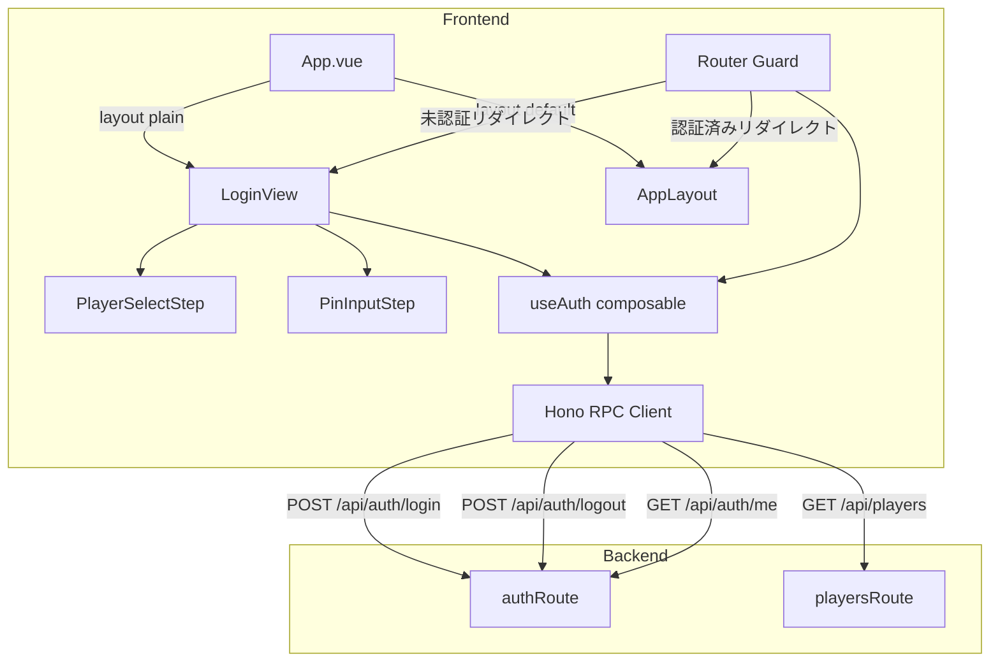
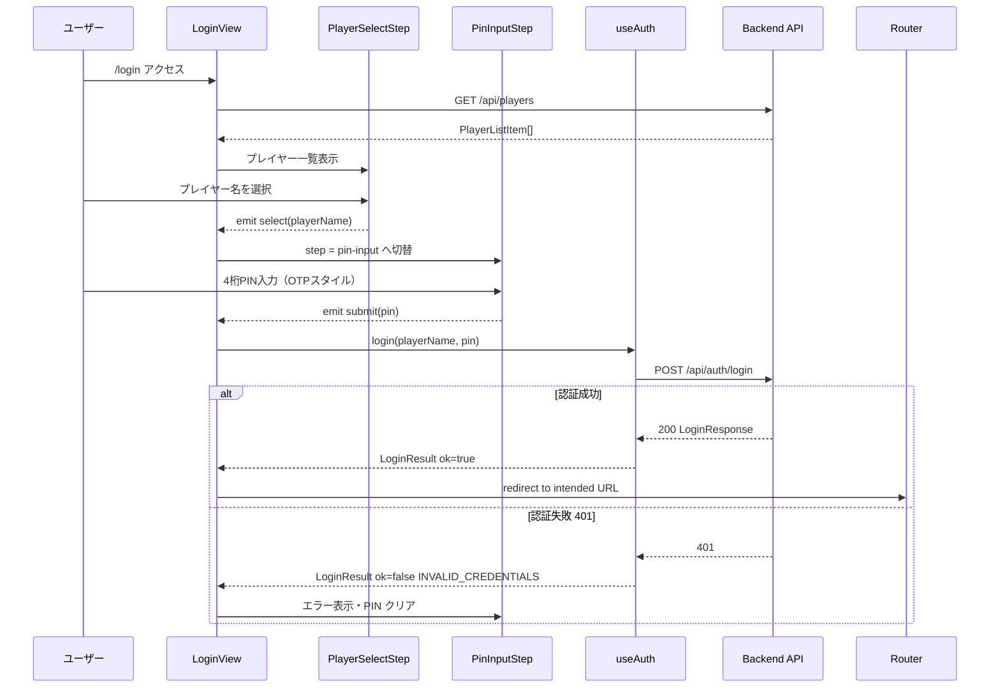
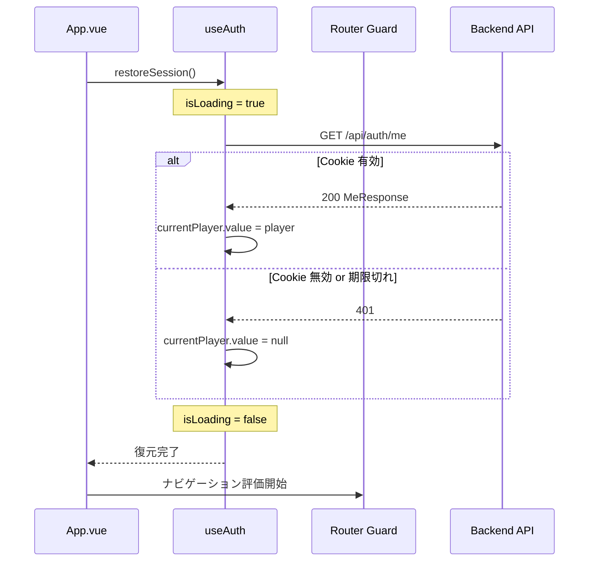

# Technical Design: auth

## Overview

本スペックは「機動戦士ガンダムEXVS 2 Infinite Boost」月例下剋上決定戦管理WebアプリにおけるログインUIを提供する。バックエンド認証基盤（JWT・PIN検証・HttpOnly Cookie）はfoundationスペックで実装済みであり、本スペックは **フロントエンドの認証フロー・状態管理・ルートガード** に集中する。

プレイヤー名選択 → 4桁PIN入力の2ステップフローを提供し、ゲームセンターの筐体前で全員が手軽にスマートフォンからログインできる体験を実現する。セッション状態はHTTPOnly CookieによってブラウザリロードをまたいでJWT有効期限内（24時間）維持される。

### Goals

- スマートフォン縦画面（375px〜430px）に最適化されたログインUI
- 認証状態のリアクティブな一元管理（アプリ全体から参照可能なcomposable）
- Vue Router ナビゲーションガードによる未認証アクセスのログイン画面へのリダイレクト

### Non-Goals

- プレイヤー登録・PIN変更機能（seedで初期投入後は管理者がDB直接操作）
- バックエンド認証ロジックの変更（`GET /api/auth/me` の追加のみ許容）
- メールアドレス・SNSログインなど、PIN以外の認証方式

## Boundary Commitments

### This Spec Owns

- `frontend/src/composables/useAuth.ts` — 認証状態の管理・login/logout/restoreSession の実装
- `frontend/src/views/LoginView.vue` — ログイン画面の orchestrator
- `frontend/src/components/auth/PlayerSelectStep.vue` — プレイヤー選択UI
- `frontend/src/components/auth/PinInputStep.vue` — PIN入力UI
- `frontend/src/router/index.ts` の更新 — `/login` ルート追加・ルートメタ宣言・ナビゲーションガード追加
- `frontend/src/App.vue` の更新 — レイアウト分岐（`layout: 'plain'`）
- `backend/src/routes/auth.ts` の更新 — `GET /me` エンドポイント追加（セッション確認用）
- `backend/src/db/seed.ts` — 初期プレイヤーデータ投入スクリプト（PIN bcryptハッシュ化）
- `backend/package.json` の更新 — `db:seed` スクリプト追加

### Out of Boundary

- バックエンドの認証ミドルウェア・JWT署名・Cookieオプション（foundation スペック完了）
- `GET /api/players` エンドポイント（foundation スペック完了）
- プレイヤー登録・PIN変更のAPI（seedによる初期投入後は管理者DB直接操作）

### Allowed Dependencies

- `backend/src/routes/auth.ts`（`POST /login`, `POST /logout`）— foundation スペック実装済み
- `backend/src/routes/players.ts`（`GET /`）— foundation スペック実装済み
- `frontend/src/api/client.ts`（Hono RPC Client）— foundation スペック実装済み
- `frontend/src/components/AppLayout.vue` / `BottomNav.vue` — foundation スペック実装済み

### Revalidation Triggers

- `AppType`（`backend/src/index.ts`）のルート構成変更
- `authMiddleware` の Cookie名・ペイロード構造変更
- `JwtPayload` インターフェースの `sub` / `name` フィールド変更

## Architecture

### Existing Architecture Analysis

- `App.vue` は `AppLayout` を全ルートに適用しており、`BottomNav` が常時表示される
- `router/index.ts` はルートメタを使用しておらず、ナビゲーションガードが未設定
- `frontend/src/api/client.ts` に Hono RPC Client が初期化済みで、型推論付きAPIコールが可能
- Pinia は未導入。既存の composable（`useEventStream`）はコンポーネントローカルな状態を持つ

### Architecture Pattern & Boundary Map



**Architecture Integration**:
- 選択パターン: モジュールスコープ singleton ref（Pinia不要・既存composableパターンの拡張）
- 依存方向: `PlayerSelectStep` / `PinInputStep` → `LoginView` → `useAuth` → `RPCClient` → Backend
- 新規追加: `useAuth` のみが新しいドメイン境界（認証状態の唯一のオーナー）

### Technology Stack

| Layer | Choice / Version | Role in Feature | Notes |
|-------|------------------|-----------------|-------|
| Frontend UI | Vue 3 + Composition API | ログイン画面・ステップコンポーネント | 既存スタック |
| Frontend Styling | Tailwind CSS | スマートフォン最適化レイアウト | ダークテーマ固定 |
| State Management | モジュールスコープ singleton ref | 認証状態のグローバル共有 | Pinia不要 |
| Router | Vue Router | ルートガード・メタ宣言 | 既存スタック |
| API Client | Hono RPC Client | 型安全なAPIコール | 既存 `client.ts` を利用 |
| Backend | Hono + authMiddleware | `GET /me` エンドポイント追加 | foundation 実装済みの拡張 |

## File Structure Plan

### Directory Structure

```
frontend/src/
├── composables/
│   └── useAuth.ts          # 新規: 認証状態singleton・login/logout/restoreSession
├── views/
│   └── LoginView.vue       # 新規: ログイン画面 orchestrator（ステップ制御）
├── components/
│   └── auth/
│       ├── PlayerSelectStep.vue  # 新規: プレイヤー選択ステップUI
│       └── PinInputStep.vue      # 新規: PIN入力ステップUI（OTPスタイル4桁）
├── router/
│   └── index.ts            # 変更: /login ルート追加・requiresAuth メタ・ガード追加
└── App.vue                 # 変更: layout メタによるレイアウト分岐

backend/src/
├── db/
│   └── seed.ts             # 新規: プレイヤー初期データ投入（bcryptハッシュ化）
└── routes/
    └── auth.ts             # 変更: GET /me エンドポイント追加
```

### Modified Files

- `frontend/src/router/index.ts` — `/login` ルートと `requiresAuth` メタ、ナビゲーションガードを追加
- `frontend/src/App.vue` — `route.meta.layout === 'plain'` の場合 AppLayout を外す
- `backend/src/routes/auth.ts` — `GET /me` エンドポイントを `authMiddleware` 付きで追加
- `backend/package.json` — `"db:seed": "tsx src/db/seed.ts"` スクリプト追加

## System Flows

### ログインフロー



### セッション復元フロー



## Requirements Traceability

| Requirement | Summary | Components | Interfaces | Flows |
|-------------|---------|------------|------------|-------|
| 1.1 | プレイヤー一覧取得・表示 | PlayerSelectStep | `GET /api/players` | ログインフロー |
| 1.2 | 名前選択でPINステップへ | LoginView, PlayerSelectStep | `PlayerSelectEmits.select` | ログインフロー |
| 1.3 | API エラー時のエラー表示・リトライ | PlayerSelectStep | — | — |
| 1.4 | 取得中ローディング表示 | PlayerSelectStep | — | — |
| 1.5 | タップしやすいカード/リスト表示 | PlayerSelectStep | — | — |
| 2.1 | 選択プレイヤー名表示 + PIN UI | PinInputStep | `PinInputStepProps` | ログインフロー |
| 2.2 | 4桁入力完了で login API 送信 | PinInputStep, LoginView, useAuth | `POST /api/auth/login` | ログインフロー |
| 2.3 | 成功後リダイレクト | LoginView, Router Guard | `LoginResult` | ログインフロー |
| 2.4 | 401時エラー表示・PIN クリア | PinInputStep, LoginView | `LoginResult` | ログインフロー |
| 2.5 | 400時エラー表示 | PinInputStep, LoginView | `LoginResult` | ログインフロー |
| 2.6 | プレイヤー選択へ戻る | PinInputStep, LoginView | `PinInputEmits.back` | — |
| 2.7 | 数字専用キーパッド | PinInputStep | — | — |
| 2.8 | リクエスト中ボタン無効化 | PinInputStep | `PinInputStepProps.isSubmitting` | ログインフロー |
| 3.1 | ログイン成功後の認証状態保持 | useAuth | `AuthenticatedPlayer` | ログインフロー |
| 3.2 | 初回ロード時セッション復元 | useAuth, App.vue | `GET /api/auth/me` | セッション復元フロー |
| 3.3 | アプリ全体から参照可能なcomposable | useAuth | `UseAuthReturn` | — |
| 3.4 | 401時の未認証状態リセット | useAuth | — | セッション復元フロー |
| 4.1 | 未認証 → ログイン画面リダイレクト | Router Guard | `RouteMeta.requiresAuth` | — |
| 4.2 | 認証済み → 大会タブリダイレクト | Router Guard | — | — |
| 4.3 | ルートメタで認証要否宣言 | router/index.ts | `RouteMeta` 型拡張 | — |
| 5.1 | ログアウト時 logout API 呼び出し | useAuth | `POST /api/auth/logout` | — |
| 5.2 | ログアウト成功後の状態クリアと遷移 | useAuth | — | — |
| 5.3 | API エラー時もローカル状態クリアして遷移 | useAuth | — | — |
| 6.1 | seed スクリプト提供 | seed.ts | — | — |
| 6.2 | PIN の bcrypt ハッシュ化 | seed.ts | — | — |
| 6.3 | 冪等実行（重複スキップ/upsert） | seed.ts | — | — |
| 6.4 | `db:seed` npm スクリプト提供 | backend/package.json | — | — |

## Components and Interfaces

### コンポーネント概要

| Component | Layer | Intent | Req Coverage | Key Dependencies | Contracts |
|-----------|-------|--------|--------------|------------------|-----------|
| useAuth | Composable | 認証状態singleton・全API操作 | 3.1–3.4, 5.1–5.3 | Hono RPC Client (P0) | Service, State |
| LoginView | View | ログインフロー orchestrator | 1.1–1.5, 2.1–2.8 | useAuth (P0), RPCClient (P0) | State |
| PlayerSelectStep | UI | プレイヤー選択ステップUI | 1.1–1.5 | LoginView (P0) | — |
| PinInputStep | UI | PIN入力ステップUI | 2.1–2.8 | LoginView (P0) | — |
| Router Guard | Routing | ナビゲーション認証チェック | 4.1–4.3 | useAuth (P0) | — |
| GET /api/auth/me | API | セッション確認エンドポイント | 3.2, 3.4 | authMiddleware (P0) | API |
| seed.ts | Script | 初期プレイヤーデータ投入 | 6.1–6.4 | Drizzle Client (P0), bcryptjs (P0) | — |

---

### Composable Layer

#### useAuth

| Field | Detail |
|-------|--------|
| Intent | 認証状態のモジュールスコープ singleton として login/logout/restoreSession を提供する |
| Requirements | 3.1, 3.2, 3.3, 3.4, 5.1, 5.2, 5.3 |

**Responsibilities & Constraints**
- `currentPlayer` と `isLoading` はモジュールスコープの `ref` として定義し、`useAuth()` 呼び出しごとに同一インスタンスを参照する
- 認証状態の変更は `useAuth` 内部のみが行う（外部からの直接書き込み禁止）
- ログアウト時はAPIエラーの有無にかかわらずローカル状態をクリアする（5.3）

**Dependencies**
- Outbound: Hono RPC Client (`client.ts`) — API呼び出し (P0)
- Inbound: `LoginView`, `Router Guard` — 認証状態の読み取りと操作 (P0)

**Contracts**: Service [x] / State [x]

##### Service Interface

```typescript
interface AuthenticatedPlayer {
  playerId: string
  name: string
}

type LoginErrorCode = 'INVALID_CREDENTIALS' | 'VALIDATION_ERROR' | 'NETWORK_ERROR'

type LoginResult =
  | { ok: true; player: AuthenticatedPlayer }
  | { ok: false; errorCode: LoginErrorCode; message: string }

interface UseAuthReturn {
  currentPlayer: Readonly<Ref<AuthenticatedPlayer | null>>
  isAuthenticated: ComputedRef<boolean>
  isLoading: Readonly<Ref<boolean>>
  login(playerName: string, pin: string): Promise<LoginResult>
  logout(): Promise<void>
  restoreSession(): Promise<void>
}
```

- Preconditions: `login` 呼び出し前に `playerName`（非空文字列）と `pin`（4桁数字）が提供されること
- Postconditions: `login` 成功後 `currentPlayer.value` が `AuthenticatedPlayer` にセットされる
- Invariants: `isAuthenticated` は常に `currentPlayer.value !== null` と等価である

##### State Management

- State model: `currentPlayer: ref<AuthenticatedPlayer | null>` / `isLoading: ref<boolean>` をモジュールスコープで保持
- Persistence: HttpOnly Cookie（バックエンドが管理）によりブラウザリロードをまたいで持続
- Concurrency: 同時 `login` 呼び出しは想定しない（UIで二重送信を防止する）

**Implementation Notes**
- Integration: `client.api.auth.me.$get()` / `client.api.auth.login.$post()` / `client.api.auth.logout.$post()` を Hono RPC 型推論付きで呼び出す
- Validation: PIN形式バリデーションはPinInputStep側で入力制御（4文字まで・数字のみ）し、useAuth は受け取った値をそのままAPIへ送信する
- Risks: フロントエンド（Vercel）とバックエンド（Railway）がクロスオリジンの場合、`SameSite=Lax` Cookie がクロスサイトリクエストで送信されない可能性がある（`research.md` 参照）

---

### View Layer

#### LoginView

| Field | Detail |
|-------|--------|
| Intent | ログインフロー（プレイヤー選択 → PIN入力）のステップ状態を管理するorchestrator |
| Requirements | 1.1–1.5, 2.1–2.8 |

**Responsibilities & Constraints**
- `step: Ref<'player-select' | 'pin-input'>` でUIステップを管理する
- `GET /api/players` の呼び出しとレスポンスの保持はLoginView が責務を持つ（useAuth対象外）
- `useAuth.login()` の結果に応じたエラー表示・リダイレクトを制御する

**Dependencies**
- Outbound: `useAuth` — login操作 (P0)
- Outbound: Hono RPC Client — `GET /api/players` (P0)
- Inbound: `PlayerSelectStep`, `PinInputStep` — イベントの受信 (P0)

**Contracts**: State [x]

##### State Management

- State model:
  ```typescript
  const step = ref<'player-select' | 'pin-input'>('player-select')
  const players = ref<PlayerListItem[]>([])
  const playersLoading = ref(false)
  const playersError = ref<string | null>(null)
  const selectedPlayerName = ref<string | null>(null)
  const loginError = ref<string | null>(null)
  ```

**Implementation Notes**
- Integration: `onMounted` で `GET /api/players` を呼び出す。ログイン成功後は `router.replace(redirect ?? '/')` でリダイレクト。
- Validation: ルートガードが認証済みユーザーを `/login` から `/` へリダイレクトするため、LoginViewは未認証状態での表示のみを想定する。
- LayoutMeta: `route.meta.layout = 'plain'` を設定し AppLayout・BottomNav を表示しない。

---

### UI Components

#### PlayerSelectStep

| Field | Detail |
|-------|--------|
| Intent | プレイヤー一覧をカード形式で表示し、タップで選択イベントを通知する |
| Requirements | 1.1, 1.2, 1.3, 1.4, 1.5 |

**Contracts**: — （presentational componentのため省略）

```typescript
interface PlayerListItem {
  id: string
  name: string
  team: 'FIRST' | 'SECOND'
  title: string | null
  mainUnit: string | null
  createdAt: string
}

interface PlayerSelectStepProps {
  players: PlayerListItem[]
  isLoading: boolean
  error: string | null
}

interface PlayerSelectStepEmits {
  select: [playerName: string]
  retry: []
}
```

**Implementation Notes**
- プレイヤーカードは `min-h-[56px]` 以上でタップ領域を確保する
- ローディング中はスケルトンまたはスピナーを表示
- エラー時は「再読み込み」ボタンを表示し `retry` イベントを emit

#### PinInputStep

| Field | Detail |
|-------|--------|
| Intent | 選択済みプレイヤー名を表示し、OTPスタイル4桁PIN入力と送信・戻るを提供する |
| Requirements | 2.1, 2.2, 2.3, 2.4, 2.5, 2.6, 2.7, 2.8 |

**Contracts**: — （presentational componentのため省略）

```typescript
interface PinInputStepProps {
  playerName: string
  isSubmitting: boolean
  error: string | null
}

interface PinInputStepEmits {
  submit: [pin: string]
  back: []
}
```

**Implementation Notes**
- 4つの `<input maxlength="1" inputmode="numeric" pattern="\d">` を横並びに配置し、入力ごとに次フィールドへ自動フォーカス
- 4桁入力完了時に `submit(pin)` を自動 emit（送信ボタン不要でもよいが、UX確認要）
- `isSubmitting === true` の間は全inputを `disabled` にしローディングインジケータを表示
- `error` が非nullの場合はPIN入力欄の下にエラーメッセージを表示し、内部のpin値をリセット

---

### Backend Extension

#### GET /api/auth/me

| Field | Detail |
|-------|--------|
| Intent | HttpOnly Cookieのセッション有効性を確認し、ログイン済みプレイヤー情報を返す |
| Requirements | 3.2, 3.4 |

**Contracts**: API [x]

##### API Contract

| Method | Endpoint | Request | Response | Errors |
|--------|----------|---------|----------|--------|
| GET | /api/auth/me | — (Cookie自動送信) | `{ playerId: string, name: string }` | 401 Unauthorized |

- `authMiddleware` を適用し、`c.get('jwtPayload')` から `sub`（playerId）と `name` を返す
- `playerId` は `JwtPayload.sub`、`name` は `JwtPayload.name` にマッピングする
- AppType に自動反映されるため、フロントの型推論への追加作業不要

---

#### seed.ts

| Field | Detail |
|-------|--------|
| Intent | プレイヤー12名の初期データをDBに投入する冪等なスクリプト |
| Requirements | 6.1, 6.2, 6.3, 6.4 |

**Responsibilities & Constraints**
- `backend/src/db/seed.ts` として実装し、`tsx` で直接実行可能にする
- プレイヤーデータ（名前・PIN）は同ファイル内の定数配列で管理する（gitignoreされた `.env` や別設定ファイルでの管理は任意）
- `bcryptjs.hash(pin, 10)` でPINをハッシュ化してから `players` テーブルへ INSERT する
- 既存レコードとの重複は `onConflictDoNothing()` で冪等に処理する（名前の `unique` 制約を利用）

**Dependencies**
- Outbound: `backend/src/db/client.ts` — Drizzle クライアント (P0)
- Outbound: `bcryptjs` — PINハッシュ化 (P0)
- Outbound: `backend/src/db/schema.ts` — `players` テーブル参照 (P0)

**Contracts**: — （CLIスクリプト。APIコントラクトなし）

**Data Structure**:

```typescript
interface SeedPlayer {
  name: string
  pin: string        // 平文4桁数字（スクリプト内でのみ存在、DBには保存しない）
  team: 'FIRST' | 'SECOND'
  title: string | null
  mainUnit: string | null
}
```

**Implementation Notes**
- Integration: `backend/package.json` に `"db:seed": "tsx src/db/seed.ts"` を追加し、`pnpm --filter backend db:seed` で実行する
- Validation: 実行後に `GET /api/players` を呼んでプレイヤー一覧が返ることで動作確認する
- Risks: PINの平文がソースコードに含まれるため、本番環境向けには `.env` や秘匿設定ファイルからの読み込みへの切り替えを検討すること（12名の身内アプリのため現状は許容範囲）

---

### Routing

#### Router Guard & Route Meta

**Route Meta 型拡張**:

```typescript
declare module 'vue-router' {
  interface RouteMeta {
    requiresAuth?: boolean
    layout?: 'default' | 'plain'
  }
}
```

**ルート定義**:

```typescript
const routes = [
  { path: '/login',   component: LoginView,      meta: { requiresAuth: false, layout: 'plain' } },
  { path: '/',        component: TournamentView,  meta: { requiresAuth: true } },
  { path: '/group',   component: GroupView,       meta: { requiresAuth: true } },
  { path: '/profile', component: ProfileView,     meta: { requiresAuth: true } },
]
```

**ナビゲーションガードロジック**:

```
beforeEach(to, from):
  useAuth().restoreSession() を初回のみ await
  if to.meta.requiresAuth === true and !isAuthenticated:
    redirect '/login' with query { redirect: to.fullPath }
  if to.path === '/login' and isAuthenticated:
    redirect to.query.redirect ?? '/'
```

**Implementation Notes**
- `restoreSession()` の初回呼び出しはフラグで管理し、ページ遷移のたびに叩かない
- `isLoading` が `true` の間（restoreSession実行中）はルートガードが評価されないよう待機する

## Error Handling

### Error Strategy

UIレイヤーでユーザーに見えるエラーメッセージを表示し、再試行手段を提供する。

### Error Categories and Responses

**ユーザーエラー（認証失敗）**:
- 401 INVALID_CREDENTIALS — 「プレイヤー名またはPINが正しくありません」を表示、PINをクリア（2.4）
- 400 VALIDATION_ERROR — 「入力内容に誤りがあります」を表示（2.5）

**ネットワーク/システムエラー**:
- `GET /api/players` 失敗 — エラーメッセージ + リトライボタン（1.3）
- ログアウトAPI失敗 — ローカル状態をクリアしてログイン画面へ遷移（5.3）
- セッション確認失敗 — 未認証状態にリセット（3.4）

### Monitoring

- コンソールへのエラーログは `useAuth` 内で実装し、本番では外部ログサービス（将来対応）へ送信する想定

## Testing Strategy

### Unit Tests

- `useAuth.login()`: 認証成功時に `currentPlayer` がセットされること
- `useAuth.login()`: 401時に `LoginResult.ok === false` かつ `INVALID_CREDENTIALS` が返ること
- `useAuth.logout()`: APIエラーでもローカル状態がクリアされること
- `useAuth.restoreSession()`: 401時に `currentPlayer` が `null` のままであること

### Integration Tests

- ログインフロー: プレイヤー選択 → PIN入力 → `POST /api/auth/login` → リダイレクト（MSWモックAPI）
- ルートガード: 未認証状態で `/` にアクセスすると `/login` へリダイレクト
- ルートガード: 認証済みで `/login` にアクセスすると `/` へリダイレクト

### E2E/UI Tests

- 正常ログインパス: プレイヤー選択 → PIN入力 → 大会タブ表示
- エラーパス: 誤PIN入力 → エラー表示 → PIN クリア
- セッション復元: リロード後に認証状態が保持されていること

## Security Considerations

- `GET /api/auth/me` は `authMiddleware` で保護し、有効なJWT Cookieなしには `{ playerId, name }` を返さない
- PinInputStep の `<input>` には `autocomplete="off"` を設定し、ブラウザのオートフィルによるPIN漏洩を防止する
- クロスオリジン環境（Vercel + Railway）での Cookie 送信は `SameSite=None; Secure` が必要な場合あり（`research.md` の「Risks & Mitigations」参照）
- `LoginErrorCode` の `INVALID_CREDENTIALS` は認証失敗の詳細（プレイヤー存在確認 vs PIN不一致）を区別しないことで、ユーザー列挙攻撃を防止する（バックエンドは統一レスポンス済み）
