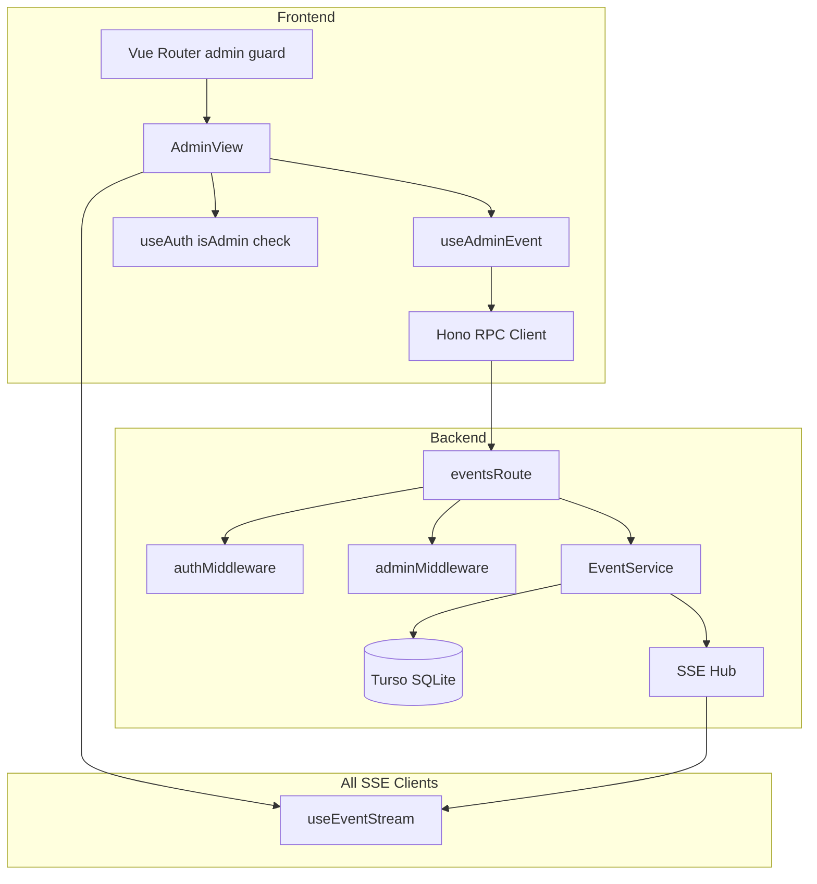
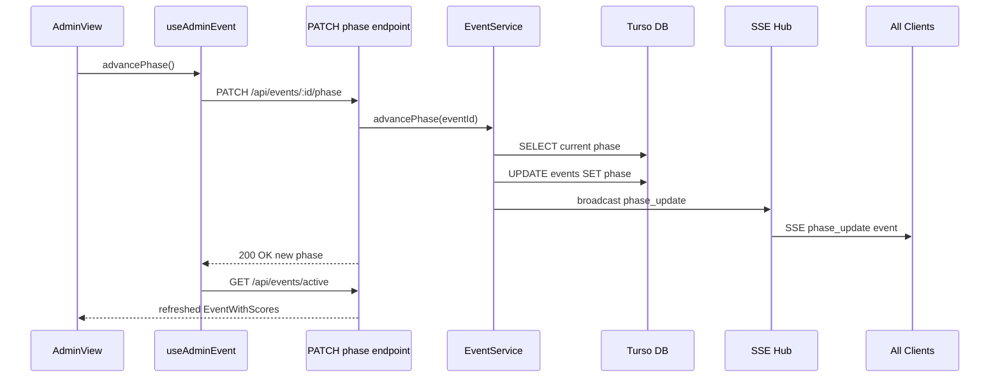
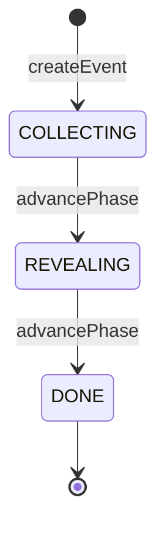

# 技術設計書 — event-management

## Overview

本機能は「月例下剋上決定戦」の大会ライフサイクルを管理する。管理者は大会を作成して参加者全員の初期スコアレコードを一括生成し、欠席フラグを管理して成績集計の精度を保ち、フェーズを `COLLECTING → REVEALING → DONE` へ手動遷移させる。フェーズ変更は SSE ブロードキャストを通じて全接続クライアントにリアルタイム通知される。

**対象ユーザー**: 管理者（大会作成・管理操作）および認証済みプレイヤー（大会情報閲覧）。**影響**: 既存の空実装 `eventsRoute`・`scoresRoute` にエンドポイントを追加し、`players` テーブルへ `isAdmin` カラムを追加する。隣接スペック（`score-entry`、`result-reveal`）は本スペックが提供する API とフェーズ変更 SSE を前提として動作する。

### Goals

- 大会の CRUD と参加者スコア初期化をアトミックに実現する
- フェーズ遷移をバリデーション付きで制御し、SSE ハブ経由で全クライアントへ同期する
- JWT クレームベースの `isAdmin` フラグで管理者操作を認可する
- スマートフォン縦画面向け管理者 UI を提供する

### Non-Goals

- 成績入力 UI（`score-entry` スペック）
- 順位発表演出（`result-reveal` スペック）
- Star 投票（`star-voting` スペック）
- SSE 接続管理ロジックの変更（`stream.ts` が所有）

---

## Boundary Commitments

### This Spec Owns

- `POST /api/events`、`GET /api/events/active`、`GET /api/events` エンドポイント
- `PATCH /api/events/:id/absent/:playerId`、`PATCH /api/events/:id/phase` エンドポイント
- `EventService`（大会作成・フェーズ遷移・欠席管理のビジネスロジック）
- `adminMiddleware`（`isAdmin` クレーム検証）
- `players.isAdmin` スキーマカラム追加（`JwtPayload` への反映含む）
- `AdminView.vue` および `useAdminEvent` composable
- `PhaseUpdatePayload` 型への `eventId` フィールド追加（`useEventStream.ts` 修正）

### Out of Boundary

- `score-entry` スペック管轄のスコア入力 API（`PATCH /api/scores/:id`）
- `result-reveal` スペック管轄の順位計算・発表 UI
- SSE ストリーム接続・切断・ ping ロジック（`stream.ts` が所有）
- Star 投票テーブルの操作

### Allowed Dependencies

- `backend/src/routes/stream.ts` の `hub` オブジェクト（ブロードキャストのみ利用）
- `backend/src/db/client.ts` の `db` インスタンス
- `backend/src/middleware/auth.ts` の `authMiddleware`（`adminMiddleware` の前段として依存）
- `frontend/src/api/client.ts` の Hono RPC クライアント
- `frontend/src/composables/useAuth.ts` の `useAuth`（isAdmin 判定に利用）
- `frontend/src/composables/useEventStream.ts` の `useEventStream`（フェーズ変更受信）

### Revalidation Triggers

- `EventWithScores` レスポンス形状を変更した場合、`score-entry` スペックの API 呼び出しを再確認する
- `PhaseUpdatePayload` の型を追加変更した場合、`result-reveal` スペックの SSE ハンドラを再確認する
- `isAdmin` の認可ロジックを変更した場合、全管理者専用エンドポイントを再確認する

---

## Architecture

### Existing Architecture Analysis

- **現行 eventsRoute**: `authMiddleware` のみ適用の空実装。型チェーンを維持しながら安全に拡張可能
- **SSE ハブ**: `stream.ts` が `hub.broadcast(eventId, type, payload)` API を提供。`phase_update` イベントタイプは定義済み
- **DB スキーマ**: `events.phase`（enum）・`scores.absent`（boolean）は定義済み。`players.isAdmin` のみ未定義
- **JWT パターン**: `authMiddleware` → `c.var.jwtPayload` の流れで新規ミドルウェアも同パターンを踏襲

### Architecture Pattern & Boundary Map



**主要な決定事項**:
- 管理者認可は JWT クレーム（`isAdmin`）で行い、DB 照会を回避する（詳細: `research.md` Decision 1）
- `EventService` をルートから分離してビジネスロジックをテスト可能にする（詳細: `research.md` Decision 2）
- `adminMiddleware` は `authMiddleware` の後段として個別エンドポイントに適用し、Hono RPC の型推論を維持する

### Technology Stack

| Layer | 選択 | 役割 |
|-------|------|------|
| Frontend / UI | Vue 3 Composition API + Tailwind CSS | AdminView・useAdminEvent |
| Backend / Services | Hono（メソッドチェーン型ルート） | eventsRoute・adminMiddleware・EventService |
| Data / Storage | Turso（Edge SQLite）+ Drizzle ORM | events・scores・players テーブル操作 |
| Messaging / Events | Hono SSE（既存 hub） | phase_update ブロードキャスト |
| Auth | JWT（hono/jwt）+ Cookie | isAdmin クレーム検証 |

---

## File Structure Plan

### Directory Structure

```
backend/src/
├── db/
│   └── schema.ts              # 修正: players に isAdmin 追加
├── lib/
│   └── jwt.ts                 # 修正: JwtPayload に isAdmin 追加
├── middleware/
│   ├── auth.ts                # 変更なし
│   └── admin.ts               # 新規: isAdmin クレーム検証
├── services/
│   └── event-service.ts       # 新規: 大会ビジネスロジック
└── routes/
    ├── auth.ts                # 修正: sign / /me に isAdmin 追加
    └── events.ts              # 拡張: 5エンドポイント追加

frontend/src/
├── composables/
│   ├── useEventStream.ts      # 修正: PhaseUpdatePayload に eventId 追加
│   ├── useAuth.ts             # 修正: AuthenticatedPlayer に isAdmin 追加
│   └── useAdminEvent.ts       # 新規: 管理者操作 composable
├── views/
│   └── AdminView.vue          # 新規: 管理者画面
└── router/
    └── index.ts               # 修正: /admin ルートと管理者ガード追加
```

### Modified Files

- `backend/src/db/schema.ts` — `players` テーブルに `isAdmin: integer('is_admin', { mode: 'boolean' }).notNull().default(false)` を追加
- `backend/src/lib/jwt.ts` — `JwtPayload` インターフェースに `isAdmin: boolean` を追加
- `backend/src/routes/auth.ts` — `sign()` 呼び出しに `isAdmin` を追加、`/me` レスポンスに `isAdmin` を追加
- `frontend/src/composables/useEventStream.ts` — `PhaseUpdatePayload` に `eventId: string` を追加
- `frontend/src/composables/useAuth.ts` — `AuthenticatedPlayer` に `isAdmin: boolean` を追加、login/restoreSession で `isAdmin` を反映
- `frontend/src/router/index.ts` — `/admin` ルート追加、管理者専用ガード追加

---

## System Flows

### フェーズ遷移フロー（要件 3）



フェーズ遷移は `COLLECTING → REVEALING → DONE` のみ許可。逆順・DONE からの遷移は 409 を返す。

### フェーズ状態機械（要件 1.1, 3.1-3.4）



---

## Requirements Traceability

| 要件 | 概要 | コンポーネント | インターフェース | フロー |
|------|------|---------------|----------------|--------|
| 1.1 | 大会を COLLECTING で作成・ID 返却 | EventService | `createEvent` / POST /api/events | — |
| 1.2 | 全プレイヤーのスコアレコード一括作成 | EventService | `createEvent` 内部トランザクション | — |
| 1.3 | 進行中大会存在時は作成拒否（409） | EventService | `createEvent` バリデーション | — |
| 1.4 | 非管理者の大会作成を 403 拒否 | adminMiddleware | JWT isAdmin クレーム検証 | — |
| 1.5 | heldAt バリデーション | eventsRoute | zod schema | — |
| 2.1 | absent=true 設定 | EventService | `setAbsent` | — |
| 2.2 | absent=false 解除 | EventService | `setAbsent` | — |
| 2.3 | COLLECTING フェーズ中のみ欠席変更許可 | EventService | `setAbsent` フェーズチェック | — |
| 2.4 | COLLECTING 以外での欠席変更を拒否（409） | EventService | `setAbsent` フェーズチェック | — |
| 2.5 | 非管理者の欠席変更を 403 拒否 | adminMiddleware | JWT isAdmin クレーム検証 | — |
| 3.1 | COLLECTING→REVEALING 遷移・SSE ブロードキャスト | EventService | `advancePhase` + hub.broadcast | フェーズ遷移フロー |
| 3.2 | REVEALING→DONE 遷移・SSE ブロードキャスト | EventService | `advancePhase` + hub.broadcast | フェーズ遷移フロー |
| 3.3 | 不正順序遷移を拒否（409） | EventService | `advancePhase` バリデーション | — |
| 3.4 | DONE からの遷移を拒否（409） | EventService | `advancePhase` バリデーション | — |
| 3.5 | 非管理者のフェーズ遷移を 403 拒否 | adminMiddleware | JWT isAdmin クレーム検証 | — |
| 3.6 | SSE ペイロードに eventId と phase を含める | EventService | PhaseUpdatePayload 型 | — |
| 4.1 | 進行中大会と全スコア返却 | eventsRoute | GET /api/events/active | — |
| 4.2 | 進行中大会なしは null 返却（200） | eventsRoute | GET /api/events/active | — |
| 4.3 | DONE 大会一覧を降順返却 | eventsRoute | GET /api/events | — |
| 4.4 | 未認証は 401 | authMiddleware | JWT 検証 | — |
| 4.5 | 大会一覧に id・phase・heldAt を含める | eventsRoute | EventSummary 型 | — |
| 5.1 | isAdmin フラグによる操作認可 | adminMiddleware | JWT isAdmin クレーム | — |
| 5.2 | 管理者の全管理操作を許可 | adminMiddleware + EventService | — | — |
| 5.3 | 非管理者に 403 返却 | adminMiddleware | 403 レスポンス | — |
| 5.4 | isAdmin を JWT クレームから導出 | auth.ts + JwtPayload | isAdmin クレーム | — |
| 6.1 | 管理者画面にフェーズ・参加者・欠席状況表示 | AdminView | useAdminEvent | — |
| 6.2 | 大会未開催時は作成フォーム表示 | AdminView | useAdminEvent.activeEvent | — |
| 6.3 | COLLECTING 時は欠席 UI + REVEALING ボタン表示 | AdminView | フェーズ条件分岐 | — |
| 6.4 | REVEALING 時は DONE ボタン表示 | AdminView | フェーズ条件分岐 | — |
| 6.5 | 非管理者の /admin アクセスをリダイレクト | Vue Router guard | isAdmin ルートガード | — |
| 6.6 | モバイルファースト・ダークテーマ適用 | AdminView | Tailwind ユーティリティ | — |
| 6.7 | フェーズ遷移後に最新状態を再取得 | AdminView + useAdminEvent | refresh() | フェーズ遷移フロー |

---

## Components and Interfaces

### コンポーネント一覧

| コンポーネント | Layer | Intent | 要件カバレッジ | 主要依存 | コントラクト |
|--------------|-------|--------|--------------|---------|------------|
| EventService | Backend Service | 大会ビジネスロジック全般 | 1, 2, 3, 4 | Drizzle DB, SSE Hub (P0) | Service |
| eventsRoute | Backend Route | HTTP エンドポイント定義 | 1–5 | EventService, adminMiddleware (P0) | API |
| adminMiddleware | Backend Middleware | isAdmin クレーム検証 | 5 | authMiddleware (P0) | Service |
| useAdminEvent | Frontend Composable | 管理者操作の状態管理 | 1, 2, 3, 6 | ApiClient (P0), useAuth (P1) | State |
| AdminView | Frontend View | 管理者 UI | 6 | useAdminEvent, useEventStream, useAuth (P0) | State |

---

### Backend Service Layer

#### EventService

| Field | Detail |
|-------|--------|
| Intent | 大会作成・欠席管理・フェーズ遷移のビジネスロジックとトランザクション境界を所有する |
| Requirements | 1.1–1.5, 2.1–2.5, 3.1–3.6, 4.1–4.5 |

**Responsibilities & Constraints**
- 大会作成時に `events` レコードと全プレイヤー分 `scores` レコードをバッチ挿入する（要件 1.2）
- 進行中大会（COLLECTING または REVEALING）が存在する場合の新規作成を拒否する（要件 1.3）
- フェーズ遷移は `COLLECTING → REVEALING → DONE` の順のみ許可する（要件 3.3, 3.4）
- フェーズ遷移後に `hub.broadcast` で `phase_update` イベントを送出する（要件 3.1, 3.2）
- 欠席フラグ変更は COLLECTING フェーズ中のみ許可する（要件 2.3, 2.4）
- SSE ハブへの直接参照を持ち、`stream.ts` の `hub` オブジェクトを呼ぶ

**Dependencies**
- Outbound: `db`（Drizzle client）— DB アクセス全般（P0）
- Outbound: `hub`（SSE Hub）— `phase_update` ブロードキャスト（P0）

**Contracts**: Service [x]

##### Service Interface

```typescript
type EventPhase = 'COLLECTING' | 'REVEALING' | 'DONE'

interface ScoreEntry {
  playerId: string
  playerName: string
  wins: number
  losses: number
  absent: boolean
}

interface EventWithScores {
  id: string
  phase: EventPhase
  heldAt: string
  scores: ScoreEntry[]
}

interface EventSummary {
  id: string
  phase: EventPhase
  heldAt: string
}

type EventError =
  | { code: 'ACTIVE_EVENT_EXISTS' }
  | { code: 'EVENT_NOT_FOUND' }
  | { code: 'PLAYER_NOT_FOUND' }
  | { code: 'INVALID_PHASE_TRANSITION'; current: EventPhase }
  | { code: 'PHASE_NOT_COLLECTING'; current: EventPhase }

interface EventService {
  createEvent(params: { heldAt: Date }): Promise<EventWithScores | EventError>
  getActiveEvent(): Promise<EventWithScores | null>
  listDoneEvents(): Promise<EventSummary[]>
  setAbsent(params: { eventId: string; playerId: string; absent: boolean }): Promise<void | EventError>
  advancePhase(params: { eventId: string }): Promise<{ phase: EventPhase } | EventError>
}
```

- 前提条件: `createEvent` — heldAt は現在時刻以降の有効な Date
- 後条件: `createEvent` — events + scores レコードが DB に存在する
- 不変条件: `advancePhase` — フェーズは COLLECTING→REVEALING→DONE の順のみ変化する

**Implementation Notes**
- `createEvent` では `db.select().from(players)` で全プレイヤーを取得し `db.insert(scores).values([...])` でバッチ挿入する
- `advancePhase` の遷移マップ: `{ COLLECTING: 'REVEALING', REVEALING: 'DONE' }` を使い DONE は対象外として弾く
- `hub.broadcast` の呼び出しは DB 更新成功後に行う（DB 失敗時はブロードキャストしない）
- リスク: Turso（Edge SQLite）は WAL モードで直列化されるため並行遷移リクエストはDB レベルで順序付けられる

---

#### eventsRoute

| Field | Detail |
|-------|--------|
| Intent | Hono RPC 型安全性を維持しながらイベント管理の HTTP エンドポイントを定義する |
| Requirements | 1.1–1.5, 2.1–2.5, 3.1–3.6, 4.1–4.5, 5.1–5.4 |

**Contracts**: API [x]

##### API Contract

| Method | Endpoint | Request Body | Response | Errors |
|--------|----------|-------------|----------|--------|
| POST | /api/events | `{ heldAt: string }` | `EventWithScores` | 400, 403, 409 |
| GET | /api/events/active | — | `{ event: EventWithScores \| null }` | 401 |
| GET | /api/events | — | `EventSummary[]` | 401 |
| PATCH | /api/events/:id/absent/:playerId | `{ absent: boolean }` | `{ ok: true }` | 400, 403, 404, 409 |
| PATCH | /api/events/:id/phase | — | `{ id: string; phase: EventPhase }` | 403, 404, 409 |

- `POST /api/events`: `adminMiddleware` 適用。`heldAt` は zod で ISO 8601 文字列 → Date に変換してバリデーション
- `PATCH /api/events/:id/absent/:playerId`: `adminMiddleware` 適用
- `PATCH /api/events/:id/phase`: `adminMiddleware` 適用
- `GET` 系: `authMiddleware` のみ（`adminMiddleware` 不要）

**Implementation Notes**
- Hono RPC の型推論を維持するため `.use()` でなく `.post(path, adminMiddleware, handler)` の形でミドルウェアを適用する
- `EventService` の `EventError` コードを HTTP ステータスにマッピング: `ACTIVE_EVENT_EXISTS` → 409、`EVENT_NOT_FOUND` → 404、`INVALID_PHASE_TRANSITION` → 409、`PHASE_NOT_COLLECTING` → 409

---

#### adminMiddleware

| Field | Detail |
|-------|--------|
| Intent | `authMiddleware` が設定した `jwtPayload.isAdmin` を検証し、false の場合 403 を返す |
| Requirements | 1.4, 2.5, 3.5, 5.1–5.4 |

**Contracts**: Service [x]

##### Service Interface

```typescript
import type { MiddlewareHandler } from 'hono'
import type { Variables } from './auth.js'

export const adminMiddleware: MiddlewareHandler<{ Variables: Variables }> = async (c, next) => {
  // authMiddleware が設定した jwtPayload を利用
  // isAdmin === false なら 403 を返す
}
```

- 前提条件: `authMiddleware` が先に実行され `c.var.jwtPayload` が設定されていること
- 後条件: `isAdmin === true` のリクエストのみ次のハンドラへ進む

---

### Frontend Layer

#### useAdminEvent

| Field | Detail |
|-------|--------|
| Intent | 管理者操作（大会作成・欠席管理・フェーズ遷移）のリアクティブ状態と API 呼び出しを管理する |
| Requirements | 1.1–1.5, 2.1–2.5, 3.1–3.5, 6.1–6.4, 6.7 |

**Contracts**: State [x]

##### State Management

```typescript
interface UseAdminEventReturn {
  activeEvent: Readonly<Ref<EventWithScores | null>>
  isLoading: Readonly<Ref<boolean>>
  error: Readonly<Ref<string | null>>
  createEvent(heldAt: Date): Promise<void>
  setAbsent(playerId: string, absent: boolean): Promise<void>
  advancePhase(): Promise<void>
  refresh(): Promise<void>
}

export function useAdminEvent(): UseAdminEventReturn
```

- State model: `activeEvent` はコンポーネントローカルの `ref`（モジュールレベル singleton にしない）
- Persistence: サーバー状態のみ。localStorage は不使用
- Concurrency: 各非同期操作中は `isLoading=true` に設定し、重複呼び出しを防ぐ

**Implementation Notes**
- 初期化時に `refresh()` を呼んでアクティブ大会を取得する
- `createEvent`・`setAbsent`・`advancePhase` 完了後に `refresh()` を呼んでローカル状態を更新する（要件 6.7）
- エラーは `error` ref に格納し、AdminView がユーザーに表示する

---

#### AdminView

| Field | Detail |
|-------|--------|
| Intent | 管理者が大会作成・欠席管理・フェーズ遷移を行うスマートフォン向けダッシュボード |
| Requirements | 6.1–6.7 |

**Contracts**: State [x] （UIコンポーネント、詳細ブロック省略）

- `useAdminEvent` から `activeEvent`・`isLoading`・`error` と各ミューテーション関数を取得する
- `useAuth` から `currentPlayer.isAdmin` を取得してレンダリング判定に利用する
- `useEventStream` を接続してフェーズ変更の SSE を受信し、外部トリガーによる状態変化に対応する（主に他クライアントが更新した場合）
- 表示ロジック:
  - `activeEvent === null` → 大会作成フォーム（`heldAt` 日時選択）
  - `activeEvent.phase === 'COLLECTING'` → 参加者一覧（欠席チェックボックス付き）+ 「REVEALING へ」ボタン
  - `activeEvent.phase === 'REVEALING'` → 「DONE へ」ボタン
  - `activeEvent.phase === 'DONE'` → 読み取り専用表示
- Tailwind クラス: `bg-dark`、`bg-main`、`border-accent`、`text-main` を使用。`bg-[#090014]` は全画面背景

---

### Modified Components

#### JwtPayload（`backend/src/lib/jwt.ts`）

```typescript
export interface JwtPayload {
  sub: string
  name: string
  isAdmin: boolean  // 追加
  iat?: number
  exp?: number
}
```

#### AuthenticatedPlayer（`frontend/src/composables/useAuth.ts`）

```typescript
export interface AuthenticatedPlayer {
  playerId: string
  name: string
  isAdmin: boolean  // 追加
}
```

- `login` と `restoreSession` のサーバーレスポンスから `isAdmin` を取得し `currentPlayer` に反映する
- `auth.ts` の `/me` エンドポイントは `{ playerId, name, isAdmin }` を返すよう修正する

#### PhaseUpdatePayload（`frontend/src/composables/useEventStream.ts`）

```typescript
export interface PhaseUpdatePayload {
  eventId: string  // 追加（要件 3.6）
  phase: 'COLLECTING' | 'REVEALING' | 'DONE'
}
```

---

## Data Models

### Domain Model

- **Event** — 大会集約ルート。`id`・`heldAt`・`phase`・`createdAt` を持つ。フェーズ遷移のトランザクション境界
- **Score** — Event に属する値オブジェクト。`eventId`・`playerId`・`wins`・`losses`・`absent` を持つ。Event 作成時に全プレイヤー分が生成される
- **Player** — 既存集約。`isAdmin` フィールドを追加

不変条件:
- 1 大会に 1 プレイヤー = 1 スコアレコード（`UNIQUE(event_id, player_id)` 制約あり）
- COLLECTING または REVEALING フェーズの大会は同時に 1 つのみ存在する

### Physical Data Model

```sql
-- players テーブルへの追加カラム
ALTER TABLE players ADD COLUMN is_admin INTEGER NOT NULL DEFAULT 0;
-- Drizzle schema 変更後に drizzle-kit migrate で適用
```

Drizzle スキーマ定義（変更箇所のみ）:

```typescript
export const players = sqliteTable('players', {
  // 既存フィールド...
  isAdmin: integer('is_admin', { mode: 'boolean' }).notNull().default(false),
})
```

インデックス: 既存の `scores_event_player_uniq` で一意性を担保済み。追加インデックス不要

### Data Contracts & Integration

**API Data Transfer（レスポンス型）**

```typescript
// GET /api/events/active
type GetActiveEventResponse = { event: EventWithScores | null }

// GET /api/events
type ListEventsResponse = EventSummary[]

// POST /api/events
type CreateEventRequest = { heldAt: string }  // ISO 8601
type CreateEventResponse = EventWithScores

// PATCH /api/events/:id/absent/:playerId
type SetAbsentRequest = { absent: boolean }
type SetAbsentResponse = { ok: true }

// PATCH /api/events/:id/phase
type AdvancePhaseResponse = { id: string; phase: EventPhase }
```

**Event Schema（SSE）**

```typescript
// SSE event: "phase_update"
interface PhaseUpdatePayload {
  eventId: string
  phase: 'COLLECTING' | 'REVEALING' | 'DONE'
}
```

配信保証: at-most-once（HTTP SSE の性質上）。クライアントは `refresh()` で状態を確認する

---

## Error Handling

### Error Strategy

バリデーションは入力境界（Hono zod-validator）とサービス層の両方で行う。エラーは discriminated union（`EventError`）として返し、ルートハンドラが HTTP ステータスにマッピングする。

### Error Categories and Responses

| カテゴリ | コード | HTTP | 説明 |
|---------|-------|------|------|
| User Error | — | 400 | `heldAt` フォーマット不正 |
| User Error | — | 401 | JWT なし・無効（authMiddleware が返す） |
| User Error | — | 403 | `isAdmin === false`（adminMiddleware が返す） |
| Business Logic | `ACTIVE_EVENT_EXISTS` | 409 | 進行中大会が既に存在する（要件 1.3） |
| Business Logic | `INVALID_PHASE_TRANSITION` | 409 | 不正なフェーズ遷移順序（要件 3.3, 3.4） |
| Business Logic | `PHASE_NOT_COLLECTING` | 409 | COLLECTING 以外での欠席変更（要件 2.4） |
| Not Found | `EVENT_NOT_FOUND` | 404 | 指定 ID の大会が存在しない |
| Not Found | `PLAYER_NOT_FOUND` | 404 | 指定 ID のプレイヤーが存在しない |

### Monitoring

既存のバックエンドログ出力パターンに準拠。SSE ブロードキャスト失敗は `console.error` でログ記録し、処理は継続する。

---

## Testing Strategy

### Unit Tests（EventService）

- `createEvent`: 進行中大会なし → 大会 + スコアレコードが作成されること
- `createEvent`: 進行中大会あり → `ACTIVE_EVENT_EXISTS` エラーを返すこと
- `advancePhase`: `COLLECTING → REVEALING` → DB 更新 + `hub.broadcast` が呼ばれること
- `advancePhase`: `DONE` から遷移要求 → `INVALID_PHASE_TRANSITION` エラーを返すこと
- `setAbsent`: `COLLECTING` フェーズ中 → `scores.absent` が更新されること
- `setAbsent`: `COLLECTING` 以外 → `PHASE_NOT_COLLECTING` エラーを返すこと

### Integration Tests（eventsRoute）

- `POST /api/events`: 管理者トークンで 200 返却・大会作成確認
- `POST /api/events`: 非管理者トークンで 403 返却
- `PATCH /api/events/:id/phase`: 正常遷移で SSE ブロードキャストが送信されること
- `GET /api/events/active`: 進行中大会なしで `{ event: null }` 返却
- `PATCH /api/events/:id/absent/:playerId`: COLLECTING 以外で 409 返却

### E2E / UI Tests（AdminView）

- 管理者ログイン → `/admin` 表示 → 大会作成 → フォームが非表示になり参加者一覧が表示されること
- COLLECTING フェーズで欠席チェック → 状態が更新されること
- REVEALING ボタン押下 → フェーズが更新されて DONE ボタンに切り替わること
- 非管理者で `/admin` アクセス → ログイン画面またはホームにリダイレクトされること

---

## Security Considerations

- **認可**: 管理者操作エンドポイントには必ず `adminMiddleware` を適用する。`authMiddleware` のみでは不十分
- **JWT クレーム**: `isAdmin` クレームはサーバー側の `sign()` のみで設定する。クライアントから渡された値は信頼しない
- **CORS / Cookie**: 既存の `sameSite: 'Lax'`・`httpOnly: true` 設定を維持する
- **フェーズ遷移の不正操作**: `EventService` でバリデーションするため、クライアント UI がバイパスされても保護される
