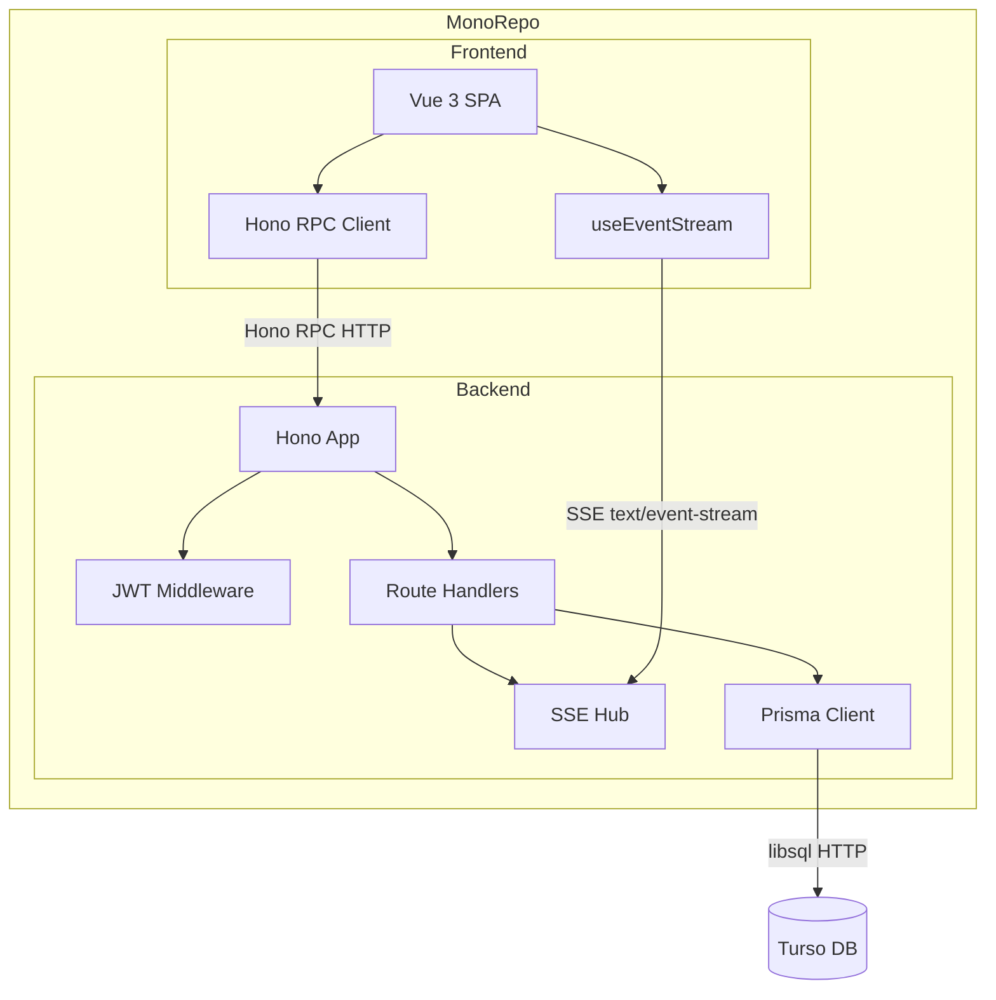
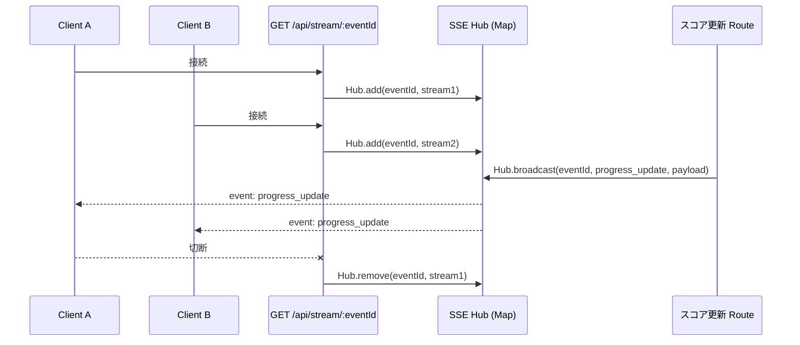
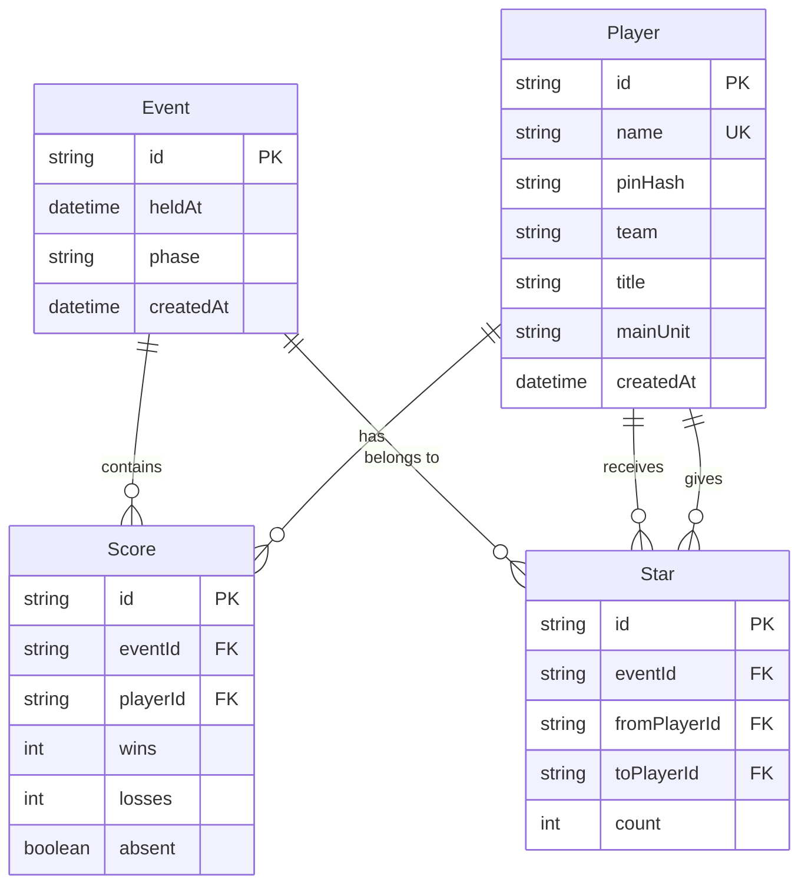

# 技術設計書：Foundation

## Overview

本スペックは「sugamo-exvs-match」の全機能スペックが依存する共通基盤を構築する。モノレポ構成（pnpm workspaces）のもと、TypeScript End-to-End 型安全性を Drizzle スキーマ（TypeScript）→ Hono RPC → Vue SPA の順で貫通させる。

身内12名専用ゆえ、スケーラビリティより**実装シンプルさと筐体前での操作性**を優先する。認証は PIN + JWT（HttpOnly Cookie）、リアルタイム同期は SSE によるインメモリブロードキャストで実現する。

本基盤が確立されることで、大会管理・Star投票・結果発表演出など各機能スペックは型の恩恵を受けながら独立して開発できる。

### Goals

- モノレポ内で TypeScript strict モードを全レイヤーで強制する
- Drizzle スキーマ（TypeScript）の `$inferSelect` / `$inferInsert` を唯一の型ソースとし手書き型定義を排除する
- Hono RPC により API 型をフロントエンドへ自動伝播させる
- SSE インフラで全クライアントのリアルタイム同期を実現する
- ダークテーマ・スマートフォン縦画面に最適化した Vue SPA 骨格を提供する

### Non-Goals

- 大会作成・成績入力・Star投票・結果発表演出の詳細実装
- 複数サーバーインスタンスへのスケールアウト対応
- PC レイアウト対応
- 厳密なトークンリフレッシュ・失効管理

---

## Boundary Commitments

### This Spec Owns

- モノレポディレクトリ構成・ルートスクリプト・TypeScript/ESLint 設定
- `backend/prisma/schema.prisma`（全モデル定義）
- PIN 認証エンドポイント（`POST /api/auth/login`）と JWT 発行・検証ミドルウェア
- Hono アプリエントリポイント・ルート分割骨格・`AppType` export
- SSE エンドポイント（`GET /api/stream/events/:eventId`）とブロードキャスト基盤
- Vue SPA エントリポイント・Tailwind テーマ設定・`AppLayout.vue`・`BottomNav.vue`
- Hono RPC クライアント初期化モジュール（`frontend/src/api/client.ts`）
- `useEventStream.ts` composable（SSE 受信 → リアクティブ状態変換）

### Out of Boundary

- 各ドメインルートの詳細実装（スコア入力、Star 投票ロジック等）
- プレイヤー登録・PIN 変更フロー
- 結果発表演出コンポーネント

### Allowed Dependencies

- pnpm workspaces（ルートパッケージマネージャ）
- Turso（外部マネージド DB サービス）
- Railway（ホスティング・CI/CD）

### Revalidation Triggers

- `AppType` の形状変更（ルート追加・削除・シグネチャ変更）
- Prisma スキーマモデル変更（フィールド追加・型変更）
- SSE イベント名・ペイロード構造の変更
- JWT ペイロード構造の変更

---

## Architecture

### Architecture Pattern & Boundary Map



**Architecture Integration**:
- **パターン**: Layered Architecture（UI → API → Service → DB）
- **型の流れ**: `db/schema.ts` → Drizzle `$inferSelect` 型 → Hono ルート → `AppType` → `hc<AppType>()` → Vue
- **ステートレス認証**: JWT を HttpOnly Cookie に格納。サーバー側ストア不要
- **SSE チャネル**: `Map<eventId, Set<SSEStreamingApi>>` をモジュールスコープで管理（インメモリ）

### Technology Stack

| Layer | Choice / Version | Role | Notes |
|-------|-----------------|------|-------|
| Frontend | Vue 3 + Vite + TypeScript | SPA + ビルドツール | Composition API 使用 |
| Styling | Tailwind CSS v3 | ダークテーマ・カスタムカラー | `tailwind.config.ts` で一元管理 |
| Backend | Hono | API サーバー・RPC | Node.js ランタイム on Railway |
| ORM | Drizzle ORM | DB アクセス・型推論 | `drizzle-orm/libsql` でネイティブ Turso 対応 |
| DB | Turso (libSQL) | Edge SQLite | `@libsql/client` 経由 |
| Auth | Hono JWT ミドルウェア + bcryptjs | PIN ハッシュ・JWT 発行検証 | HS256、HttpOnly Cookie |
| Realtime | Hono streamSSE | SSE ブロードキャスト | インメモリ Map |
| Package Mgr | pnpm workspaces | モノレポ管理 | |
| Hosting | Railway（API）+ Vercel（SPA）| デプロイ・実行環境 | `Procfile`（Railway）+ Vercel CLI |

---

## File Structure Plan

### Directory Structure

```
sugamo-exvs-match/
├── package.json              # ルートスクリプト (dev / build / lint)
├── pnpm-workspace.yaml       # workspaces: [frontend, backend]
├── backend/
│   ├── package.json
│   ├── tsconfig.json         # composite: true, strict: true
│   ├── drizzle.config.ts     # Drizzle Kit 設定（dialect: turso）
│   ├── Procfile              # Railway 起動設定
│   └── src/
│       ├── index.ts          # Hono アプリ エントリ、AppType export
│       ├── db/
│       │   ├── schema.ts     # 全テーブル定義（型ソース）
│       │   ├── client.ts     # Drizzle クライアントシングルトン
│       │   └── migrations/   # drizzle-kit generate 出力
│       ├── lib/
│       │   └── jwt.ts        # sign / verify ヘルパー
│       ├── middleware/
│       │   └── auth.ts       # JWT 検証ミドルウェア
│       └── routes/
│           ├── auth.ts       # POST /api/auth/login, POST /api/auth/logout
│           ├── players.ts    # GET /api/players（認証不要）
│           ├── events.ts     # 大会 CRUD 骨格
│           ├── scores.ts     # スコア 骨格
│           ├── stars.ts      # Star 骨格
│           └── stream.ts     # GET /api/stream/events/:eventId + SSE Hub
└── frontend/
    ├── package.json
    ├── tsconfig.json         # references backend, strict: true
    ├── vite.config.ts        # @/ alias
    ├── tailwind.config.ts    # カスタムカラー定義
    └── src/
        ├── main.ts           # エントリポイント
        ├── App.vue
        ├── api/
        │   └── client.ts     # hc<AppType> 初期化
        ├── composables/
        │   └── useEventStream.ts  # SSE → Vue reactive
        └── components/
            ├── AppLayout.vue      # 共通レイアウト
            └── BottomNav.vue      # ボトムナビゲーション
```

### Modified Files

- 新規プロジェクトのため既存ファイルの変更なし

---

## System Flows

### 認証フロー

```mermaid
sequenceDiagram
    participant C as Vue SPA
    participant A as POST /api/auth/login
    participant DB as Prisma / Turso

    C->>A: { playerName, pin }
    A->>DB: findUnique(name)
    DB-->>A: Player | null
    alt Player not found
        A-->>C: 401 { error: "Invalid credentials" }
    else PIN hash mismatch
        A-->>C: 401 { error: "Invalid credentials" }
    else OK
        A->>A: sign JWT { sub: playerId, name }
        A-->>C: 200 + Set-Cookie: token=<JWT>; HttpOnly
    end
```

### SSE ブロードキャストフロー



---

## Requirements Traceability

| 要件 | 概要 | コンポーネント | インターフェース | フロー |
|------|------|--------------|----------------|------|
| 1.1 | モノレポ構成 | MonorepoConfig | pnpm-workspace.yaml | — |
| 1.2 | TypeScript strict | TSConfig | tsconfig.json (両 WS) | — |
| 1.3 | no-explicit-any ESLint | ESLintConfig | .eslintrc | — |
| 1.4 | スコープ内インストール | MonorepoConfig | pnpm workspaces | — |
| 1.5 | ルートスクリプト | MonorepoConfig | root package.json | — |
| 2.1 | Drizzle テーブル定義 | DrizzleSchema | schema.ts | — |
| 2.2 | players テーブル | DrizzleSchema | Player 型 | — |
| 2.3 | events テーブル | DrizzleSchema | Event 型 | — |
| 2.4 | scores テーブル | DrizzleSchema | Score 型 | — |
| 2.5 | stars テーブル | DrizzleSchema | Star 型 | — |
| 2.6 | drizzle-kit migrate | DrizzleSchema | マイグレーション | — |
| 2.7 | Drizzle クライアント | DrizzleClient | client.ts | — |
| 3.1 | PIN ハッシュ認証 | AuthRoute | POST /api/auth/login | 認証フロー |
| 3.2 | JWT 発行 | JwtHelper | sign() | 認証フロー |
| 3.3 | 401 エラー | AuthRoute | ErrorResponse 型 | 認証フロー |
| 3.4 | 保護ルート | AuthMiddleware | jwt() MW | — |
| 3.5 | 失効 JWT 拒否 | AuthMiddleware | jwt() MW | — |
| 3.6 | PIN 平文保存禁止 | AuthRoute | bcryptjs | — |
| 3.7 | GET /api/players 認証不要 | PlayersRoute | API Contract | — |
| 4.1 | Hono エントリ | HonoApp | index.ts | — |
| 4.2 | ルート分割 | RouteHandlers | routes/ | — |
| 4.3 | AppType export | HonoApp | AppType | — |
| 4.4 | 認証ガード | AuthMiddleware | auth.ts MW | — |
| 4.5 | バリデーション 400 | RouteHandlers | zValidator | — |
| 4.6 | Railway デプロイ設定 | DeployConfig | Procfile | — |
| 5.1 | SSE エンドポイント | SSEHub | GET /api/stream/events/:id | SSE フロー |
| 5.2 | text/event-stream | SSEHub | streamSSE | SSE フロー |
| 5.3 | イベント型定義 | SSEEventTypes | SSEEvent 型 | SSE フロー |
| 5.4 | progress_update | SSEHub | broadcast() | SSE フロー |
| 5.5 | result_ready | SSEHub | broadcast() | SSE フロー |
| 5.6 | phase_update | SSEHub | broadcast() | SSE フロー |
| 5.7 | 切断時クリーンアップ | SSEHub | Hub.remove() | SSE フロー |
| 6.1 | Vue 3 + Vite | VueSPA | main.ts | — |
| 6.2 | Tailwind カスタムカラー | TailwindConfig | tailwind.config.ts | — |
| 6.3 | ダークテーマ固定 | TailwindConfig | index.html | — |
| 6.4 | AppLayout.vue | AppLayout | コンポーネント Props | — |
| 6.5 | BottomNav.vue | BottomNav | コンポーネント Props | — |
| 6.6 | Hono RPC クライアント | ApiClient | client.ts | — |
| 6.7 | useEventStream | EventStreamComposable | useEventStream | SSE フロー |
| 6.8 | @/ パスエイリアス | ViteConfig | vite.config.ts | — |

---

## Components and Interfaces

### コンポーネント一覧

| コンポーネント | Layer | Intent | 要件カバレッジ | 主要依存 (P0/P1) | Contracts |
|------------|-------|--------|-------------|-----------------|-----------|
| MonorepoConfig | Infra | pnpm workspaces + ルートスクリプト | 1.1–1.5 | pnpm (P0) | — |
| DrizzleSchema | Data | 全テーブル定義（型ソース） | 2.1–2.6 | Turso (P0), Drizzle ORM (P0) | State |
| DrizzleClient | Data | DB アクセスシングルトン | 2.7 | DrizzleSchema (P0) | Service |
| AuthRoute | API | PIN 検証 + JWT 発行 | 3.1–3.7 | PrismaClient (P0), JwtHelper (P0), bcryptjs (P0) | API |
| JwtHelper | Lib | JWT sign / verify | 3.2, 3.4, 3.5 | Hono JWT (P0) | Service |
| AuthMiddleware | MW | 保護ルートのトークン検証 | 3.4, 3.5 | JwtHelper (P0) | — |
| HonoApp | API | アプリエントリ + AppType export | 4.1–4.6 | 全 Routes (P0) | API |
| RouteHandlers | API | 各ドメインルート骨格 | 4.2, 4.5 | PrismaClient (P0), AuthMiddleware (P1) | API |
| SSEHub | Realtime | イベント管理 + ブロードキャスト | 5.1–5.7 | Hono streamSSE (P0) | Event |
| ApiClient | Frontend | Hono RPC クライアント初期化 | 6.6 | HonoApp AppType (P0) | Service |
| EventStreamComposable | Frontend | SSE 受信 → Vue reactive | 6.7 | SSEHub (P0) | State |
| VueSPA | Frontend | SPA エントリ + ルーティング骨格 | 6.1, 6.8 | Vue Router (P0) | — |
| AppLayout | UI | 共通レイアウトシェル | 6.4 | BottomNav (P1) | — |
| BottomNav | UI | タブナビゲーション | 6.5 | Vue Router (P0) | — |
| TailwindConfig | Infra | テーマ・カラーパレット | 6.2, 6.3 | Tailwind CSS (P0) | — |

---

### Backend / Data Layer

#### DrizzleSchema（`backend/src/db/schema.ts`）

| Field | Detail |
|-------|--------|
| Intent | 全テーブル定義と型推論の唯一のソース |
| Requirements | 2.1, 2.2, 2.3, 2.4, 2.5, 2.6 |

**Responsibilities & Constraints**
- `backend/src/db/schema.ts` が唯一のスキーマ定義場所
- `$inferSelect` / `$inferInsert` 型を他コンポーネントへ export
- `fromPlayerId != toPlayerId` 制約はアプリ層（stars ルート）で強制

**Contracts**: State [x]

##### State Management

```typescript
// backend/src/db/schema.ts
import { sqliteTable, text, integer } from 'drizzle-orm/sqlite-core'

export const players = sqliteTable('players', {
  id: text('id').primaryKey(),
  name: text('name').notNull().unique(),
  pinHash: text('pin_hash').notNull(),
  team: text('team', { enum: ['FIRST', 'SECOND'] }).notNull(),
  title: text('title'),
  mainUnit: text('main_unit'),
  createdAt: integer('created_at', { mode: 'timestamp' }).notNull(),
})

export const events = sqliteTable('events', {
  id: text('id').primaryKey(),
  heldAt: integer('held_at', { mode: 'timestamp' }).notNull(),
  phase: text('phase', { enum: ['COLLECTING', 'REVEALING', 'DONE'] }).notNull(),
  createdAt: integer('created_at', { mode: 'timestamp' }).notNull(),
})

export const scores = sqliteTable('scores', {
  id: text('id').primaryKey(),
  eventId: text('event_id').notNull().references(() => events.id),
  playerId: text('player_id').notNull().references(() => players.id),
  wins: integer('wins').notNull().default(0),
  losses: integer('losses').notNull().default(0),
  absent: integer('absent', { mode: 'boolean' }).notNull().default(false),
})

export const stars = sqliteTable('stars', {
  id: text('id').primaryKey(),
  eventId: text('event_id').notNull().references(() => events.id),
  fromPlayerId: text('from_player_id').notNull().references(() => players.id),
  toPlayerId: text('to_player_id').notNull().references(() => players.id),
  count: integer('count').notNull(),
})

// 型エクスポート
export type Player = typeof players.$inferSelect
export type Event = typeof events.$inferSelect
export type Score = typeof scores.$inferSelect
export type Star = typeof stars.$inferSelect
```

- **Persistence**: Turso (libSQL) via `@libsql/client`
- **Consistency**: `scores` は `(eventId, playerId)` に Unique 制約を追加
- **Concurrency**: 単一サーバーインスタンスのため楽観的ロックは不要

**Implementation Notes**
- Migration: `drizzle-kit generate` で SQL ファイル生成 → `drizzle-kit migrate` で Turso に直接適用（ローカル SQLite 不要）
- `drizzle.config.ts` に `dialect: 'turso'`・`dbCredentials: { url, authToken }` を設定

---

#### DrizzleClient（`backend/src/db/client.ts`）

| Field | Detail |
|-------|--------|
| Intent | Drizzle クライアントシングルトン |
| Requirements | 2.7 |

**Contracts**: Service [x]

##### Service Interface

```typescript
// backend/src/db/client.ts
import { drizzle } from 'drizzle-orm/libsql'
import { createClient } from '@libsql/client'
import * as schema from './schema'

const client = createClient({
  url: process.env.TURSO_DATABASE_URL!,
  authToken: process.env.TURSO_AUTH_TOKEN,
})

export const db = drizzle(client, { schema })
```

- Preconditions: `TURSO_DATABASE_URL` 環境変数が設定されていること
- Postconditions: モジュール初回 import 時に接続確立
- Invariants: アプリ全体でシングルトンを共有

---

### Backend / Auth Layer

#### JwtHelper（`backend/src/lib/jwt.ts`）

| Field | Detail |
|-------|--------|
| Intent | JWT の署名・検証ラッパー |
| Requirements | 3.2, 3.4, 3.5 |

**Contracts**: Service [x]

##### Service Interface

```typescript
export interface JwtPayload {
  sub: string    // Player.id
  name: string   // Player.name
  iat?: number
  exp?: number
}

export interface JwtHelper {
  sign(payload: Omit<JwtPayload, 'iat' | 'exp'>): Promise<string>
  verify(token: string): Promise<JwtPayload>
}
```

- Preconditions: `JWT_SECRET` 環境変数が設定されていること
- Postconditions: `sign` は HS256 署名 JWT を返す。`verify` は改ざん・失効を検証
- Invariants: 有効期限 24 時間

---

#### AuthRoute（`backend/src/routes/auth.ts`）

| Field | Detail |
|-------|--------|
| Intent | PIN 検証 + JWT 発行・ログアウト |
| Requirements | 3.1, 3.2, 3.3, 3.6, 3.7 |

**Contracts**: API [x]

##### API Contract

| Method | Endpoint | Request | Response | Errors |
|--------|----------|---------|----------|--------|
| POST | /api/auth/login | `{ playerName: string, pin: string }` | `{ playerId: string, name: string }` + Cookie | 400, 401 |
| POST | /api/auth/logout | — | `{ ok: true }` + Cookie clear | — |

**Implementation Notes**
- Validation: `zValidator('json', loginSchema)` で playerName・pin（4 桁数字）を検証
- PIN 比較: `bcryptjs.compare(pin, player.pinHash)`
- Cookie: `sameSite: 'lax'`, `httpOnly: true`, `secure: 本番 true`

---

#### AuthMiddleware（`backend/src/middleware/auth.ts`）

| Field | Detail |
|-------|--------|
| Intent | 保護ルートへの JWT 検証ガード |
| Requirements | 3.4, 3.5 |

**Contracts**: Service [x]

##### Service Interface

```typescript
// Hono middleware — 検証成功時に c.set('jwtPayload', payload) をセット
export const authMiddleware: MiddlewareHandler = async (c, next) => {
  // Cookie から token 取得 → verify → c.set → next()
  // 失敗時: c.json({ error: 'Unauthorized' }, 401)
}
```

---

### Backend / API Layer

#### HonoApp（`backend/src/index.ts`）

| Field | Detail |
|-------|--------|
| Intent | Hono アプリのルート統合と `AppType` の export |
| Requirements | 4.1, 4.2, 4.3, 4.6 |

**Contracts**: API [x]

##### Service Interface

```typescript
const app = new Hono()
  .route('/api/auth', authRoute)
  .route('/api/players', playersRoute)
  .route('/api/events', eventsRoute)
  .route('/api/scores', scoresRoute)
  .route('/api/stars', starsRoute)
  .route('/api/stream', streamRoute)

export type AppType = typeof app
export default app
```

---

#### SSEHub（`backend/src/routes/stream.ts`）

| Field | Detail |
|-------|--------|
| Intent | SSE 接続管理とイベントブロードキャスト |
| Requirements | 5.1, 5.2, 5.3, 5.4, 5.5, 5.6, 5.7 |

**Contracts**: API [x] Event [x]

##### API Contract

| Method | Endpoint | Request | Response | Errors |
|--------|----------|---------|----------|--------|
| GET | /api/stream/events/:eventId | — | `text/event-stream` | 401 |

##### Event Contract

```typescript
export type SSEEventType = 'progress_update' | 'result_ready' | 'phase_update' | 'ping'

export interface ProgressUpdatePayload {
  completedCount: number
  totalCount: number
}

export interface ResultReadyPayload {
  eventId: string
}

export interface PhaseUpdatePayload {
  phase: 'COLLECTING' | 'REVEALING' | 'DONE'
}

export type SSEEventPayload =
  | { event: 'progress_update'; data: ProgressUpdatePayload }
  | { event: 'result_ready';    data: ResultReadyPayload }
  | { event: 'phase_update';    data: PhaseUpdatePayload }
  | { event: 'ping';            data: Record<string, never> }
```

- Published events: `progress_update`, `result_ready`, `phase_update`, `ping`
- Subscribed events: なし（外部ルートから `broadcast()` を呼ぶ）
- Ordering / delivery guarantees: ベストエフォート。切断時は再接続で最新状態を取得

##### Service Interface（Hub）

```typescript
export interface SSEHub {
  add(eventId: string, stream: SSEStreamingApi): void
  remove(eventId: string, stream: SSEStreamingApi): void
  broadcast(eventId: string, payload: SSEEventPayload): Promise<void>
}
```

**Implementation Notes**
- Connection: `streamSSE(c, async (stream) => { ... })` を使用。切断検知は `c.req.raw.signal.addEventListener('abort', ...)`
- Keepalive: 30 秒間隔で `ping` イベントを送信し Railway のタイムアウトを回避
- Risk: インメモリ管理のためサーバー再起動で全接続リセット。クライアントは `EventSource` の自動再接続に依存

---

### Frontend Layer

#### ApiClient（`frontend/src/api/client.ts`）

| Field | Detail |
|-------|--------|
| Intent | Hono RPC クライアントの初期化・提供 |
| Requirements | 6.6 |

**Contracts**: Service [x]

##### Service Interface

```typescript
import { hc } from 'hono/client'
import type { AppType } from '../../../backend/src/index'

export const client = hc<AppType>(import.meta.env.VITE_API_BASE_URL ?? '/')

export type ApiClient = typeof client
```

- Preconditions: バックエンドの `AppType` が TypeScript Project References 経由で解決されること
- Postconditions: 全APIコールがレスポンス型推論付きで利用可能

---

#### EventStreamComposable（`frontend/src/composables/useEventStream.ts`）

| Field | Detail |
|-------|--------|
| Intent | SSE 接続管理と受信イベントの Vue リアクティブ変換 |
| Requirements | 6.7 |

**Contracts**: State [x]

##### State Management

```typescript
export interface UseEventStreamReturn {
  progressUpdate: Readonly<Ref<ProgressUpdatePayload | null>>
  resultReady: Readonly<Ref<boolean>>
  currentPhase: Readonly<Ref<PhaseUpdatePayload['phase'] | null>>
  isConnected: Readonly<Ref<boolean>>
  connect(eventId: string): void
  disconnect(): void
}
```

- State model: `ref` で各イベント種別の最新値を保持
- Persistence: メモリのみ（ページリロードで初期化）
- Concurrency: `EventSource` の自動再接続で SSE の切断を復旧

**Implementation Notes**
- `onUnmounted` で `disconnect()` を呼び EventSource をクリーンアップ
- `ping` イベントは無視

---

### Frontend / UI Layer

#### AppLayout（`frontend/src/components/AppLayout.vue`）・BottomNav（`frontend/src/components/BottomNav.vue`）

| Field | Detail |
|-------|--------|
| Intent | スマートフォン縦画面向け共通レイアウトとタブナビゲーション |
| Requirements | 6.4, 6.5 |

**Responsibilities & Constraints**
- `AppLayout.vue` は `<slot>` で画面コンテンツを受け取り、下部に `BottomNav.vue` を配置
- `BottomNav.vue` は Vue Router の `<RouterLink>` を使用。現在ルートを `router.currentRoute` で判定しアクティブ表示
- 375px〜430px 幅を基準。画面幅 > 430px はコンテナ中央揃えのみ

**Implementation Notes**（Summary-only）
- `html.dark` クラスを `index.html` に固定し Tailwind dark variant を有効化
- Tailwind カスタムカラー（`base-900/800/600/accent`）を `tailwind.config.ts` で定義

---

## Data Models

### Domain Model



### Logical Data Model

- **Player**: `team` は `FIRST | SECOND` の文字列 enum（Prisma `@map` で管理）
- **Event**: `phase` は `COLLECTING | REVEALING | DONE` の文字列 enum
- **Score**: `(eventId, playerId)` に Unique 制約。`absent: true` 時は `wins`・`losses` を 0 固定
- **Star**: `count` は 1〜3 の整数。`fromPlayerId != toPlayerId` はアプリ層で強制

### Data Contracts & Integration

**認証レスポンス**

```typescript
export interface LoginResponse {
  playerId: string
  name: string
}

export interface ErrorResponse {
  error: string
}
```

---

## Error Handling

### Error Categories and Responses

| Category | Status | 例 | 対応 |
|---------|--------|-----|------|
| バリデーション | 400 | PIN 形式不正 | `zValidator` が自動返却 |
| 認証失敗 | 401 | PIN 不一致・JWT 失効 | `{ error: "Invalid credentials" }` |
| 未認証アクセス | 401 | 保護ルートへの未認証リクエスト | `{ error: "Unauthorized" }` |
| サーバーエラー | 500 | DB 接続失敗 | ログ出力 + `{ error: "Internal Server Error" }` |

### Monitoring

- Railway のログ機能でサーバーエラーを確認
- SSE 接続数を起動時に `console.info` で出力（デバッグ用）

---

## Testing Strategy

### Unit Tests

- `JwtHelper.sign()` / `verify()` — 正常・失効・改ざんトークン
- `AuthRoute` — bcrypt 比較成功・失敗ケース
- `SSEHub.broadcast()` — 接続中クライアントへの配信、切断済みクライアントのスキップ
- `useEventStream` — イベント受信時のリアクティブ状態更新

### Integration Tests

- `POST /api/auth/login` — 正常ログイン → Cookie 付与
- `POST /api/auth/login` — 不正 PIN → 401
- 保護ルートへの認証なしアクセス → 401
- SSE エンドポイント接続 → イベント受信

### E2E Tests

- ログイン画面でプレイヤー選択 + PIN 入力 → ホーム遷移
- 認証切れ状態で保護画面アクセス → ログイン画面リダイレクト

---

## Security Considerations

- PIN は `bcryptjs`（saltRounds: 10）でハッシュ化して保存。平文保存禁止
- JWT は `HttpOnly; SameSite=Lax; Secure（本番）` Cookie に格納。XSS でのトークン窃取を防止
- `GET /api/players` のみ認証不要（ログイン画面用）。その他全エンドポイントは `authMiddleware` を適用
- 自己投票禁止（`fromPlayerId != toPlayerId`）は Star 保存ルートのサービス層で検証

---

## Supporting References

詳細な調査ノートは [research.md](./research.md) を参照。

- Hono RPC ドキュメント: https://hono.dev/docs/guides/rpc
- Turso + Prisma セットアップ: https://docs.turso.tech/sdk/ts/orm/prisma
- Hono Streaming Helper: https://hono.dev/docs/helpers/streaming
- Hono JWT Middleware: https://hono.dev/docs/middleware/builtin/jwt
