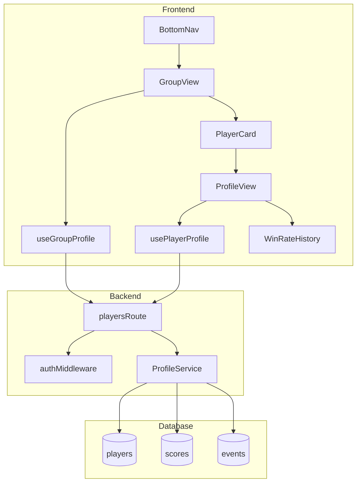
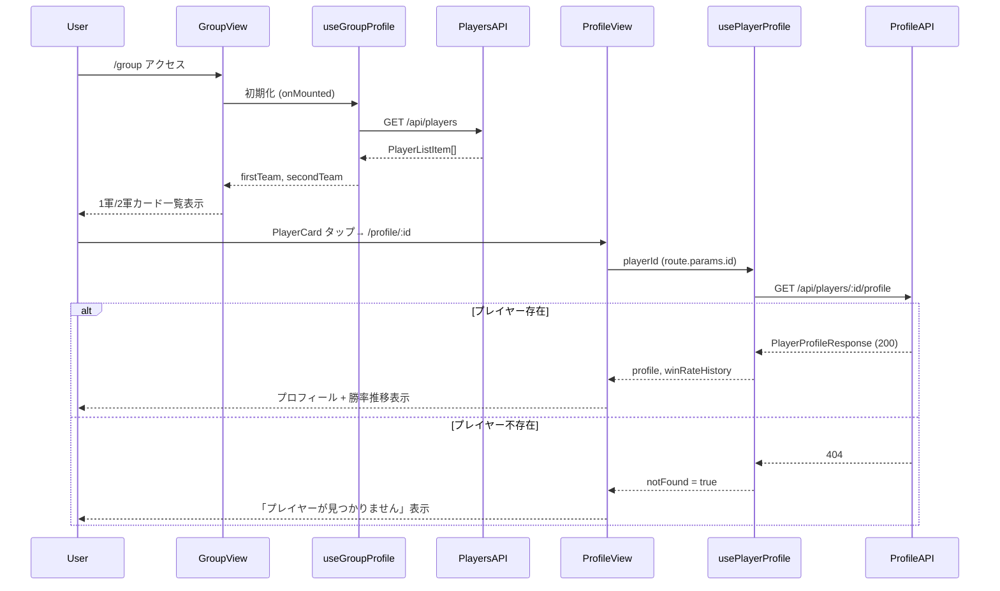

# テクニカルデザイン: group-profile

## Overview

本フィーチャーは、月例下剋上決定戦管理アプリにおける1軍（FIRST TEAM）・2軍（SECOND TEAM）のプレイヤー一覧表示と、各プレイヤーの個人プロフィール（称号・主使用機体・直近5回の勝率推移）閲覧機能を提供する。既存の `players`・`scores`・`events` テーブルをそのまま活用し、DBスキーマ変更なしで実現する。

**ユーザー**: 全プレイヤーが対象。ゲームセンターでの大会後やゲーム外での日常的なメンバー確認に利用する。

**影響**: 既存の `GET /api/players` エンドポイントに認証ガードを追加し、`/profile` ルートを動的な `/profile/:id` に変更する。

### Goals

- 1軍・2軍別のプレイヤー一覧画面を実装する
- プレイヤーごとの個人プロフィール画面（称号・主使用機体・勝率推移）を実装する
- `GET /api/players/:id/profile` エンドポイントを新設し、Hono RPC で型安全に共有する
- 既存 `GET /api/players` に認証ガードを追加する（他ルートとの一貫性）

### Non-Goals

- チーム所属の変更・昇格/降格処理（`result-reveal` スペック担当）
- 称号・主使用機体の管理者による編集
- リアルタイム更新（SSE不要、ページ表示時の1回取得のみ）
- PCレイアウト対応

---

## Boundary Commitments

### This Spec Owns

- `GET /api/players` エンドポイントへの認証ガード追加
- `GET /api/players/:id/profile` エンドポイントの新設（レスポンス型定義含む）
- `ProfileService`（勝率推移計算ビジネスロジック）
- `useGroupProfile`・`usePlayerProfile` composable
- `GroupView.vue`・`ProfileView.vue` の本実装（スタブから移行）
- `PlayerCard.vue`・`WinRateHistory.vue` UIコンポーネントの新設
- ルーター `/profile` → `/profile/:id` の変更および BottomNav の動的化

### Out of Boundary

- `players` テーブルのスキーマ変更（不要）
- チーム変更・昇格/降格のロジックおよびUI
- 称号・主使用機体の編集フォーム
- Star投票の集計・表示（`star-voting` スペック担当）

### Allowed Dependencies

- 既存 `players`・`scores`・`events` テーブル（読み取り専用）
- `authMiddleware`（Cookie JWT認証）
- `useAuth` composable（`currentPlayer.value?.playerId` 参照）
- Hono RPC クライアント（`hc<AppType>`）
- Drizzle ORM（`drizzle-orm/libsql`）

### Revalidation Triggers

- `players` テーブルのカラム追加・変更時
- `scores` テーブルの `submitted`・`absent`・`wins`・`losses` カラムのセマンティクス変更時
- `authMiddleware` の認証方式変更時
- ルーター構造の変更時（他スペックによる `/profile` パターン利用）

---

## Architecture

### Existing Architecture Analysis

- `playersRoute`（`backend/src/routes/players.ts`）が `GET /api/players` を提供するが認証ガード未適用。
- `frontend/src/views/GroupView.vue` と `ProfileView.vue` は title のみのスタブ。
- フロントエンドルーター `/profile` は静的パスで、プレイヤーIDパラメータを持たない。
- 既存サービス層（`score-service.ts`・`event-service.ts`）はオブジェクトリテラル形式のパターンが確立。

### Architecture Pattern & Boundary Map



**依存方向**: Database → ProfileService → playersRoute → composable → View/Component。上位レイヤーから下位レイヤーへの依存のみ許可。

### Technology Stack

| レイヤー | 選択 | 役割 | 備考 |
|---|---|---|---|
| Frontend / View | Vue 3 (Composition API) | GroupView・ProfileView 実装 | 既存スタブを本実装へ |
| Frontend / UI | Tailwind CSS | ダークテーマ・バー表示 | 外部グラフライブラリ不使用 |
| Frontend / State | composable (`useGroupProfile`, `usePlayerProfile`) | データ取得・リアクティブ状態管理 | 既存 composable パターン踏襲 |
| Frontend / API | Hono RPC Client (`hc<AppType>`) | 型安全なAPIコール | `client.api.players[':id'].profile.$get()` |
| Backend / Route | Hono | エンドポイント提供・認証ガード | `playersRoute` 拡張 |
| Backend / Service | TypeScript オブジェクト | `ProfileService`（勝率計算） | 既存サービスパターン踏襲 |
| Data | Drizzle ORM (`drizzle-orm/libsql`) | Turso SQLite アクセス | JOIN・ORDER BY・LIMIT 利用 |
| Infrastructure | Railway (backend) / Vercel (frontend) | デプロイ | 変更なし |

---

## File Structure Plan

### Directory Structure

```
backend/src/
├── routes/
│   └── players.ts              # authMiddleware 追加 + GET /:id/profile 追加
├── services/
│   └── profile-service.ts      # 新規: ProfileService (getProfile 実装)
└── __tests__/
    ├── profile-service.test.ts # 新規: ProfileService ユニットテスト
    └── players-route.test.ts   # 更新: /:id/profile エンドポイントテスト追加

frontend/src/
├── views/
│   ├── GroupView.vue           # スタブから本実装へ
│   └── ProfileView.vue         # スタブから本実装へ（:id パラメータ対応）
├── composables/
│   ├── useGroupProfile.ts      # 新規
│   └── usePlayerProfile.ts     # 新規
├── components/
│   └── group/
│       ├── PlayerCard.vue      # 新規
│       └── WinRateHistory.vue  # 新規
└── router/
    └── index.ts                # /profile → /profile/:id
```

### Modified Files

- `backend/src/routes/players.ts` — `authMiddleware` を `use('/*', ...)` で追加、`GET /:id/profile` を追加
- `frontend/src/router/index.ts` — `/profile` ルートを `/profile/:id` に変更
- `frontend/src/components/BottomNav.vue` — プロフィールタブを `currentPlayer.value?.playerId` で動的リンク化

---

## System Flows

### グループ一覧→プロフィール遷移フロー



**ゲーティング条件**: `authMiddleware` が Cookie の JWT を検証し、無効な場合は 401 を返す。フロントエンドのルーターガードが認証前のアクセスを `/login` へリダイレクトするため、認証済みユーザーのみフローに到達する。

---

## Requirements Traceability

| 要件ID | 概要 | コンポーネント | インターフェース | フロー |
|---|---|---|---|---|
| 1.1 | グループ一覧APIからプレイヤー取得・表示 | GroupView, useGroupProfile | GET /api/players | グループ一覧フロー |
| 1.2 | 1軍/2軍セクション別表示 | GroupView | — | — |
| 1.3 | 名前・称号・主使用機体を一覧表示 | PlayerCard | — | — |
| 1.4 | プレイヤータップでプロフィール遷移 | PlayerCard | Router /profile/:id | グループ→プロフィールフロー |
| 1.5 | データ取得失敗時エラーメッセージ表示 | GroupView, useGroupProfile | — | — |
| 2.1 | プロフィール画面でプレイヤー詳細表示 | ProfileView, usePlayerProfile | GET /api/players/:id/profile | プロフィールフロー |
| 2.2 | 直近5回勝率推移データ取得・表示 | WinRateHistory, ProfileService | ProfileService.getProfile | — |
| 2.3 | ローディングインジケーター表示 | ProfileView, usePlayerProfile | isLoading state | — |
| 2.4 | 称号未設定時「未設定」表示 | PlayerCard, ProfileView | — | — |
| 2.5 | 主使用機体未設定時「未設定」表示 | PlayerCard, ProfileView | — | — |
| 2.6 | 存在しないプレイヤーIDで404画面表示 | ProfileView, usePlayerProfile | 404 response / notFound state | プロフィールフロー |
| 3.1 | submitted=true・heldAt降順5件取得 | ProfileService | ProfileService.getProfile | — |
| 3.2 | 勝率 wins÷(wins+losses)・小数点1桁% | ProfileService | WinRateEntry.winRate | — |
| 3.3 | absent時は勝率除外・「欠席」表示 | ProfileService, WinRateHistory | WinRateEntry (absent: true) | — |
| 3.4 | 5回未満の場合は実際の件数のみ | ProfileService | winRateHistory.length ≤ 5 | — |
| 3.5 | 勝率推移をグラフ/リスト形式で表示 | WinRateHistory | — | — |
| 4.1 | GET /api/players で全プレイヤー返却 | playersRoute | GET /api/players | — |
| 4.2 | GET /api/players/:id/profile で個人プロフィール返却 | playersRoute, ProfileService | GET /api/players/:id/profile | — |
| 4.3 | Hono RPC で型安全に共有 | playersRoute, api/client.ts | AppType | — |
| 4.4 | 存在しないIDで HTTP 404 返却 | playersRoute, ProfileService | 404 | — |
| 4.5 | 認証ガード適用 | authMiddleware | Cookie JWT | — |
| 5.1 | スマートフォン縦画面最適化レイアウト | GroupView, ProfileView | max-w-[430px] | — |
| 5.2 | ダークテーマ適用 | PlayerCard, WinRateHistory, ProfileView | bg-dark / bg-main / accent | — |
| 5.3 | BottomNavからグループ一覧へのアクセス | BottomNav | Router /group | — |
| 5.4 | 1軍/2軍チームバッジ表示 | PlayerCard | team prop | — |

---

## Components and Interfaces

### Summary

| コンポーネント | ドメイン/レイヤー | 役割 | 要件カバレッジ | 主要依存 (優先度) | コントラクト |
|---|---|---|---|---|---|
| ProfileService | Backend/Service | プロフィール取得・勝率計算 | 3.1-3.4, 4.2, 4.4 | Drizzle ORM (P0) | Service |
| playersRoute | Backend/Route | APIエンドポイント + 認証ガード | 4.1-4.5 | ProfileService (P0), authMiddleware (P0) | API |
| useGroupProfile | Frontend/Composable | グループ一覧データ管理 | 1.1, 1.5 | client.api.players (P0) | State |
| usePlayerProfile | Frontend/Composable | 個人プロフィールデータ管理 | 2.1-2.3, 2.6 | client.api.players[':id'].profile (P0) | State |
| GroupView | Frontend/View | 1軍/2軍一覧画面 | 1.1-1.5, 5.1-5.3 | useGroupProfile (P0), PlayerCard (P0) | — |
| ProfileView | Frontend/View | 個人プロフィール画面 | 2.1-2.6, 5.1-5.2 | usePlayerProfile (P0), WinRateHistory (P0) | — |
| PlayerCard | Frontend/UI | プレイヤーカード表示 | 1.3, 1.4, 2.4, 2.5, 5.2, 5.4 | Router (P0) | — |
| WinRateHistory | Frontend/UI | 勝率推移ビジュアル | 3.3, 3.5 | — | — |

---

### Backend / Route

#### playersRoute（修正）

| Field | Detail |
|---|---|
| Intent | `/api/players` 配下のエンドポイントを提供し、認証ガードを全エンドポイントに適用する |
| Requirements | 4.1, 4.2, 4.3, 4.4, 4.5 |

**Responsibilities & Constraints**
- `GET /` → 全プレイヤー一覧（id, name, team, title, mainUnit, createdAt）を返す（既存機能に認証ガード追加）
- `GET /:id/profile` → `ProfileService.getProfile(id)` を呼び出し、プロフィール＋勝率推移を返す（新規）
- `ProfileService.getProfile()` が `null` を返した場合は HTTP 404 を返す
- `authMiddleware` を `use('/*', authMiddleware)` で全エンドポイントに適用する

**Dependencies**
- Inbound: Hono RPC Client — HTTP リクエスト (P0)
- Outbound: `ProfileService.getProfile()` — プロフィールデータ取得 (P0)
- External: `authMiddleware` — JWT Cookie 認証検証 (P0)

**Contracts**: API [x]

##### API Contract

| Method | Endpoint | Request | Response | Errors |
|---|---|---|---|---|
| GET | /api/players | — | `PlayerListItem[]` | 401 |
| GET | /api/players/:id/profile | path: `id` (string) | `PlayerProfileResponse` | 401, 404 |

---

### Backend / Service

#### ProfileService（新規）

| Field | Detail |
|---|---|
| Intent | プレイヤーの基本情報と直近5回の勝率推移データを計算して返す |
| Requirements | 3.1, 3.2, 3.3, 3.4, 4.2, 4.4 |

**Responsibilities & Constraints**
- `players` テーブルから指定 ID のプレイヤーを1件取得する。存在しない場合は `null` を返す（Req 4.4）
- `scores JOIN events` を `submitted = true` かつ `heldAt` 降順で最大5件取得する（Req 3.1, 3.4）
- `absent = true` のエントリは `{ ..., absent: true }` として返し、winRate を計算しない（Req 3.3）
- `absent = false` かつ `wins + losses > 0` の場合: `winRate = Math.round((wins / (wins + losses)) * 1000) / 10`
- `wins + losses = 0` の場合: `winRate = 0.0`

**Dependencies**
- Inbound: playersRoute — `playerId: string` (P0)
- Outbound: `db` — players, scores, events テーブル (P0)

**Contracts**: Service [x]

##### Service Interface

```typescript
type WinRateEntry =
  | {
      eventId: string
      heldAt: Date
      winRate: number
      wins: number
      losses: number
      absent: false
    }
  | {
      eventId: string
      heldAt: Date
      absent: true
    }

type PlayerProfileResponse = {
  id: string
  name: string
  team: 'FIRST' | 'SECOND'
  title: string | null
  mainUnit: string | null
  winRateHistory: WinRateEntry[]
}

export const profileService: {
  getProfile(playerId: string): Promise<PlayerProfileResponse | null>
}
```

- Preconditions: `playerId` は非空文字列
- Postconditions: `winRateHistory` は最大5件、`heldAt` 降順、`winRate` は 0.0〜100.0
- Invariants: `absent: true` エントリには `winRate`・`wins`・`losses` を含まない

**Implementation Notes**
- Integration: Drizzle の `innerJoin` + `orderBy(desc(events.heldAt))` + `limit(5)` を使用
- Validation: `playerId` の形式チェックはルートハンドラ側に委ねる（Drizzle プリペアードクエリで SQL インジェクション対策済み）
- Risks: `wins + losses = 0` の場合のゼロ除算を `winRate = 0.0` で明示的にハンドリングすること

---

### Frontend / Composable

#### useGroupProfile（新規）

| Field | Detail |
|---|---|
| Intent | グループ一覧データを API から取得し、チーム別に分類してリアクティブに提供する |
| Requirements | 1.1, 1.5 |

**Contracts**: State [x]

##### State Management

```typescript
type PlayerListItem = {
  id: string
  name: string
  team: 'FIRST' | 'SECOND'
  title: string | null
  mainUnit: string | null
  createdAt: string
}

interface UseGroupProfileReturn {
  firstTeam: Readonly<Ref<PlayerListItem[]>>
  secondTeam: Readonly<Ref<PlayerListItem[]>>
  isLoading: Readonly<Ref<boolean>>
  error: Readonly<Ref<string | null>>
  refresh(): Promise<void>
}
```

- State model: `onMounted` 時に `GET /api/players` を呼び出し、`team` フィールドで分類して `firstTeam`・`secondTeam` に格納
- Persistence: なし（ページ表示ごとに取得）
- Concurrency: 重複呼び出し防止のため `isLoading = true` 時は `refresh()` を early return

#### usePlayerProfile（新規）

| Field | Detail |
|---|---|
| Intent | 特定プレイヤーのプロフィールと勝率推移を API から取得して提供する |
| Requirements | 2.1, 2.2, 2.3, 2.6 |

**Contracts**: State [x]

##### State Management

```typescript
interface UsePlayerProfileReturn {
  profile: Readonly<Ref<PlayerProfileResponse | null>>
  isLoading: Readonly<Ref<boolean>>
  error: Readonly<Ref<string | null>>
  notFound: Readonly<Ref<boolean>>
}

export function usePlayerProfile(playerId: Ref<string>): UsePlayerProfileReturn
```

- State model: `watchEffect` または `onMounted` で `playerId` を監視し、変化時に `GET /api/players/:id/profile` を呼び出す
- 404 レスポンス時: `notFound.value = true`、`profile.value = null`
- ProfileView は `notFound = true` の場合に「プレイヤーが見つかりません」画面を表示する

---

### Frontend / View

#### GroupView（スタブ→本実装）

| Field | Detail |
|---|---|
| Intent | 1軍・2軍別のプレイヤーカード一覧画面を表示する |
| Requirements | 1.1, 1.2, 1.3, 1.4, 1.5, 5.1, 5.2, 5.3 |

- `useGroupProfile` を初期化し、`firstTeam`・`secondTeam` を取得
- `isLoading = true` の間はローディングスピナーを表示
- `error` が存在する場合はエラーメッセージを表示
- 2セクション構成: `bg-dark` パネル内に「1軍 FIRST TEAM」「2軍 SECOND TEAM」のラベルと `PlayerCard` 一覧を表示
- 既存の `AppLayout`（`max-w-[430px]`・`pb-16`）を使用

#### ProfileView（スタブ→本実装）

| Field | Detail |
|---|---|
| Intent | 特定プレイヤーの詳細プロフィールと勝率推移画面を表示する |
| Requirements | 2.1, 2.2, 2.3, 2.4, 2.5, 2.6, 5.1, 5.2 |

- `useRoute().params.id` から `playerId` を取得し `usePlayerProfile(playerId)` を初期化
- `isLoading = true` の間はローディングスピナーを表示
- `notFound = true` の場合は「プレイヤーが見つかりません」メッセージと戻るボタンを表示
- プレイヤー情報セクション: 名前・チームバッジ・称号（null → 「未設定」）・主使用機体（null → 「未設定」）
- 勝率推移セクション: `WinRateHistory` コンポーネントに `winRateHistory` を渡す

---

### Frontend / UI Component

#### PlayerCard（新規）

| Field | Detail |
|---|---|
| Intent | プレイヤーカードを表示し、タップでプロフィール画面へ遷移させる |
| Requirements | 1.3, 1.4, 2.4, 2.5, 5.2, 5.4 |

```typescript
interface PlayerCardProps {
  player: {
    id: string
    name: string
    team: 'FIRST' | 'SECOND'
    title: string | null
    mainUnit: string | null
  }
}
```

- `RouterLink` を使用して `/profile/${player.id}` へ遷移（Req 1.4）
- `team === 'FIRST'` → `yellow-400` テキストの「1軍」バッジ、`'SECOND'` → `bg-main` の「2軍」バッジ（Req 5.4）
- `title === null` → 「未設定」（text-gray-400）で表示（Req 2.4）
- `mainUnit === null` → 「未設定」（text-gray-400）で表示（Req 2.5）
- カード背景: `bg-dark`、ボーダー: `border-main`

#### WinRateHistory（新規）

| Field | Detail |
|---|---|
| Intent | 直近5回の勝率推移をリスト形式で視覚的に表示する |
| Requirements | 3.3, 3.5 |

```typescript
type WinRateEntry =
  | { eventId: string; heldAt: string; winRate: number; wins: number; losses: number; absent: false }
  | { eventId: string; heldAt: string; absent: true }

interface WinRateHistoryProps {
  history: WinRateEntry[]
}
```

- `absent: true` のエントリ → 「欠席」テキスト（`text-gray-400`）を表示し、バーを描画しない（Req 3.3）
- `absent: false` のエントリ → 勝率（例: `68.5%`）のテキストと、`winRate` 値を width として Tailwind インラインスタイル（`:style="{ width: \`${entry.winRate}%\` }"`）でバーを描画（Req 3.5）
- バーの色: `bg-main`（通常）/ `bg-accent`（100%時）
- 最新エントリを先頭に表示（APIレスポンス順を維持）

---

## Data Models

### Domain Model

- `Player`（既存）: name, team (`FIRST`|`SECOND`), title?, mainUnit? — チームメンバー識別の集約ルート
- `Score`（既存）: wins, losses, absent, submitted — 1大会における1プレイヤーの成績エンティティ
- `Event`（既存）: heldAt — 大会の開催日時を持つエンティティ
- `WinRateEntry`（新規DTO）: `Score` と `Event` から算出される読み取り専用値オブジェクト

### Logical Data Model

**プロフィールクエリ**:
1. `players WHERE id = :playerId` → 1件取得（存在しない場合はnull返却）
2. `scores INNER JOIN events ON scores.event_id = events.id WHERE scores.player_id = :playerId AND scores.submitted = true ORDER BY events.held_at DESC LIMIT 5`

**Consistency**: 勝率は算出値（永続化しない）。`scores.submitted` フラグが真のレコードのみ対象とする。

### Data Contracts & Integration

**PlayerListItem（GET /api/players レスポンス型）**:

```typescript
type PlayerListItem = {
  id: string
  name: string
  team: 'FIRST' | 'SECOND'
  title: string | null
  mainUnit: string | null
  createdAt: string  // ISO 8601
}
```

**PlayerProfileResponse（GET /api/players/:id/profile レスポンス型）**:

```typescript
type WinRateEntry =
  | {
      eventId: string
      heldAt: string  // ISO 8601
      winRate: number // 0.0 〜 100.0、小数点以下1桁
      wins: number
      losses: number
      absent: false
    }
  | {
      eventId: string
      heldAt: string  // ISO 8601
      absent: true
    }

type PlayerProfileResponse = {
  id: string
  name: string
  team: 'FIRST' | 'SECOND'
  title: string | null
  mainUnit: string | null
  winRateHistory: WinRateEntry[]  // 最大5件、heldAt降順
}
```

型は `backend/src/index.ts` の `AppType` を通じて Hono RPC により `frontend/src/api/client.ts` に自動共有される（Req 4.3）。

---

## Error Handling

### Error Strategy

バックエンドは HTTP ステータスコードとエラーコードで区別し、フロントエンドは composable の `error`・`notFound` state を通じて適切なUIを表示する。

### Error Categories and Responses

| エラー種別 | 発生箇所 | HTTP | フロントエンド対応 |
|---|---|---|---|
| 認証なし / トークン無効 | authMiddleware | 401 | ルーターガード（既存）が `/login` へリダイレクト |
| 存在しないプレイヤーID | playersRoute / ProfileService | 404 | `notFound = true` → 「プレイヤーが見つかりません」画面表示 |
| ネットワーク / fetch エラー | useGroupProfile, usePlayerProfile | — | `error` state にメッセージを設定し画面に表示 |
| DB / サーバーエラー | ProfileService | 500 | `error` state に汎用エラーメッセージを設定 |

### Monitoring

既存ログ基盤に準拠。500 エラー時はサーバーコンソールにスタックトレースを出力（既存 Hono デフォルト動作）。

---

## Testing Strategy

### ユニットテスト（ProfileService）

- 通常プレイヤー（submitted=true のスコア5件）→ winRateHistory 5件が返る
- 欠席混在（absent=true のエントリあり）→ 該当エントリが `absent: true` で返る
- スコアが5件未満 → 実際の件数のみ返る（Req 3.4）
- 存在しない playerId → `null` が返る（Req 4.4）
- `wins + losses = 0` → `winRate = 0.0` が返る

### 統合テスト（playersRoute）

- `GET /api/players`：認証なし → 401、認証あり → `PlayerListItem[]`
- `GET /api/players/:id/profile`：認証あり・存在するID → 200 + `PlayerProfileResponse`
- `GET /api/players/:id/profile`：認証あり・存在しないID → 404
- `GET /api/players/:id/profile`：認証なし → 401

### UIテスト（Vue コンポーネント）

- GroupView: 1軍/2軍セクションが表示される、ローディング中にスピナーが表示される、エラー時にメッセージが表示される
- ProfileView: プレイヤー情報が表示される、`notFound = true` で「プレイヤーが見つかりません」が表示される
- WinRateHistory: 欠席エントリに「欠席」テキストが表示される

---

## Security Considerations

- `authMiddleware`（Cookie JWT）を `playersRoute` の全エンドポイントに適用し、未認証アクセスを 401 で拒否する（Req 4.5）
- プレイヤーID はパスパラメータで受け取り、Drizzle ORM のプリペアードクエリを通じてDBに渡すため SQL インジェクションリスクなし
- プロフィール情報（称号・主使用機体）は読み取り専用。書き込みは本スペックのスコープ外
