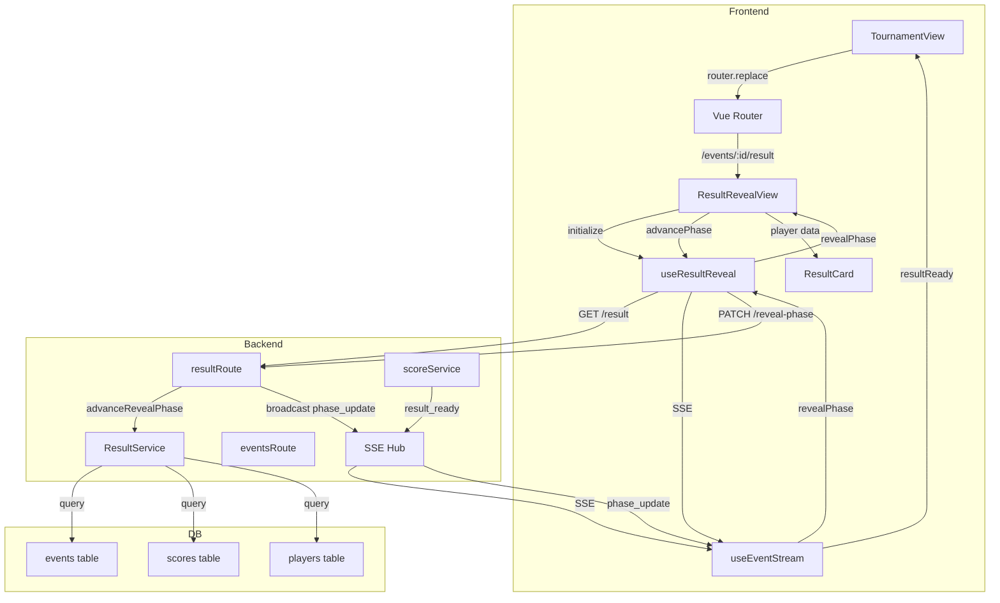
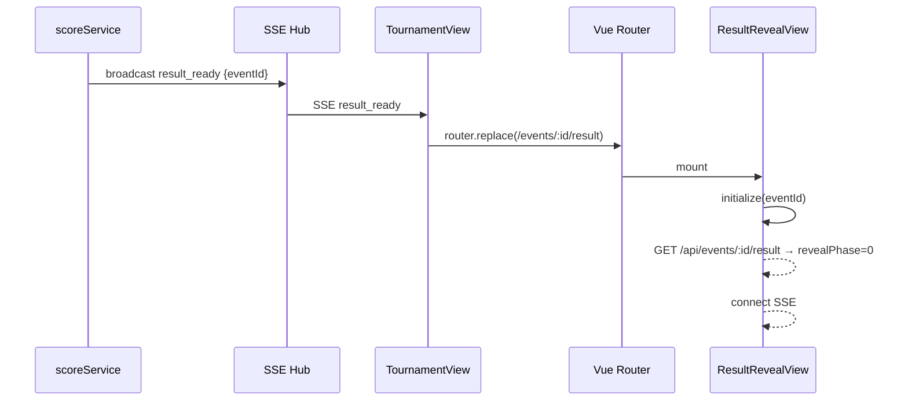
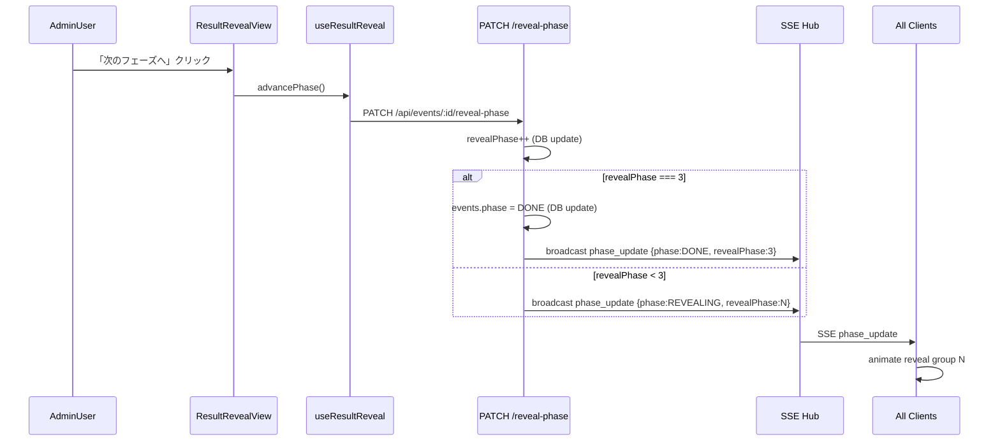
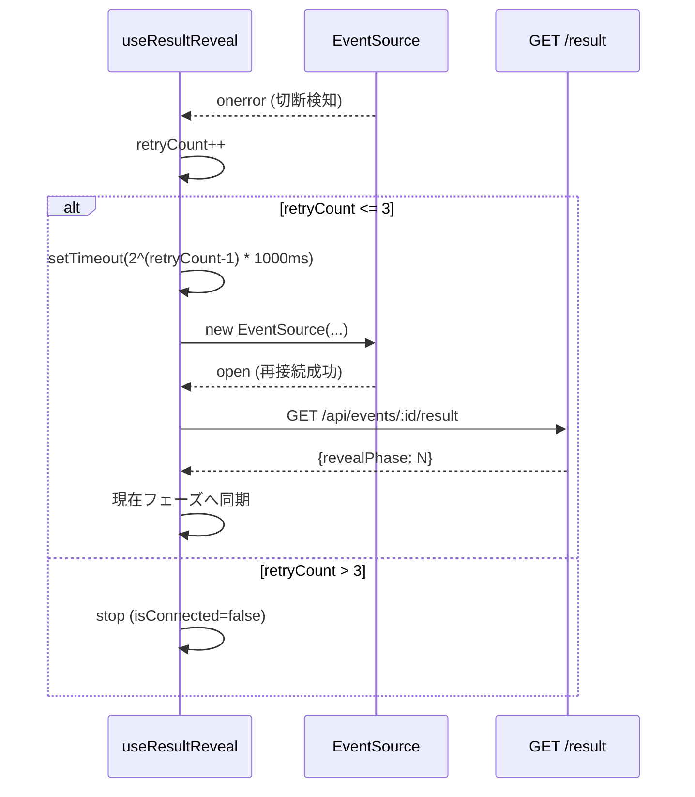
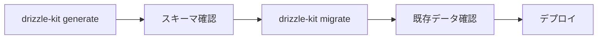

# Design Document: result-reveal

## Overview

result-reveal は、月例下剋上決定戦において全プレイヤーの成績入力完了を契機に実行される、段階的順位発表演出システムである。score-entry スペックが `result_ready` SSEイベントを送信した時点から本スペックが起動し、全クライアントをリアルタイムで結果発表ページへ強制遷移させる。

管理者が「次のフェーズへ」ボタンを押すたびに `phase_update` SSEが全クライアントへブロードキャストされ、「1軍残留」→「2軍残留」→「ボーダー（入れ替え対象）」の順でプレイヤーカードがアニメーション付きで開示される。全フェーズ完了時に大会フェーズが `DONE` へ遷移し、Star投票への誘導UIを表示する。

**ユーザー**: 12名のプレイヤー全員（スマートフォン縦画面）と管理者1名。

### Goals

- 全クライアントの結果発表ページへの一斉強制遷移
- 管理者による段階的フェーズ進行制御（フェーズ0〜3）とSSE全体同期
- ランキング算出・グループ分類 API の提供
- eスポーツ大会演出（ダークテーマ、アニメーション、没入型フルスクリーン）

### Non-Goals

- スコア入力処理（score-entry スペック）
- Star投票UI（star-voting スペック）
- 大会フェーズ管理 `COLLECTING→REVEALING`（event-management スペック）
- PCレイアウト対応

---

## Boundary Commitments

### This Spec Owns

- `/events/:id/result` ルートとその表示ロジック
- `GET /api/events/:id/result` エンドポイント（結果データと revealPhase の提供）
- `PATCH /api/events/:id/reveal-phase` エンドポイント（発表フェーズ進行）
- `result_ready` 受信時のクライアント強制遷移ロジック
- 順位計算・グループ分類ロジック（`ResultService`）
- `events.revealPhase` カラムの所有と永続化
- SSE `phase_update` への `revealPhase` フィールド追加（スキーマ拡張）

### Out of Boundary

- `result_ready` のブロードキャスト生成（score-entry が所有）
- `COLLECTING → REVEALING` フェーズ遷移（event-management が所有）
- SSEハブ（`hub.broadcast`）の内部実装
- Star投票ページそのもの

### Allowed Dependencies

- `hub.broadcast`（stream.ts）— SSEブロードキャスト基盤
- `authMiddleware` / `adminMiddleware`
- `events`, `scores`, `players` テーブル（読み取り + events.revealPhase/phase 書き込み）
- `useAuth()` composable（管理者判定）
- `useEventStream()` composable（SSE接続管理）
- Vue Router（ナビゲーションガード・`router.replace`）

### Revalidation Triggers

- `result_ready` SSEペイロード形状の変更
- `events` テーブルの `phase` enum 変更
- `scores` テーブルの集計カラム（wins/losses/absent）の変更
- `players.team` enum 変更

---

## Architecture

### Existing Architecture Analysis

本スペックは以下の既存パターンを維持・拡張する:

- **型の流れ**: `schema.ts ($inferSelect)` → `service.ts` → Hono RPC → Vue composable → View
- **SSE**: `hub.broadcast(eventId, type, payload)` によるイベント配信
- **認証ガード**: `router/index.ts` の `requiresAuth` / `requiresAdmin` meta
- **レイアウト切替**: `App.vue` の `route.meta.layout !== 'plain'` で BottomNav を制御

### Architecture Pattern & Boundary Map



**Key Decisions**:
- `useResultReveal` は SSE接続を `useEventStream` に委譲し、自身は状態管理とAPI呼び出しに専念する
- `ResultRevealView` は `layout: 'plain'` でBottomNavを非表示にしてフルスクリーン演出を実現する
- 管理者ボタンは `ResultRevealView` 内にインライン配置し、同じ演出画面を見ながら操作できるようにする

### Technology Stack

| Layer | 選択 | 本機能での役割 |
|-------|------|---------------|
| Frontend | Vue 3 Composition API | ResultRevealView・ResultCard・useResultReveal |
| Styling | Tailwind CSS | ダークテーマ・アニメーション（`transition`・`animate-`） |
| Backend | Hono + Hono RPC | resultRoute のエンドポイント定義 |
| ORM | Drizzle ORM (drizzle-orm/libsql) | ResultService のDB参照・revealPhase更新 |
| Realtime | SSE（既存 hub.broadcast） | phase_update ペイロード拡張（revealPhase 追加） |
| Database | Turso (Edge SQLite) | events.revealPhase カラム追加（マイグレーション必須） |

---

## File Structure Plan

### Directory Structure

```
backend/src/
├── db/
│   └── schema.ts              # events テーブルに revealPhase カラム追加
├── services/
│   └── result-service.ts      # 新規: 順位計算・グループ分類・revealPhase進行
└── routes/
    └── result.ts              # 新規: GET /result・PATCH /reveal-phase

frontend/src/
├── views/
│   └── ResultRevealView.vue   # 新規: 結果発表専用ページ
├── composables/
│   ├── useResultReveal.ts     # 新規: フェーズ状態管理・SSE再接続・API呼び出し
│   └── useEventStream.ts      # 変更: PhaseUpdatePayload に revealPhase? 追加
├── components/result/
│   └── ResultCard.vue         # 新規: プレイヤーカードUI
└── router/
    └── index.ts               # 変更: /events/:id/result ルート追加
```

### Modified Files

- `backend/src/db/schema.ts` — `events` テーブルに `revealPhase: integer('reveal_phase').notNull().default(0)` 追加
- `backend/src/index.ts` — `resultRoute` を `/api/events` 配下に追加登録
- `frontend/src/composables/useEventStream.ts` — `PhaseUpdatePayload` に `revealPhase?: number` を追加
- `frontend/src/router/index.ts` — `/events/:id/result` ルートを追加（`requiresAuth: true, layout: 'plain'`）
- `frontend/src/views/TournamentView.vue` — `watch(resultReady)` で `router.replace` による強制遷移を実装
- `frontend/src/views/AdminView.vue` — REVEALING フェーズの「DONE へ」ボタンを削除（本スペックの `/reveal-phase` が代替）

---

## System Flows

### Flow 1: 強制遷移（result_ready 受信）



遷移は `router.replace`（戻るボタン無効化）を使用する。`layout: 'plain'` によりBottomNavが非表示になり手動タブ切替も不可となる。

### Flow 2: 発表フェーズ進行



### Flow 3: SSE切断・再接続



---

## Requirements Traceability

| 要件 | 概要 | 担当コンポーネント | インターフェース | フロー |
|------|------|------------------|-----------------|--------|
| 1.1 | result_ready ブロードキャスト | scoreService（既存） | SSE Event | — |
| 1.2 | クライアント強制遷移 | TournamentView + Router | Vue Router | Flow 1 |
| 1.3 | 遷移中の手動操作無効化 | router.replace + layout:plain | — | Flow 1 |
| 1.4 | COLLECTING 時の直接アクセスガード | ResultRevealView.onMounted | GET /result | — |
| 1.5 | 未認証アクセスガード | Router (requiresAuth) | — | — |
| 2.1 | 初期フェーズ0表示 | ResultRevealView | GET /result | — |
| 2.2 | フェーズ0〜3の4段階管理 | RevealPhase（DB） + ResultRevealView | revealPhase フィールド | — |
| 2.3 | 管理者フェーズ進行・SSEブロードキャスト | resultRoute + ResultService + SSEHub | PATCH /reveal-phase | Flow 2 |
| 2.4 | フェーズ3でボタン無効化 | ResultRevealView | — | — |
| 2.5 | 非管理者の403 | adminMiddleware | PATCH /reveal-phase | — |
| 2.6 | revealPhase 永続化 | events.revealPhase カラム | DB schema | — |
| 3.1 | phase_update 受信でアニメーション表示 | ResultRevealView + ResultCard | SSE Event | — |
| 3.2 | SSE接続維持 | useResultReveal | SSE | — |
| 3.3 | 自動再接続（最大3回・指数バックオフ） | useResultReveal | — | Flow 3 |
| 3.4 | 再接続成功後のフェーズ同期 | useResultReveal | GET /result | Flow 3 |
| 3.5 | 初期表示時のフェーズ状態同期 | ResultRevealView.onMounted | GET /result | — |
| 4.1 | 勝利数降順ランキング算出 | ResultService.computeResult | — | — |
| 4.2 | 勝率二次ソート | ResultService.computeResult | — | — |
| 4.3 | グループ分類 | ResultService.classifyPlayer | — | — |
| 4.4 | GET /result エンドポイント | resultRoute | GET /result | — |
| 4.5 | 認証済みのみ返す | authMiddleware | — | — |
| 5.1 | ダークテーマ全画面 | ResultRevealView（layout:plain） | — | — |
| 5.2 | フェード・スライドアニメーション | ResultRevealView + ResultCard | — | — |
| 5.3 | グループ見出し強調 | ResultRevealView | — | — |
| 5.4 | プレイヤーカード表示 | ResultCard | — | — |
| 5.5 | 未開示フェーズの情報秘匿 | ResultRevealView（条件付きレンダリング） | — | — |
| 5.6 | BottomNav非表示フルスクリーン | layout:plain | — | — |
| 5.7 | ボーダーカードへの昇格/降格インジケーター | ResultCard | — | — |
| 6.1 | フェーズ3完了時にDONE遷移 | resultRoute（自動） | PATCH /reveal-phase | Flow 2 |
| 6.2 | DONE後 Star投票CTA表示 | ResultRevealView | — | — |
| 6.3 | DONE後も結果閲覧可 | GET /result（phase=DONEでも提供） | — | — |
| 6.4 | DONE状態で全フェーズ開示表示 | ResultRevealView（phase===DONE→revealPhase=3） | — | — |

---

## Components and Interfaces

### コンポーネントサマリー

| コンポーネント | レイヤー | 目的 | 要件カバー | 主な依存 | コントラクト |
|---|---|---|---|---|---|
| ResultService | Backend Service | 順位計算・グループ分類・revealPhase進行 | 2.3, 2.6, 4.1-4.5, 6.1 | events/scores/players テーブル | Service |
| resultRoute | Backend Route | REST API エンドポイント提供 | 2.3, 2.5, 4.4, 4.5 | ResultService, authMiddleware, adminMiddleware | API, Event |
| useResultReveal | Frontend Composable | フェーズ状態管理・SSE再接続・API呼び出し | 2.1-2.4, 3.2-3.5, 6.2, 6.4 | useEventStream, resultRoute | State |
| ResultRevealView | Frontend View | 結果発表専用ページ | 1.2-1.5, 2.1-2.4, 5.1-5.7, 6.2-6.4 | useResultReveal, useAuth, ResultCard | — |
| ResultCard | Frontend Component | プレイヤーカードUI | 5.4, 5.7 | PlayerResult 型 | — |

---

### Backend Layer

#### ResultService

| Field | Detail |
|-------|--------|
| Intent | 順位計算・グループ分類・revealPhase永続化・DONEへの自動遷移 |
| Requirements | 2.3, 2.6, 4.1, 4.2, 4.3, 4.4, 6.1 |

**Responsibilities & Constraints**
- `scores` テーブルから wins/losses/absent を集計し、勝利数降順・勝率二次ソートで最終順位を算出する
- 非欠席 FIRST チーム人数 F、SECOND チーム人数 S を集計し、上位 F スロットを基準にグループ分類する
- `revealPhase` をインクリメントし、`revealPhase === 3` のとき `events.phase = 'DONE'` も同時に更新する
- 欠席者は `rank: null, group: null, borderDirection: null` として返す

**Dependencies**
- Inbound: resultRoute — API ハンドラから呼び出し (P0)
- Outbound: Drizzle ORM — events/scores/players テーブルへのクエリ (P0)
- Outbound: hub.broadcast — phase_update SSE送信（resultRoute 経由）

**Contracts**: Service [x]

##### Service Interface

```typescript
type PlayerGroup = 'FIRST_STAY' | 'SECOND_STAY' | 'BORDER'
type BorderDirection = 'PROMOTION' | 'RELEGATION'

interface PlayerResult {
  playerId: string
  playerName: string
  team: 'FIRST' | 'SECOND'
  wins: number
  losses: number
  absent: boolean
  rank: number | null
  group: PlayerGroup | null
  borderDirection: BorderDirection | null
}

interface RevealResult {
  eventId: string
  revealPhase: number
  eventPhase: 'COLLECTING' | 'REVEALING' | 'DONE'
  players: PlayerResult[]
}

type ResultError =
  | { code: 'EVENT_NOT_FOUND' }
  | { code: 'PHASE_NOT_REVEALING'; current: string }
  | { code: 'REVEAL_PHASE_MAXED' }

interface ResultService {
  getRevealResult(eventId: string): Promise<RevealResult | { code: 'EVENT_NOT_FOUND' }>
  advanceRevealPhase(eventId: string): Promise<
    { revealPhase: number; eventPhase: string } | ResultError
  >
}
```

- Preconditions: `advanceRevealPhase` は `events.phase === 'REVEALING'` かつ `revealPhase < 3` のときのみ有効
- Postconditions: `advanceRevealPhase` は `revealPhase++` をDBに反映し、`revealPhase === 3` のとき `events.phase` を `'DONE'` に更新する
- Invariants: `revealPhase` は 0〜3 の範囲を超えない

**グループ分類アルゴリズム**

```
1. 非欠席プレイヤーを wins DESC, (wins / (wins+losses)) DESC でソートして rank を付与
2. F = 非欠席 FIRST チーム人数, S = 非欠席 SECOND チーム人数
3. rank <= F のプレイヤーが「1軍スロット」、rank > F のプレイヤーが「2軍スロット」
4. FIRST チーム × 1軍スロット → FIRST_STAY
   SECOND チーム × 2軍スロット → SECOND_STAY
   FIRST チーム × 2軍スロット → BORDER (borderDirection: RELEGATION)
   SECOND チーム × 1軍スロット → BORDER (borderDirection: PROMOTION)
5. 欠席者は rank=null, group=null, borderDirection=null
```

**Implementation Notes**
- 統計が0勝0敗（試合なし）の場合、勝率計算は 0/0 → 0.0 として安全に処理する
- F=0 または S=0 のエッジケース（チーム全員欠席）では、全プレイヤーが `group: null` になり得る。この場合は空の分類結果を返す（エラーではない）

---

#### resultRoute

| Field | Detail |
|-------|--------|
| Intent | 結果データ取得・発表フェーズ進行のHTTPエンドポイントを提供する |
| Requirements | 2.3, 2.5, 4.4, 4.5 |

**Contracts**: API [x], Event [x]

##### API Contract

| Method | Endpoint | Request | Response | Errors |
|--------|----------|---------|----------|--------|
| GET | /api/events/:id/result | — | `RevealResult` | 401, 404 |
| PATCH | /api/events/:id/reveal-phase | body: none | `{ revealPhase: number, eventPhase: string }` | 401, 403, 404, 409 |

- `GET /api/events/:id/result`: `authMiddleware` のみ適用。event.phase が `DONE` の場合も有効（全フェーズ開示済みとして返す）
- `PATCH /api/events/:id/reveal-phase`: `authMiddleware` + `adminMiddleware` を適用。409 は `PHASE_NOT_REVEALING` または `REVEAL_PHASE_MAXED` を返す

##### Event Contract

- Published events: `phase_update` — ペイロード `{ eventId: string, phase: EventPhase, revealPhase: number }`
- Ordering / delivery guarantee: at-most-once（SSEのベストエフォート）

**Implementation Notes**
- `resultRoute` を `backend/src/index.ts` で `app.route('/api/events', resultRoute)` として登録する（既存 `eventsRoute` と同一プレフィックス下）
- エラーコードと HTTP ステータスのマッピング: `EVENT_NOT_FOUND` → 404、`PHASE_NOT_REVEALING` / `REVEAL_PHASE_MAXED` → 409

---

### Frontend Layer

#### useResultReveal

| Field | Detail |
|-------|--------|
| Intent | 結果発表フェーズの状態管理・SSE再接続ロジック・API呼び出しを担うコンポーザブル |
| Requirements | 2.1, 2.3, 2.4, 3.2, 3.3, 3.4, 3.5, 6.2, 6.4 |

**Contracts**: State [x]

##### State Management

```typescript
interface UseResultRevealReturn {
  result: Readonly<Ref<RevealResult | null>>
  revealPhase: Readonly<Ref<number>>
  eventPhase: Readonly<Ref<'COLLECTING' | 'REVEALING' | 'DONE' | null>>
  isConnected: Readonly<Ref<boolean>>
  isLoading: Readonly<Ref<boolean>>
  error: Readonly<Ref<string | null>>
  initialize(eventId: string): Promise<void>
  advancePhase(): Promise<void>
  cleanup(): void
}
```

- State model:
  - `revealPhase`: 現在の発表フェーズ（0〜3）。SSE `phase_update` で更新される
  - `eventPhase`: 大会フェーズ（COLLECTING/REVEALING/DONE）。DONE になると star-voting CTA を表示
  - `isConnected`: SSE接続状態。再接続中は `false`
- Persistence: サーバーが正とし、`initialize` / 再接続後の `GET /result` で同期する
- Concurrency strategy: 再接続中は `isLoading = true` でボタンを無効化する

**再接続ロジック**:
- `EventSource.onerror` で検知 → `close()` → `setTimeout(2^(retry-1) * 1000)` → `new EventSource(url)`
- 最大3回。3回超で `isConnected = false` を維持し、ユーザーにリロードを促すエラーメッセージを表示
- 再接続成功後: `GET /api/events/:id/result` を呼び出し `revealPhase` を現在フェーズに同期

**Implementation Notes**
- `initialize(eventId)` はまず `GET /api/events/:id/result` でフェーズ初期値を取得し、その後 `useEventStream().connect(eventId)` でSSEを開始する
- `phase_update` イベントの `revealPhase` フィールドで `useResultReveal` の状態を更新する
- `onUnmounted` で `cleanup()` を呼び出し EventSource を確実にクローズする

---

#### ResultRevealView

| Field | Detail |
|-------|--------|
| Intent | 結果発表専用の没入型フルスクリーンページ |
| Requirements | 1.2, 1.3, 1.4, 1.5, 2.1, 2.2, 2.4, 5.1-5.7, 6.2, 6.3, 6.4 |

ルート: `/events/:id/result`、`meta: { requiresAuth: true, layout: 'plain' }`

**Responsibilities & Constraints**
- `onMounted` で `initialize(route.params.id)` を呼び出し、初期フェーズを取得する
- `eventPhase === 'COLLECTING'` のとき `router.replace('/')` でスコア入力ページへリダイレクトする（要件1.4）
- `eventPhase === 'DONE'` のとき `revealPhase` を 3 として扱い、全グループを表示する（要件6.4）
- `revealPhase` に応じて表示するグループを段階的に出力する（0: 全非表示、1: FIRST_STAY表示、2: +SECOND_STAY表示、3: +BORDER表示）
- 管理者（`currentPlayer.isAdmin === true`）にのみ「次のフェーズへ」ボタンを表示する
- `eventPhase === 'DONE'` のとき Star投票へのCTAボタンを全ユーザーに表示する

**Implementation Note**: アニメーションは Tailwind `transition-all duration-700` + `v-if` / `v-show` の組み合わせで実装する。プレイヤーカードは `staggered` 表示（各カードの `transition-delay` を index * 100ms で設定）。

---

#### ResultCard

| Field | Detail |
|-------|--------|
| Intent | 1プレイヤーの結果を表示するカードUIコンポーネント |
| Requirements | 5.4, 5.7 |

プレゼンテーションコンポーネント。新しい境界は持たない。

```typescript
interface ResultCardProps {
  player: PlayerResult
  rank: number | null
}
```

表示要素: プレイヤー名・今大会 wins-losses・最終順位。`borderDirection === 'PROMOTION'` は `yellow-400` 上向き矢印、`borderDirection === 'RELEGATION'` は `accent` 色（`#c20e00`）下向き矢印で表示する。

---

### 既存ファイルの変更サマリー

| ファイル | 変更内容 | 影響 |
|---|---|---|
| `useEventStream.ts` | `PhaseUpdatePayload` に `revealPhase?: number` 追加 | 後方互換（オプショナル追加） |
| `router/index.ts` | `/events/:id/result` ルートを追加 | 新規ルート |
| `TournamentView.vue` | `watch(resultReady)` 内に `router.replace('/events/${eventId}/result')` を実装 | 強制遷移ロジック |
| `AdminView.vue` | REVEALING フェーズの「DONE へ」ボタンを除去 | `resultRoute` の `/reveal-phase` が代替 |

---

## Data Models

### Domain Model

- **Event（集約ルート）**: `revealPhase` を追加。`phase: REVEALING` のとき、`revealPhase` が 0〜3 の値を持つ
- **PlayerResult（値オブジェクト）**: `ResultService` が算出する一時的な集計結果。DB永続化しない
- Invariant: `revealPhase` は `phase === 'REVEALING'` のときのみ意味を持つ。`phase === 'DONE'` では常に 3 として解釈する

### Physical Data Model

**events テーブル変更**:

```sql
ALTER TABLE events ADD COLUMN reveal_phase INTEGER NOT NULL DEFAULT 0;
```

Drizzle スキーマ追加:

```typescript
revealPhase: integer('reveal_phase').notNull().default(0),
```

インデックス追加なし（主に単一イベントの更新・参照のため不要）。

### Data Contracts & Integration

**GET /api/events/:id/result レスポンス**:

```typescript
{
  eventId: string
  revealPhase: number           // 0-3
  eventPhase: 'COLLECTING' | 'REVEALING' | 'DONE'
  players: Array<{
    playerId: string
    playerName: string
    team: 'FIRST' | 'SECOND'
    wins: number
    losses: number
    absent: boolean
    rank: number | null
    group: 'FIRST_STAY' | 'SECOND_STAY' | 'BORDER' | null
    borderDirection: 'PROMOTION' | 'RELEGATION' | null
  }>
}
```

**phase_update SSEペイロード（拡張後）**:

```typescript
{
  eventId: string
  phase: 'COLLECTING' | 'REVEALING' | 'DONE'
  revealPhase?: number          // phase === 'REVEALING' または 'DONE' のとき必須
}
```

---

## Error Handling

### Error Strategy

フロントエンドはユーザー向けエラーメッセージを日本語で表示し、再試行可能な操作を明示する。バックエンドはエラーコードをJSON形式で返す。

### Error Categories and Responses

**User Errors (4xx)**
- 401 Unauthorized: 認証が切れた場合、`router.push('/login')` へリダイレクト
- 403 Forbidden: 非管理者が PATCH を呼び出した場合、フロントエンドではそもそもボタンを非表示にするため通常到達しない
- 404 Not Found: 無効な eventId → 「大会が見つかりません」を表示

**System Errors (5xx)**
- SSE接続エラー: 再接続フロー（Flow 3）を起動。3回失敗後は「接続に失敗しました。ページをリロードしてください」を表示

**Business Logic Errors (409)**
- `PHASE_NOT_REVEALING`: 管理者が COLLECTING 中に誤って呼び出した場合（通常到達しない）
- `REVEAL_PHASE_MAXED`: フェーズ3既達。フロントエンドでボタンを無効化しているため通常到達しない

### Monitoring

- `hub.broadcast` のエラーは既存の `catch` で処理済み（stream.ts）
- `advanceRevealPhase` の失敗は Hono のログ機構に委ねる

---

## Testing Strategy

### Unit Tests（ResultService）

- 勝利数降順・勝率二次ソートによるランキング算出
- FIRST_STAY / SECOND_STAY / BORDER の正確な分類（標準ケース）
- 欠席者を含む場合の分類（欠席者は group=null）
- F=0 または S=0 エッジケース
- 同勝利数・同勝率での安定ソート

### Unit Tests（useResultReveal）

- SSE再接続: 1回成功・3回失敗・再接続後の状態同期
- `initialize` で revealPhase が正しく初期化されること
- `advancePhase` 失敗時の error 状態設定

### Integration Tests（resultRoute）

- `GET /api/events/:id/result`: 認証あり→200、未認証→401、不明ID→404
- `PATCH /api/events/:id/reveal-phase`: 管理者→200+SSEブロードキャスト、非管理者→403、phase3済み→409
- revealPhase=3 で event.phase が DONE になること

### E2E / UI Tests

- `result_ready` 受信後に TournamentView から ResultRevealView へ強制遷移
- 管理者が3回「次のフェーズへ」を押すと3つのグループが順次表示される
- DONE 状態で直接アクセスすると全フェーズが表示される
- COLLECTING 状態で直接アクセスするとスコア入力ページへリダイレクト

---

## Migration Strategy



- **スキーマ変更**: `events` テーブルへの `reveal_phase INTEGER NOT NULL DEFAULT 0` 追加
- **後方互換**: 既存レコードは `DEFAULT 0` が設定される。phase=DONE の既存レコードは `revealPhase=0` になるが、フロントエンドが「phase===DONE のとき revealPhase=3 として扱う」ロジックで吸収する
- **ロールバック**: `reveal_phase` カラムを DROP するだけで元の状態に戻せる（SQLite は DROP COLUMN を Turso v0.9+ でサポート）
- **ゼロダウンタイム**: カラム追加は後方互換のため既存 API は継続動作する
