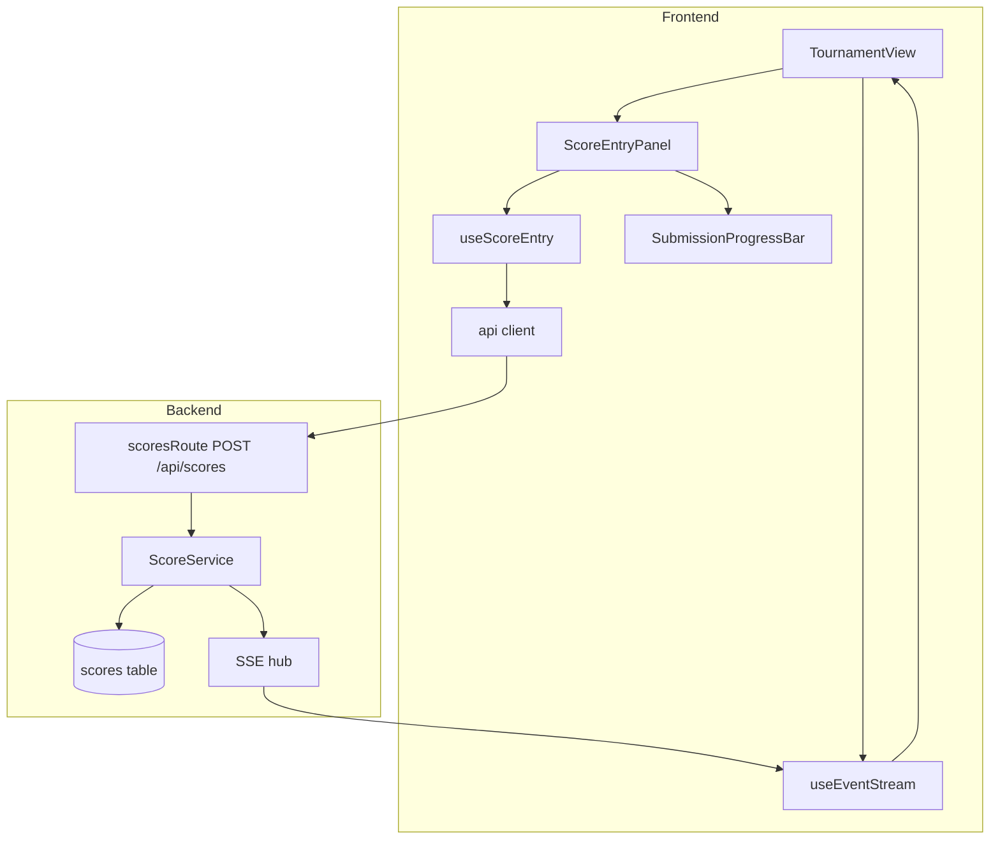
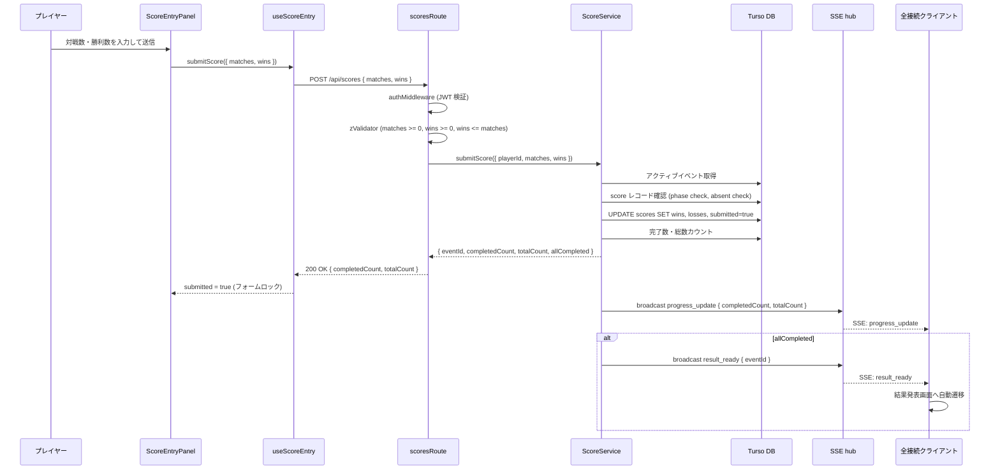
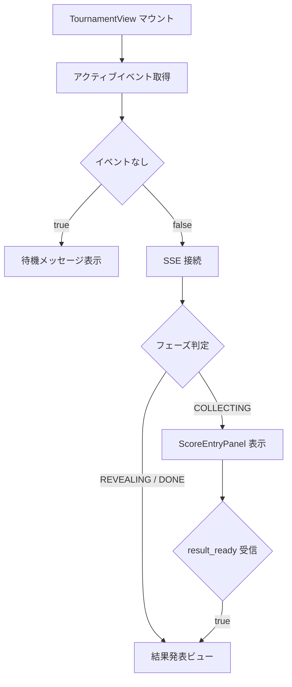
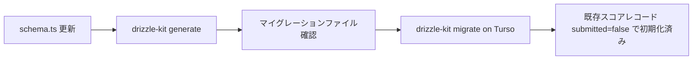

# 技術デザインドキュメント: score-entry

## Overview

`score-entry` は成績収集フェーズ（`COLLECTING`）において、プレイヤーが自身の対戦数・勝利数を入力・送信する機能と、全員の入力進捗をリアルタイムで共有する機能を提供する。スコア提出は既存の認証基盤・SSE ハブを活用した拡張として実装する。

提出が成功するたびに `progress_update` SSE イベントが全接続クライアントにブロードキャストされる。欠席者を除く全プレイヤーの提出完了時には `result_ready` SSE イベントが発行され、全クライアントが結果発表画面へ自動遷移する。

**DB スキーマとの整合**: `scores` テーブルは `wins` / `losses` カラムを持つ。API は「対戦数 (matches) + 勝利数 (wins)」を受け取り、`losses = matches - wins` を導出して保存する（導出方式を採用）。提出済み判定のため `submitted` boolean カラムを追加する。詳細な判断根拠は `research.md` を参照。

### Goals

- 認証済みプレイヤーが COLLECTING フェーズ中にスコアを提出できる
- 全接続クライアントがリアルタイムで提出進捗を確認できる
- 全員完了時に `result_ready` SSE を発行し、結果発表フェーズへの自動遷移をトリガーする
- スマートフォン縦画面で直感的に入力できる UI を提供する

### Non-Goals

- フェーズ遷移操作（`event-management` スペック）
- 段階的順位発表演出（`result-reveal` スペック）
- Star 投票（`star-voting` スペック）
- 欠席フラグ管理（`event-management` スペック）

---

## Boundary Commitments

### This Spec Owns

- `POST /api/scores` エンドポイント（スコア提出）
- `ScoreService.submitScore()` ビジネスロジック
- `submitted` boolean カラムの追加（`scores` テーブル）
- `progress_update` SSE イベントのブロードキャスト（提出完了後）
- `result_ready` SSE イベントのブロードキャスト（全員完了時）
- `ScoreEntryPanel.vue` — スコア入力フォーム + 進捗バー
- `SubmissionProgressBar.vue` — 提出進捗表示
- `useScoreEntry.ts` — フロントエンドの提出ロジック composable
- `TournamentView.vue` の COLLECTING フェーズ対応（既存ファイルの拡充）

### Out of Boundary

- `COLLECTING → REVEALING` フェーズ遷移操作（`event-management` スペック）
- 結果発表画面の実装（`result-reveal` スペック）
- SSE ストリームエンドポイント自体（既存 `stream.ts` を利用）
- 欠席フラグの設定・管理（`event-management` スペック）

### Allowed Dependencies

- `backend/src/routes/stream.ts` の `hub`（ブロードキャスト用）
- `backend/src/db/schema.ts`（scores テーブル定義）
- `backend/src/middleware/auth.ts`（認証）
- `frontend/src/composables/useEventStream.ts`（SSE 受信）
- `frontend/src/api/client.ts`（Hono RPC クライアント）

### Revalidation Triggers

- `scores` テーブルのカラム構造変更
- `hub.broadcast()` のシグネチャ変更
- `JwtPayload.sub` の意味変更（現在はプレイヤー ID）
- `useEventStream` の `progressUpdate` / `resultReady` インターフェース変更

---

## Architecture

### Architecture Pattern & Boundary Map



**Architecture Integration**:
- 選択パターン: service 層分離（既存 `event-service` と同パターン）
- 依存方向: `scoresRoute` → `ScoreService` → `db` / `hub`; フロントエンド: `TournamentView` → `ScoreEntryPanel` → `useScoreEntry` → `api/client`
- SSE はサービス層 (`score-service.ts`) から `hub.broadcast()` を直接呼び出す
- フロントエンドの SSE 受信は既存 `useEventStream` に委譲

### Technology Stack

| レイヤー | 技術 / バージョン | 本機能での役割 |
|---------|-----------------|--------------|
| Frontend | Vue 3 Composition API + Tailwind CSS | スコア入力 UI、プログレスバー |
| Backend | Hono + zod-validator | スコア提出エンドポイント、バリデーション |
| Data | Turso + Drizzle ORM (`drizzle-orm/libsql`) | `scores` テーブル更新、`submitted` カラム追加 |
| Messaging | Hono SSE (`hono/streaming`) / 既存 `hub` | `progress_update` / `result_ready` ブロードキャスト |
| Auth | JWT Cookie（既存 `authMiddleware`） | プレイヤー ID の取得・認証ガード |

---

## File Structure Plan

### Directory Structure

```
backend/src/
├── routes/
│   └── scores.ts          # 既存スタブに POST / を追加
├── services/
│   └── score-service.ts   # 新規: スコア提出ビジネスロジック
└── db/
    └── schema.ts           # submitted カラム追加

frontend/src/
├── views/
│   └── TournamentView.vue  # フェーズ対応コンテナに拡充
├── components/
│   └── score/
│       ├── ScoreEntryPanel.vue        # 新規: スコア入力フォーム
│       └── SubmissionProgressBar.vue  # 新規: 提出進捗バー
└── composables/
    └── useScoreEntry.ts    # 新規: 提出ロジック
```

### Modified Files

- `backend/src/db/schema.ts` — `scores` テーブルに `submitted: integer('submitted', { mode: 'boolean' }).notNull().default(false)` を追加
- `backend/src/routes/scores.ts` — 既存スタブに `POST /` ハンドラを追加
- `frontend/src/views/TournamentView.vue` — フェーズ取得・SSE 接続・フェーズ別レンダリング

---

## System Flows

### スコア提出フロー



### フロントエンドフェーズ分岐



---

## Requirements Traceability

| 要件 | 概要 | コンポーネント | インターフェース | フロー |
|------|------|--------------|---------------|-------|
| 1.1 | スコアレコード更新・成功返却 | ScoreService | submitScore() | スコア提出フロー |
| 1.2 | COLLECTING 以外は拒否 | ScoreService | ScoreError.PHASE_NOT_COLLECTING | スコア提出フロー |
| 1.3 | 欠席者は拒否 | ScoreService | ScoreError.PLAYER_ABSENT | スコア提出フロー |
| 1.4 | 未認証は 401 | scoresRoute | authMiddleware | — |
| 1.5 | 入力値バリデーション（0 以上整数） | scoresRoute | zValidator スキーマ | — |
| 2.1 | 提出後 progress_update ブロードキャスト | ScoreService | hub.broadcast | スコア提出フロー |
| 2.2 | progress_update に completedCount / totalCount | ScoreService | ProgressUpdatePayload | スコア提出フロー |
| 2.3 | クライアントでプログレスバー更新 | SubmissionProgressBar | useEventStream.progressUpdate | — |
| 2.4 | COLLECTING 中は SSE で配信 | TournamentView | useEventStream.connect | フェーズ分岐 |
| 3.1 | 全員完了で result_ready ブロードキャスト | ScoreService | hub.broadcast | スコア提出フロー |
| 3.2 | result_ready に eventId | ScoreService | ResultReadyPayload | スコア提出フロー |
| 3.3 | 欠席者を完了判定から除外 | ScoreService | submitScore() クエリ条件 | — |
| 3.4 | 全員完了後の再提出はフェーズ依存で拒否 | ScoreService | ScoreError.PHASE_NOT_COLLECTING | — |
| 4.1 | COLLECTING 中はフォーム表示 | ScoreEntryPanel | TournamentView フェーズ分岐 | フェーズ分岐 |
| 4.2 | 提出後フォームロック | ScoreEntryPanel | useScoreEntry.submitted | — |
| 4.3 | リアルタイムプログレスバー | SubmissionProgressBar | useEventStream.progressUpdate | — |
| 4.4 | result_ready で結果発表画面へ自動遷移 | TournamentView | useEventStream.resultReady | フェーズ分岐 |
| 4.5 | モバイルファースト・ダークテーマ | ScoreEntryPanel | Tailwind クラス設計 | — |
| 4.6 | 欠席プレイヤーに欠席メッセージ・フォーム非表示 | ScoreEntryPanel | useScoreEntry.isAbsent | — |
| 5.1 | API バリデーション（0 以上整数） | scoresRoute | zValidator スキーマ | — |
| 5.2 | 不正値は 400 | scoresRoute | zValidator エラーレスポンス | — |
| 5.3 | wins > matches は 400 | scoresRoute | zValidator refine | — |
| 5.4 | フロントエンド事前バリデーション・送信ボタン無効化 | ScoreEntryPanel | useScoreEntry.isValid | — |
| 5.5 | アクティブイベントなし時 404 | ScoreService | ScoreError.NO_ACTIVE_EVENT | — |

---

## Components and Interfaces

### コンポーネントサマリー

| コンポーネント | レイヤー | 概要 | 要件カバレッジ | 主要依存 (P0/P1) |
|--------------|---------|------|--------------|-----------------|
| ScoreService | Backend / Service | スコア提出ビジネスロジック | 1.1–1.5, 2.1–2.2, 3.1–3.3, 5.5 | DB (P0), hub (P0) |
| scoresRoute | Backend / Route | HTTP ハンドラ・バリデーション | 1.4, 1.5, 5.1–5.3 | ScoreService (P0), authMiddleware (P0) |
| TournamentView | Frontend / View | フェーズ対応コンテナ | 2.4, 4.1, 4.4 | useEventStream (P0), ScoreEntryPanel (P0) |
| ScoreEntryPanel | Frontend / Component | スコア入力フォーム | 4.1–4.6, 5.4 | useScoreEntry (P0), SubmissionProgressBar (P1) |
| SubmissionProgressBar | Frontend / Component | 提出進捗バー | 2.3, 4.3 | progressUpdate prop (P0) |
| useScoreEntry | Frontend / Composable | 提出ロジック | 1.1–1.5, 4.2, 4.6 | api/client (P0) |

---

### Backend / Service

#### ScoreService

| フィールド | 詳細 |
|----------|------|
| Intent | スコア提出のバリデーション・DB 更新・SSE ブロードキャストを一元管理する |
| Requirements | 1.1, 1.2, 1.3, 1.5, 2.1, 2.2, 3.1, 3.2, 3.3, 5.5 |

**Responsibilities & Constraints**
- アクティブイベントの取得・フェーズ検証（COLLECTING のみ受付）
- プレイヤーの欠席チェック
- `wins` / `losses = matches - wins` の導出・DB 更新
- `submitted = true` への更新
- 欠席者除外での completedCount / totalCount 計算
- `hub.broadcast('progress_update', ...)` の呼び出し
- 全員完了時に `hub.broadcast('result_ready', ...)` を追加呼び出し

**Dependencies**
- Outbound: `db` (Drizzle / Turso) — スコア読み書き (P0)
- Outbound: `hub` (`stream.ts`) — SSE ブロードキャスト (P0)

**Contracts**: Service [x] / API [ ] / Event [x] / Batch [ ] / State [ ]

##### Service Interface

```typescript
interface ScoreService {
  submitScore(params: {
    playerId: string
    matches: number
    wins: number
  }): Promise<SubmitScoreResult | ScoreError>
}

interface SubmitScoreResult {
  eventId: string
  completedCount: number
  totalCount: number
  allCompleted: boolean
}

type ScoreError =
  | { code: 'NO_ACTIVE_EVENT' }
  | { code: 'PHASE_NOT_COLLECTING'; current: EventPhase }
  | { code: 'PLAYER_ABSENT' }
  | { code: 'SCORE_NOT_FOUND' }
```

- Preconditions: `playerId` は有効なプレイヤー ID（JWT 検証済み）; `matches >= 0`, `wins >= 0`, `wins <= matches`（ルート層で検証済み）
- Postconditions: 成功時、`scores` レコードの `wins` / `losses` / `submitted` が更新され、`progress_update` SSE が全クライアントに発行される
- Invariants: `absent = true` のプレイヤーは提出不可; フェーズが `COLLECTING` 以外は提出不可

##### Event Contract

- Published events:
  - `progress_update` — ペイロード: `{ completedCount: number; totalCount: number }`; 提出成功ごとに発行
  - `result_ready` — ペイロード: `{ eventId: string }`; 全員完了時のみ発行
- Ordering: `progress_update` → (条件付き) `result_ready` の順に発行
- Delivery: best-effort（SSE over HTTP/1.1）; 切断済みクライアントへの送信エラーは無視

**Implementation Notes**
- `losses = matches - wins` の導出はサービス層で行い、ルート層・フロントエンドには公開しない
- 全員完了判定: `WHERE event_id = $eventId AND absent = false AND submitted = true` の count が `WHERE event_id = $eventId AND absent = false` の count と一致したとき
- `hub` は `stream.ts` からインポート（循環依存を避けるため `score-service.ts` → `routes/stream.ts` の依存方向を許容; service が route をインポートする形になるが、`hub` は route ファイルからエクスポートされた共有オブジェクトとして機能する）

---

### Backend / Route

#### scoresRoute

| フィールド | 詳細 |
|----------|------|
| Intent | スコア提出 HTTP リクエストのバリデーションと ScoreService への委譲 |
| Requirements | 1.4, 1.5, 5.1, 5.2, 5.3 |

**Contracts**: Service [x] / API [x] / Event [ ] / Batch [ ] / State [ ]

##### API Contract

| Method | Endpoint | Request | Response | Errors |
|--------|----------|---------|----------|--------|
| POST | /api/scores | `{ matches: number; wins: number }` | `{ completedCount: number; totalCount: number }` | 400, 401, 404, 409 |

**Zod バリデーションスキーマ**:
```typescript
const submitScoreSchema = z.object({
  matches: z.number().int().min(0),
  wins: z.number().int().min(0),
}).refine((data) => data.wins <= data.matches, {
  message: 'wins must not exceed matches',
  path: ['wins'],
})
```

**エラーコードとHTTPステータスのマッピング**:
- `NO_ACTIVE_EVENT` → 404
- `PHASE_NOT_COLLECTING` → 409
- `PLAYER_ABSENT` → 409
- `SCORE_NOT_FOUND` → 404
- zValidator エラー → 400

---

### Frontend / View

#### TournamentView

| フィールド | 詳細 |
|----------|------|
| Intent | フェーズに応じて適切な子コンポーネントを切り替えるコンテナ View |
| Requirements | 2.4, 4.1, 4.4 |

**Responsibilities & Constraints**
- マウント時にアクティブイベントを取得し、SSE (`useEventStream`) に接続する
- `currentPhase` が `COLLECTING` の場合 `ScoreEntryPanel` を表示
- `resultReady` が `true` になったら結果発表ルートへ自動ナビゲート（現状は `/` のまま待機; `result-reveal` スペック実装後にルートを更新）
- アクティブイベントがない場合は待機メッセージを表示

**Implementation Notes**
- `useEventStream.connect(eventId)` はアクティブイベント取得後に呼び出す
- `result_ready` 受信後のルーティング先は `result-reveal` スペックで確定するため、本スペックでは `console.log` またはプレースホルダーメッセージで代替

---

### Frontend / Component

#### ScoreEntryPanel

| フィールド | 詳細 |
|----------|------|
| Intent | 対戦数・勝利数の入力フォームと提出進捗を統合したパネルコンポーネント |
| Requirements | 4.1, 4.2, 4.3, 4.5, 4.6, 5.4 |

**Props**:
```typescript
interface ScoreEntryPanelProps {
  eventId: string
  progressUpdate: ProgressUpdatePayload | null
}
```

**Responsibilities & Constraints**
- `useScoreEntry` composable を使用してフォーム状態・提出ロジックを管理
- `isAbsent` が `true` の場合は入力フォームを非表示にし欠席メッセージを表示
- `submitted` が `true` の場合は送信完了状態に切り替え、フォームをロック（再提出防止）
- Tailwind によるダークテーマ（`bg-dark`, `text-white`, `border-main`, `focus:border-accent`）
- 送信ボタンは `isValid && !submitted && !isAbsent` のときのみ有効化

**Implementation Notes**
- 入力フィールドは `type="number"` + `inputmode="numeric"` でモバイルキーパッドを最適化
- `SubmissionProgressBar` を `progressUpdate` prop で制御

#### SubmissionProgressBar

presentational コンポーネント。Props として `completedCount: number` と `totalCount: number` を受け取り、`completedCount / totalCount` をパーセンテージ表示するバーと "X / Y 人提出済み" テキストを描画する。新規境界なし。

---

### Frontend / Composable

#### useScoreEntry

| フィールド | 詳細 |
|----------|------|
| Intent | スコア提出のフォーム状態管理・API 呼び出し・エラーハンドリングを提供する composable |
| Requirements | 1.1–1.5, 4.2, 4.6, 5.4 |

**Contracts**: Service [x] / API [ ] / Event [ ] / Batch [ ] / State [x]

##### Service Interface

```typescript
interface UseScoreEntryReturn {
  matches: Ref<number | null>
  wins: Ref<number | null>
  isValid: Readonly<Ref<boolean>>
  isSubmitting: Readonly<Ref<boolean>>
  submitted: Readonly<Ref<boolean>>
  isAbsent: Readonly<Ref<boolean>>
  error: Readonly<Ref<string | null>>
  submitScore(): Promise<void>
}

function useScoreEntry(eventId: Ref<string>): UseScoreEntryReturn
```

- `isValid`: `matches !== null && wins !== null && matches >= 0 && wins >= 0 && wins <= matches`
- `isAbsent`: アクティブイベントのスコアデータから現在プレイヤーの `absent` フラグを取得
- `submitScore()`: 送信中は `isSubmitting = true`; 成功後は `submitted = true`; エラー時は `error` にメッセージを設定

##### State Management

- `submitted` は `sessionStorage` に保存しない（ページリロード時に再提出可能；フェーズが `COLLECTING` でなければ API が拒否するため安全）
- `isAbsent` はマウント時に `client.api.events.active.$get()` レスポンスから現在プレイヤーのスコアレコードを参照して設定

**Implementation Notes**
- API 呼び出しは Hono RPC クライアント (`client.api.scores.$post(...)`) を使用
- `error` はフォーム上部のエラーバナーとして表示

---

## Data Models

### Domain Model

- **Score** (集約エンティティ): `(eventId, playerId)` のユニーク制約。`wins`, `losses`, `submitted`, `absent` を属性に持つ
- **SubmitScore** (ドメインイベント的操作): `matches` + `wins` を受け取り、`losses = matches - wins` を導出。`submitted = true` に遷移
- 不変条件: `absent = true` のプレイヤーは `submitted` を `true` にできない; フェーズが `COLLECTING` 以外では更新不可

### Physical Data Model

**`scores` テーブル変更（追加カラム）**:

```sql
-- Drizzle schema 変更
ALTER TABLE scores ADD COLUMN submitted INTEGER NOT NULL DEFAULT 0;
```

Drizzle スキーマ:
```typescript
submitted: integer('submitted', { mode: 'boolean' }).notNull().default(false),
```

**完了判定クエリパターン**:
```typescript
// 欠席者除く総数
const total = db.select({ count: count() }).from(scores)
  .where(and(eq(scores.eventId, eventId), eq(scores.absent, false)))

// 提出済み数
const completed = db.select({ count: count() }).from(scores)
  .where(and(
    eq(scores.eventId, eventId),
    eq(scores.absent, false),
    eq(scores.submitted, true),
  ))
```

### Data Contracts & Integration

**API リクエスト/レスポンス**:
```typescript
// POST /api/scores リクエスト
type SubmitScoreRequest = {
  matches: number  // 0 以上の整数
  wins: number     // 0 以上の整数、matches 以下
}

// 成功レスポンス
type SubmitScoreResponse = {
  completedCount: number
  totalCount: number
}
```

**SSE イベントスキーマ**:
```typescript
// progress_update (既存型を利用)
type ProgressUpdatePayload = {
  completedCount: number
  totalCount: number
}

// result_ready
type ResultReadyPayload = {
  eventId: string
}
```

---

## Error Handling

### Error Categories and Responses

**User Errors (4xx)**:
- `400 Bad Request`: `matches` / `wins` が不正値（負数・非整数・wins > matches）→ フロントエンドに field-level メッセージ表示
- `401 Unauthorized`: JWT なし / 無効 → ログイン画面にリダイレクト
- `404 Not Found`: アクティブイベントなし (`NO_ACTIVE_EVENT`) または score レコードなし → "大会が開始されていません" メッセージ表示

**Business Logic Errors (409)**:
- `PHASE_NOT_COLLECTING`: フェーズが COLLECTING 以外 → "現在スコアを受け付けていません" メッセージ
- `PLAYER_ABSENT`: 欠席フラグあり → UI 側でフォームを非表示にしているため通常到達しないが、API は拒否する

**System Errors (5xx)**:
- DB 接続エラー → 500 Internal Server Error → フロントエンドは汎用エラーメッセージを表示

### Monitoring

- ScoreService 内でのエラーは `console.error` でログ出力（既存パターンに合わせる）
- SSE ブロードキャストエラーは既存 `hub.broadcast` の実装（エラー時クライアントを切断）に委譲

---

## Testing Strategy

### Unit Tests (backend)

- `score-service.ts`:
  - フェーズが COLLECTING 以外のとき `PHASE_NOT_COLLECTING` を返す
  - `absent = true` のプレイヤーは `PLAYER_ABSENT` を返す
  - `losses = matches - wins` の導出が正しく DB に保存される
  - 全員完了時に `hub.broadcast('result_ready', ...)` が呼ばれる
  - 全員未完了時は `result_ready` が呼ばれない

### Unit Tests (frontend)

- `useScoreEntry`:
  - `wins > matches` のとき `isValid = false`
  - 送信成功後 `submitted = true`、フォームロック
  - API エラー時 `error` にメッセージが設定される

### Integration Tests

- `POST /api/scores`: 正常系・フェーズエラー・欠席エラー・バリデーションエラーのレスポンス検証
- SSE ブロードキャスト: スコア提出後に `progress_update` が発行されることを確認（`hub.broadcast` をモック）
- 全員完了時に `result_ready` が発行されることを確認

### E2E Tests

- COLLECTING フェーズ中にスコア入力フォームが表示される
- 提出後フォームがロックされ「送信済み」状態になる
- `progress_update` 受信後プログレスバーが更新される

---

## Security Considerations

- すべてのスコア提出エンドポイントは `authMiddleware` 必須（`scoresRoute` に既に適用済み）
- `playerId` はリクエストボディから受け取らず、JWT の `sub` クレームから取得（なりすまし防止）
- フロントエンドのバリデーション（5.4）はユーザビリティ目的。セキュリティはサービス層バリデーションに依存

---

## Migration Strategy



- ロールバック: マイグレーションの逆適用（`ALTER TABLE scores DROP COLUMN submitted`）
- 既存データへの影響: `DEFAULT false` により既存行はすべて `submitted = false` となり、実質「未提出」として扱われる（大会開始直後の状態と等価）
