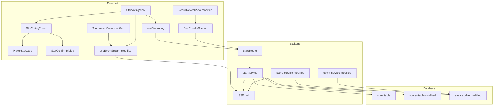
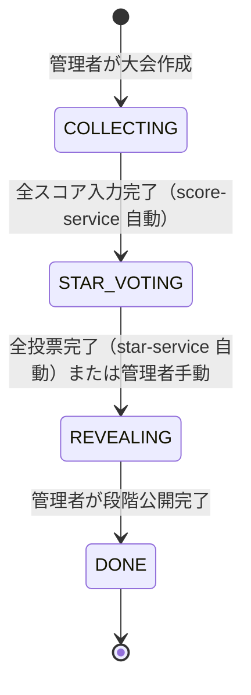
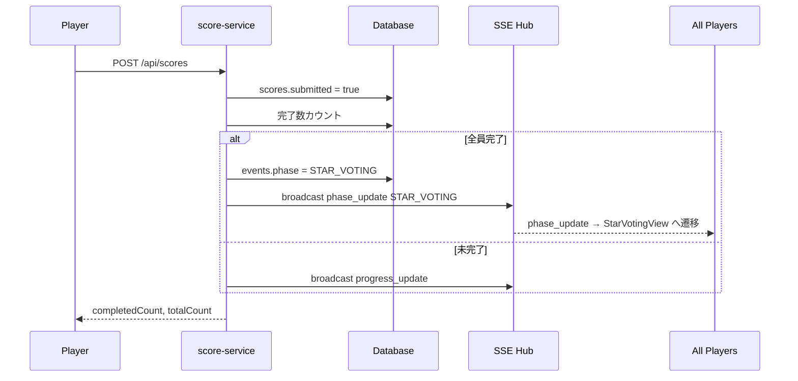
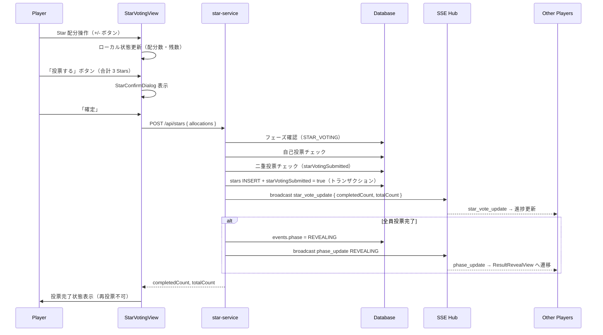
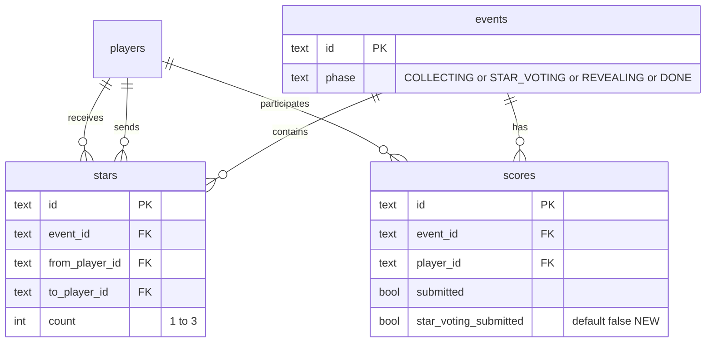

# Design Document — star-voting

## Overview

Star投票機能は、月例下剋上決定戦における参加者相互の称賛システムである。各プレイヤーが3つのStarを他プレイヤーへ自由に配分（全ツッパ or 複数人への分散）できる投票体験を、スコア入力完了直後のフェーズとして提供する。

本機能は既存のフェーズ管理システムを拡張し、`COLLECTING → STAR_VOTING → REVEALING → DONE` という状態遷移を実現する。全スコア入力完了を契機に自動で `STAR_VOTING` へ遷移し、全員投票完了後に `REVEALING` へ自動遷移する。自己投票禁止ルールはフロントエンド・バックエンド双方で強制し、集計ロジックはバックエンドのサービス層に閉じる。

既存の SSE インフラ・Hono RPC クライアント・Vue Composition API のパターンをそのまま踏襲しながら、最小限のスキーマ変更（フェーズ enum 拡張・インデックス追加・フラグカラム追加）で実装できる拡張型設計である。

### Goals

- スコア入力完了後に `STAR_VOTING` フェーズへ自動遷移し、投票 UI を解放する
- 3 つの Star の自由な配分操作・リアルタイム残数表示・確認ダイアログによる確定フローを提供する
- フロントエンド・バックエンド双方での自己投票禁止と 1 大会 1 プレイヤー 1 回制を保証する
- SSE による投票進捗リアルタイム同期と、全員完了時の `REVEALING` への自動遷移を実現する
- `ResultRevealView` に Star 獲得ランキングを統合し、大会結果画面からアクセス可能にする

### Non-Goals

- Star 投票結果に基づく順位変動・ポイント換算
- Star 履歴の長期アーカイブ・統計機能
- 欠席プレイヤーの Star 投票スキップ処理（投票対象・投票者の両方から除外するが仕様詳細は対象外）
- Star 獲得の詳細送信元内訳の UI 表示（DB には記録するが集計のみ表示）

---

## Boundary Commitments

### This Spec Owns

- `STAR_VOTING` フェーズでの投票 UI（`StarVotingView`）の表示・操作・送信フロー
- Star 配分バリデーション（合計 3・自己投票禁止・1 回制限）
- `stars` テーブルへのデータ書き込みと集計ロジック
- `COLLECTING → STAR_VOTING` 自動遷移ロジック（`score-service.ts` 修正による）
- `STAR_VOTING → REVEALING` 自動遷移ロジック（`star-service.ts` 実装による）
- `star_vote_update` SSE イベントの定義とブロードキャスト
- Star 投票結果表示（`StarResultsSection`）の `ResultRevealView` への統合

### Out of Boundary

- `REVEALING → DONE` フェーズ遷移（既存の管理者手動操作のまま）
- スコア入力ロジック・スコア計算（`score-entry` スペックが管轄）
- 大会の段階的結果発表ロジック（`result-service.ts` / `ResultRevealView` が管轄）
- プレイヤー認証・セッション管理

### Allowed Dependencies

- `score-entry` スペックが提供する `scores.submitted` フラグと全員入力完了検出ロジック
- 既存 SSE ハブ（`stream.ts` の `hub`）
- 既存 `events` テーブル・`players` テーブル・`scores` テーブル（読み取りおよび限定的な更新）
- 既存 `authMiddleware`・`zValidator`・`hc` RPC クライアントパターン

### Revalidation Triggers

- `EventPhase` 型定義の変更 → `useAdminEvent.ts` など型参照箇所の更新が必要
- `PHASE_MAP` の変更 → 管理者画面の「フェーズを進める」ボタンの動作が変わる（`COLLECTING` 時に `STAR_VOTING` へ進む）
- `SSEEventType` への `star_vote_update` 追加 → SSE クライアント側で型更新が必要

---

## Architecture

### Existing Architecture Analysis

現行システムは `COLLECTING → REVEALING → DONE` の 3 フェーズで動作している。スコア入力完了時に `score-service.ts` が `result_ready` イベントをブロードキャストし、管理者が手動でフェーズを進める設計である。

主要な統合ポイント：

- **`score-service.ts`**: 全スコア完了時の `result_ready` ブロードキャストを廃止し、`STAR_VOTING` への自動遷移に置換する
- **`stream.ts`**: `SSEEventType` Union 型に `star_vote_update` を追加する
- **`event-service.ts`**: `EventPhase` 型と `PHASE_MAP` に `STAR_VOTING` を追加する
- **`schema.ts`**: `events.phase` enum・`scores.starVotingSubmitted`・`stars` ユニーク制約を変更する
- **`useEventStream.ts`**: `star_vote_update` ハンドラと返り値型を拡張する

### Architecture Pattern & Boundary Map



依存方向: `Database → Service → Route → Composable/View`

### Technology Stack

| Layer | 選択 | 本機能での役割 | 備考 |
|-------|------|--------------|------|
| Frontend / View | Vue 3 Composition API | StarVotingView・投票 UI | 既存パターン踏襲 |
| Frontend / State | Vue `ref` / `computed` | Star 配分ローカル状態管理 | Pinia 未使用 |
| Frontend / API | Hono RPC Client | `/api/stars` 呼び出し | End-to-End 型安全 |
| Backend / Route | Hono + zValidator | リクエスト検証・Service 委譲 | 既存パターン踏襲 |
| Backend / Service | TypeScript | 投票バリデーション・集計・遷移 | service 層のみ集計 |
| Data / Storage | Turso + Drizzle ORM | stars・scores・events 操作 | スキーマ変更あり |
| Messaging / Events | SSE（既存 hub） | `star_vote_update` ブロードキャスト | WebSocket 不使用 |

---

## File Structure Plan

### Directory Structure

```
backend/src/
├── db/
│   ├── schema.ts           # 修正: phase enum・starVotingSubmitted・uniqueIndex
│   └── migrations/         # 新規: Drizzle KIT 生成マイグレーション
├── routes/
│   └── stars.ts            # 修正: POST /・GET /status・GET /results/:eventId を実装
├── services/
│   ├── star-service.ts     # 新規: Star 投票の全ビジネスロジック
│   ├── score-service.ts    # 修正: result_ready 廃止・STAR_VOTING 自動遷移に変更
│   └── event-service.ts    # 修正: EventPhase 型・PHASE_MAP に STAR_VOTING を追加

frontend/src/
├── views/
│   ├── StarVotingView.vue  # 新規: STAR_VOTING フェーズの投票画面
│   ├── TournamentView.vue  # 修正: STAR_VOTING 受信時に /events/:id/star-voting へ遷移
│   └── ResultRevealView.vue# 修正: StarResultsSection を組み込み
├── composables/
│   ├── useStarVoting.ts    # 新規: Star 配分状態・投票送信ロジック
│   ├── useEventStream.ts   # 修正: star_vote_update ハンドラ・型追加
│   └── useAdminEvent.ts    # 修正: EventPhase 型に STAR_VOTING を追加
├── components/
│   └── star/
│       ├── StarVotingPanel.vue    # 新規: 投票 UI 全体パネル
│       ├── PlayerStarCard.vue     # 新規: プレイヤーカード・Star 増減ボタン
│       ├── StarConfirmDialog.vue  # 新規: 送信確認ダイアログ
│       └── StarResultsSection.vue # 新規: Star 獲得ランキングセクション
└── router/
    └── index.ts            # 修正: /events/:id/star-voting ルート追加
```

### Modified Files

- `backend/src/db/schema.ts` — `events.phase` enum に `'STAR_VOTING'` 追加、`scores` に `starVotingSubmitted` カラム追加、`stars` に `uniqueIndex('stars_event_from_to_uniq')` 追加
- `backend/src/routes/stars.ts` — スタブからフル実装に変更（POST・GET 2 本）
- `backend/src/services/score-service.ts` — `allCompleted` 時の `result_ready` ブロードキャストを `STAR_VOTING` 自動遷移に置換
- `backend/src/services/event-service.ts` — `EventPhase` 型と `PHASE_MAP` を更新
- `backend/src/routes/stream.ts` — `SSEEventType` に `'star_vote_update'` を追加
- `frontend/src/composables/useEventStream.ts` — `star_vote_update` ハンドラと `UseEventStreamReturn` 型拡張
- `frontend/src/composables/useAdminEvent.ts` — `EventPhase` 型に `'STAR_VOTING'` を追加
- `frontend/src/views/TournamentView.vue` — `phase_update STAR_VOTING` 受信時に `/events/:id/star-voting` へ遷移
- `frontend/src/views/ResultRevealView.vue` — `StarResultsSection` のインポートと表示
- `frontend/src/router/index.ts` — `/events/:id/star-voting` ルート追加（`requiresAuth: true`、`layout: 'plain'`）

---

## System Flows

### フェーズ遷移ステートマシン



`STAR_VOTING → REVEALING` の管理者手動経路は、欠席者が出た場合など全員投票が揃わないケースのフォールバックとして機能する（`PHASE_MAP` に `STAR_VOTING: 'REVEALING'` を追加することで自動的に担保される）。

### スコア入力完了 → STAR_VOTING 自動遷移



### Star 投票送信フロー



---

## Requirements Traceability

| 要件 | 概要 | コンポーネント | インターフェース | フロー |
|------|------|----------------|-----------------|--------|
| 1.1 | STAR_VOTING 開始時に投票画面表示 | TournamentView, StarVotingView | phase_update SSE | フェーズ遷移 |
| 1.2 | 全参加プレイヤー一覧表示 | StarVotingPanel, star-service | GET /api/stars/status | - |
| 1.3 | プレイヤー名表示 | PlayerStarCard | status response.players | - |
| 1.4 | 残り Star 数リアルタイム表示 | useStarVoting, StarVotingPanel | remaining（ローカル状態） | - |
| 1.5 | 自己プレイヤーを一覧から除外 | useStarVoting, star-service | プレイヤーフィルタ | - |
| 2.1 | Star 付与ボタン（+1） | PlayerStarCard | useStarVoting.increment | - |
| 2.2 | Star 取り消しボタン（-1） | PlayerStarCard | useStarVoting.decrement | - |
| 2.3 | 残り 0 での付与拒否 | useStarVoting | ローカルバリデーション | - |
| 2.4 | 配分 0 での取り消し拒否 | useStarVoting | ローカルバリデーション | - |
| 2.5 | 1 人に最大 3 つ配分可能 | useStarVoting | バリデーション（max per player） | - |
| 2.6 | 残り Star 数リアルタイム更新 | useStarVoting, StarVotingPanel | remaining（computed） | - |
| 3.1 | 自己プレイヤーを UI 一覧から非表示 | useStarVoting | プレイヤーフィルタ | - |
| 3.2 | 自己投票 API リクエスト拒否 | star-service | POST /api/stars バリデーション | - |
| 3.3 | フロント・バック双方で自己投票禁止 | useStarVoting + star-service | 両層バリデーション | - |
| 4.1 | 合計 3 Stars 時に送信ボタン活性化 | StarVotingPanel, useStarVoting | isReadyToSubmit | - |
| 4.2 | 合計 3 未満での送信拒否 | StarVotingPanel, star-service | バリデーション | - |
| 4.3 | 送信前確認ダイアログ | StarConfirmDialog | onConfirm callback | - |
| 4.4 | 確認後にサーバーへ送信 | useStarVoting | POST /api/stars | 送信シーケンス |
| 4.5 | 送信成功後に投票完了状態へ遷移 | useStarVoting | submitted state | - |
| 4.6 | ネットワークエラー時の再送信保持 | useStarVoting | error 状態保持 | - |
| 4.7 | 1 大会 1 プレイヤー 1 回のみ | star-service | scores.starVotingSubmitted | - |
| 5.1 | 大会単位の Star 総数集計 | star-service | getResults | - |
| 5.2 | 送信元・個数の記録 | stars テーブル | fromPlayerId + count カラム | - |
| 5.3 | 集計は service 層のみ | star-service | バックエンド限定実装 | - |
| 5.4 | 全投票完了時に集計確定マーク | star-service | allVoted → REVEALING 遷移 | 送信シーケンス |
| 6.1 | 投票完了人数/全体参加人数表示 | StarVotingPanel | star_vote_update SSE | - |
| 6.2 | 他プレイヤー完了時にリアルタイム更新 | useEventStream, StarVotingPanel | star_vote_update | - |
| 6.3 | 全員完了時に全クライアントへ通知 | star-service, SSE hub | phase_update REVEALING | 送信シーケンス |
| 7.1 | 全投票確定後に Star 獲得数表示 | StarResultsSection | GET /api/stars/results/:eventId | - |
| 7.2 | Star 獲得数ランキング形式表示 | StarResultsSection | rankings 配列 | - |
| 7.3 | ★ アイコンによる視覚的表示 | StarResultsSection | yellow-400 Tailwind | - |
| 7.4 | 同数の場合に同順位 | star-service | DENSE_RANK 相当ロジック | - |
| 7.5 | 大会結果画面からのナビゲーション | ResultRevealView | StarResultsSection 統合 | - |
| 8.1 | STAR_VOTING フェーズ時のみ投票解放 | star-service | フェーズ検証 | - |
| 8.2 | 非 STAR_VOTING フェーズでの投票拒否 | star-service | 409 エラー | - |
| 8.3 | API でフェーズ検証 | star-service | バックエンドバリデーション | - |
| 8.4 | 全スコア完了時に STAR_VOTING 自動遷移 | score-service | phase_update STAR_VOTING | フェーズ遷移 |

---

## Components and Interfaces

| コンポーネント | Domain/Layer | Intent | 要件 | 主要依存 | Contracts |
|-------------|-------------|--------|------|---------|-----------|
| star-service | Backend/Service | Star 投票の全ビジネスロジック | 3〜8 | stars, scores, events, hub | Service, Event |
| starsRoute | Backend/Route | HTTP 検証・Service 委譲 | 3〜8 | star-service, authMiddleware | API |
| score-service（修正） | Backend/Service | 全スコア完了時の STAR_VOTING 自動遷移 | 8.4 | events, hub | Service |
| event-service（修正） | Backend/Service | EventPhase 型・PHASE_MAP 拡張 | 8.1, 8.2 | events | Service |
| useStarVoting | Frontend/Composable | Star 配分ローカル状態・送信ロジック | 1〜4 | starsRoute, useAuth | State |
| useEventStream（修正） | Frontend/Composable | star_vote_update 受信 | 6.2, 6.3 | SSE hub | Event |
| StarVotingView | Frontend/View | STAR_VOTING フェーズの投票画面 | 1.1, 1.2, 6.1〜6.3 | useStarVoting, useEventStream | - |
| StarVotingPanel | Frontend/Component | 投票 UI 全体パネル | 1.2〜2.6, 4.1, 6.1 | PlayerStarCard, useStarVoting | - |
| PlayerStarCard | Frontend/Component | 個別 Star 増減 UI | 2.1〜2.5 | useStarVoting | - |
| StarConfirmDialog | Frontend/Component | 投票内容の最終確認 | 4.3, 4.4 | useStarVoting | - |
| StarResultsSection | Frontend/Component | Star 獲得ランキング表示 | 7.1〜7.5 | starsRoute | - |

---

### Backend / Service Layer

#### star-service

| Field | Detail |
|-------|--------|
| Intent | Star 投票の保存・バリデーション・集計・フェーズ遷移を担うバックエンドのビジネスロジック層 |
| Requirements | 3.2, 3.3, 4.4, 4.7, 5.1, 5.2, 5.3, 5.4, 6.2, 6.3, 7.4, 8.1, 8.2, 8.3 |

**Responsibilities & Constraints**

- Star 投票の受付・保存・バリデーション（フェーズ確認・自己投票禁止・1 回制限・合計 3 検証）をトランザクション内で実行する
- `stars` テーブルへの一括 INSERT と `scores.starVotingSubmitted = true` の更新をアトミックに行う
- 全員投票完了時に `events.phase = 'REVEALING'` へ更新し `hub.broadcast(phase_update)` を実行する
- 集計処理はこのサービス層のみで実行し、フロントエンドに集計ロジックを持たせない

**Dependencies**

- Inbound: `starsRoute` → Star 投票リクエストを受け取る (P0)
- Outbound: `db` (Drizzle) → `stars`, `scores`, `events` テーブル操作 (P0)
- Outbound: `hub` (`stream.ts`) → SSE ブロードキャスト (P0)

**Contracts**: Service [x] / API [ ] / Event [x] / Batch [ ] / State [ ]

##### Service Interface

```typescript
interface StarAllocation {
  toPlayerId: string
  count: number  // 1〜3
}

interface SubmitVoteResult {
  completedCount: number
  totalCount: number
}

type StarVoteError =
  | { code: 'NO_ACTIVE_VOTING_EVENT' }
  | { code: 'PHASE_NOT_STAR_VOTING'; current: EventPhase }
  | { code: 'ALREADY_VOTED' }
  | { code: 'SELF_VOTE_FORBIDDEN' }
  | { code: 'INVALID_TOTAL'; actual: number }

interface VotingStatus {
  completedCount: number
  totalCount: number
  hasVoted: boolean
  players: { playerId: string; playerName: string }[]  // 自己除外・非欠席のみ
}

interface StarRanking {
  rank: number
  playerId: string
  playerName: string
  starCount: number
}

interface StarService {
  submitVote(params: {
    playerId: string
    allocations: StarAllocation[]
  }): Promise<SubmitVoteResult | StarVoteError>

  getVotingStatus(params: {
    playerId: string
    eventId: string
  }): Promise<VotingStatus | { code: 'NO_ACTIVE_VOTING_EVENT' }>

  getResults(params: {
    eventId: string
  }): Promise<StarRanking[] | { code: 'EVENT_NOT_FOUND' }>
}
```

- Preconditions: `allocations` は `sum(count) === 3`、`toPlayerId !== playerId`、重複 `toPlayerId` なし
- Postconditions: `stars` に `allocations.length` 件の行が挿入され、`scores.starVotingSubmitted = true`
- Invariants: 1 大会 1 プレイヤー 1 回のみ（`starVotingSubmitted` フラグで保証）

##### Event Contract

- Published events: `star_vote_update { completedCount, totalCount }` — 各投票完了時にブロードキャスト
- Published events: `phase_update { eventId, phase: 'REVEALING' }` — 全員投票完了時
- Ordering / delivery guarantees: SSE は at-most-once。フロントエンドはページロード時の HTTP ポーリングで状態を補完する

**Implementation Notes**

- Integration: `score-service.ts` の `allCompleted` 時処理を `STAR_VOTING` 自動遷移に変更し、`result_ready` ブロードキャストを廃止する
- Validation: `allocations` の合計が 3 でない場合は `INVALID_TOTAL` を返す（フロント先行バリデーションが機能していれば実質到達しない）
- Risks: `starVotingSubmitted` チェックと INSERT の間の競合 → Drizzle `db.transaction` でアトミックに保護する

---

#### score-service（修正）

`allCompleted` 時の処理のみ変更する：

```typescript
// Before
if (allCompleted) {
  await hub.broadcast(eventId, 'result_ready', { eventId })
}

// After
if (allCompleted) {
  await db.update(events).set({ phase: 'STAR_VOTING' }).where(eq(events.id, eventId))
  await hub.broadcast(eventId, 'phase_update', { eventId, phase: 'STAR_VOTING' })
}
```

`EventPhase` 型の参照を `'STAR_VOTING'` を含む型に更新する。

---

#### event-service（修正）

```typescript
// Before
export type EventPhase = 'COLLECTING' | 'REVEALING' | 'DONE'
const PHASE_MAP = { COLLECTING: 'REVEALING', REVEALING: 'DONE' }

// After
export type EventPhase = 'COLLECTING' | 'STAR_VOTING' | 'REVEALING' | 'DONE'
const PHASE_MAP = { COLLECTING: 'STAR_VOTING', STAR_VOTING: 'REVEALING', REVEALING: 'DONE' }
```

`PHASE_MAP` への `STAR_VOTING: 'REVEALING'` 追加により、管理者が手動で投票フェーズを抜けるフォールバックが自動的に担保される。

---

### Backend / Route Layer

#### starsRoute

| Field | Detail |
|-------|--------|
| Intent | `/api/stars` 配下の HTTP エンドポイント。認証必須。Zod バリデーションと star-service 委譲。 |
| Requirements | 3.2, 4.4, 6.1, 7.1 |

**Contracts**: Service [ ] / API [x] / Event [ ] / Batch [ ] / State [ ]

##### API Contract

| Method | Endpoint | Request Body | Response | Errors |
|--------|----------|-------------|----------|--------|
| POST | /api/stars | `{ allocations: { toPlayerId: string; count: number }[] }` | `{ completedCount: number; totalCount: number }` | 400, 409, 422 |
| GET | /api/stars/status | — | `{ completedCount: number; totalCount: number; hasVoted: boolean; players: { playerId: string; playerName: string }[] }` | 401, 404 |
| GET | /api/stars/results/:eventId | — | `{ rankings: { rank: number; playerId: string; playerName: string; starCount: number }[] }` | 401, 404 |

エラーコードとステータスのマッピング：

| code | HTTP Status |
|------|------------|
| `ALREADY_VOTED`, `PHASE_NOT_STAR_VOTING` | 409 |
| `SELF_VOTE_FORBIDDEN`, `INVALID_TOTAL` | 422 |
| `NO_ACTIVE_VOTING_EVENT`, `EVENT_NOT_FOUND` | 404 |

---

### Frontend / Composable Layer

#### useStarVoting

| Field | Detail |
|-------|--------|
| Intent | Star 配分のローカル状態管理・バリデーション・投票送信ロジック |
| Requirements | 1.4, 1.5, 2.1〜2.6, 3.1, 3.3, 4.1〜4.6 |

**Contracts**: Service [ ] / API [ ] / Event [ ] / Batch [ ] / State [x]

##### State Management

```typescript
interface PlayerEntry {
  playerId: string
  playerName: string
  allocated: number  // 0〜3
}

interface UseStarVotingReturn {
  players: Readonly<Ref<PlayerEntry[]>>        // 自己除外済みプレイヤー一覧
  remaining: Readonly<Ref<number>>             // 残り配分可能 Star 数（0〜3）
  isReadyToSubmit: Readonly<Ref<boolean>>      // remaining === 0
  isSubmitting: Readonly<Ref<boolean>>
  submitted: Readonly<Ref<boolean>>
  error: Readonly<Ref<string | null>>
  increment(playerId: string): void            // remaining === 0 なら拒否
  decrement(playerId: string): void            // allocated === 0 なら拒否
  submitVote(): Promise<void>
  loadPlayers(eventId: string): Promise<void>  // GET /api/stars/status を呼び出し
}
```

- State model: `allocated` は各 `PlayerEntry` に直接保持し、`remaining = 3 - sum(allocated)`
- Persistence: なし（ローカル状態のみ）。送信後は `submitted = true` になり操作不可
- Concurrency: 単一ユーザー操作のため競合なし

**Implementation Notes**

- Integration: `loadPlayers` で `hasVoted === true` が返った場合は `submitted = true` で初期化する（ページリロード対応）
- Validation: `increment` 時に `remaining === 0` チェック、`decrement` 時に `allocated === 0` チェックをcomposable 内でも実施（3.3 フロント側バリデーション）
- Risks: なし

---

#### useEventStream（修正）

追加変更のみ：

```typescript
// 追加インターフェース
interface StarVoteUpdatePayload {
  completedCount: number
  totalCount: number
}

// UseEventStreamReturn に追加
starVoteUpdate: Readonly<Ref<StarVoteUpdatePayload | null>>

// EventSource に追加するリスナー
source.addEventListener('star_vote_update', (e: MessageEvent) => {
  starVoteUpdate.value = JSON.parse(e.data) as StarVoteUpdatePayload
})
```

---

### Frontend / View & Component Layer

**StarVotingView** (新規)
- `onMounted` で `useStarVoting.loadPlayers(eventId)` を呼び出しプレイヤー一覧を取得
- `useEventStream.connect(eventId)` で SSE に接続し `star_vote_update` を受信して進捗を更新
- `phase_update REVEALING` 受信時に `router.replace(/events/:id/result)` へ遷移
- `submitted === true` の場合は投票完了メッセージを表示し他プレイヤーの完了を待機

**StarVotingPanel** (新規・サマリーのみ)
- `players`・`remaining`・`isReadyToSubmit` を props/inject で受け取り描画
- 残り Star 数ヘッダー・プレイヤー一覧（`PlayerStarCard` ×n）・「投票する」ボタンを提供
- 「投票する」ボタンは `isReadyToSubmit === true` の時のみ活性化

**PlayerStarCard** (新規・サマリーのみ)
- `allocated === 0` なら `-` ボタンを disabled
- `remaining === 0 && allocated === 0` なら `+` ボタンを disabled
- `+`/`-` ボタン押下で `useStarVoting.increment`/`decrement` を呼び出す

**StarConfirmDialog** (新規・サマリーのみ)
- `allocations`（配分内容一覧）を表示し「確定」「戻る」を提供
- 「確定」押下で `useStarVoting.submitVote()` を呼び出す

**StarResultsSection** (新規・サマリーのみ)
- `onMounted` で `GET /api/stars/results/:eventId` を呼び出しランキングを取得
- `rank`・`playerName`・`starCount`（★ アイコン、`yellow-400`）の行を Star 数降順で描画
- 同順位には同一 `rank` 値を表示
- `ResultRevealView.vue` に `REVEALING` または `DONE` フェーズで埋め込まれる（7.5）

---

## Data Models

### Domain Model



**ドメインルール**：

- `stars(eventId, fromPlayerId)` の合計 count は必ず 3（DB 制約ではなく service 層が保証）
- `fromPlayerId ≠ toPlayerId`（service 層で保証、フロントでも除外）
- `scores.starVotingSubmitted = true` ↔ その eventId の `stars` に `fromPlayerId` 行が存在する（整合性は service トランザクションが保証）
- ランキングの同順位は `starCount` が同一の場合に同一 `rank`（DENSE_RANK 相当、service 層で計算）

### Physical Data Model

`backend/src/db/schema.ts` への変更：

```typescript
// events.phase enum に 'STAR_VOTING' を追加
export const events = sqliteTable('events', {
  id: text('id').primaryKey(),
  heldAt: integer('held_at', { mode: 'timestamp' }).notNull(),
  phase: text('phase', {
    enum: ['COLLECTING', 'STAR_VOTING', 'REVEALING', 'DONE'],
  }).notNull(),
  revealPhase: integer('reveal_phase').notNull().default(0),
  createdAt: integer('created_at', { mode: 'timestamp' }).notNull(),
})

// scores に starVotingSubmitted カラムを追加
export const scores = sqliteTable(
  'scores',
  {
    // ... 既存カラム ...
    starVotingSubmitted: integer('star_voting_submitted', { mode: 'boolean' })
      .notNull()
      .default(false),
  },
  (table) => [uniqueIndex('scores_event_player_uniq').on(table.eventId, table.playerId)],
)

// stars にユニーク制約を追加
export const stars = sqliteTable(
  'stars',
  {
    id: text('id').primaryKey(),
    eventId: text('event_id').notNull().references(() => events.id),
    fromPlayerId: text('from_player_id').notNull().references(() => players.id),
    toPlayerId: text('to_player_id').notNull().references(() => players.id),
    count: integer('count').notNull(),
  },
  (table) => [
    uniqueIndex('stars_event_from_to_uniq').on(
      table.eventId,
      table.fromPlayerId,
      table.toPlayerId,
    ),
  ],
)
```

---

### Data Contracts & Integration

**SSE イベントスキーマ**：

| Event Type | Payload | Trigger |
|-----------|---------|---------|
| `star_vote_update` | `{ completedCount: number; totalCount: number }` | 各プレイヤーの投票完了時 |
| `phase_update` | `{ eventId: string; phase: 'STAR_VOTING' }` | 全スコア入力完了時（score-service） |
| `phase_update` | `{ eventId: string; phase: 'REVEALING' }` | 全投票完了時（star-service） |

`SSEEventType` の更新：

```typescript
// stream.ts
export type SSEEventType = 'progress_update' | 'result_ready' | 'phase_update' | 'star_vote_update'
// 注: result_ready は後方互換のため型定義は残すが、score-service からの broadcast は廃止
```

---

## Error Handling

### Error Categories and Responses

**User Errors (4xx)**：

- `400 Bad Request`: `allocations` の Zod バリデーション失敗（count ≤ 0、`toPlayerId` 空など） → フィールドレベルエラーを UI 表示
- `401 Unauthorized`: `authMiddleware` 失敗 → ログイン画面へリダイレクト
- `404 Not Found`: `NO_ACTIVE_VOTING_EVENT`、`EVENT_NOT_FOUND` → 「現在は投票フェーズではありません」表示

**Business Logic Errors (422)**：

- `SELF_VOTE_FORBIDDEN`: 自己投票試行 → フロント先行バリデーションで実質到達しないが「自分自身には投票できません」を返す
- `INVALID_TOTAL`: 合計が 3 でない → フロント先行バリデーションで実質到達しないが「3 つのStarをすべて配分してください」を返す

**System / Conflict Errors (409)**：

- `ALREADY_VOTED`: 二重投票試行 → `submitted = true` に強制遷移して「すでに投票済みです」を表示
- `PHASE_NOT_STAR_VOTING`: フェーズ不一致（投票フェーズ外での操作） → 「現在は投票を受け付けていません」を表示

**Network Errors**：

- `useStarVoting.submitVote` でキャッチし `error.value` にセット
- 「ネットワークエラーが発生しました。もう一度お試しください」を表示し、`submitted = false` の状態を維持（4.6）

---

## Testing Strategy

### Unit Tests

- `star-service.submitVote`: 自己投票 / 合計 ≠ 3 / 二重投票 / 正常系 / 全員完了時フェーズ遷移
- `star-service.getResults`: 同順位計算（密集順位）・空集計・部分投票時
- `useStarVoting`: `increment`/`decrement` の境界値、`isReadyToSubmit` の条件、`allocated` 最大値（3）

### Integration Tests

- `POST /api/stars` 正常 → DB 確認（stars 行・starVotingSubmitted フラグ）+ SSE ブロードキャスト確認
- `POST /api/stars` 二重投票 → 409 確認
- `POST /api/stars` STAR_VOTING 外フェーズ → 409 確認
- 全員投票完了 → `events.phase = 'REVEALING'` への自動遷移確認
- `score-service.submitScore` 全員完了 → `events.phase = 'STAR_VOTING'` への自動遷移確認

### E2E / UI Tests

- スコア入力完了 → STAR_VOTING 画面への自動遷移
- Star 配分操作（+/- ボタン・残数表示・境界値）
- 確認ダイアログ → 投票送信 → 完了状態表示（再投票不可）
- SSE による他プレイヤーの投票進捗リアルタイム更新
- 全員完了 → `ResultRevealView` への自動遷移と Star ランキング表示

## Security Considerations

- 自己投票禁止は JWT ペイロードの `sub`（playerId）とリクエストの `toPlayerId` の比較で検証する（フロント・バック双方で実施、3.3）
- `scores.starVotingSubmitted` フラグと `stars` INSERT はトランザクション内でアトミックに実行し、二重投票の競合条件を排除する
- `GET /api/stars/results/:eventId` は `authMiddleware` 必須。フェーズが `REVEALING` または `DONE` 以外の場合は 404 を返すことでスコア確定前の結果漏洩を防ぐ（実装時に検討）
